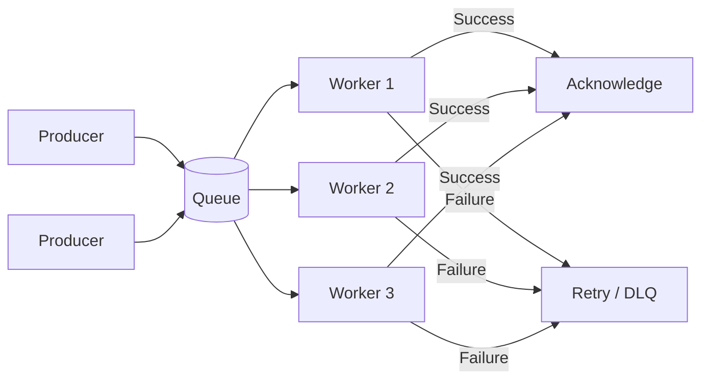
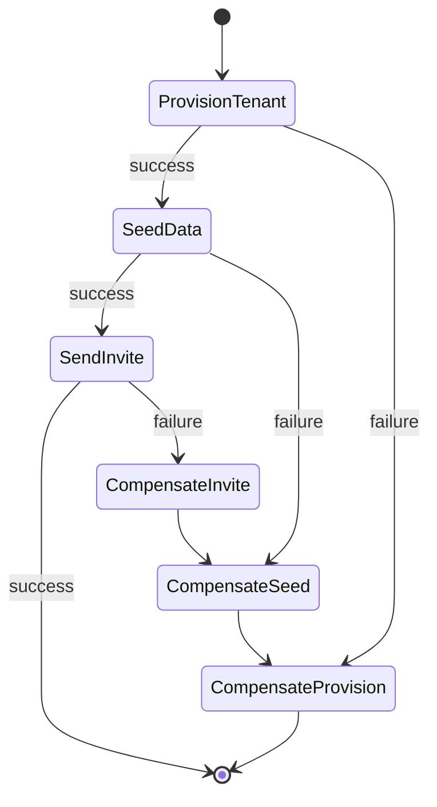

---
<!-- source: architecture/background-jobs.md -->
---

# Background Jobs

Background job execution patterns for SaaS: queues, scheduled jobs, workflows. Retry strategies, idempotency, observability.

These patterns implement the layered architecture defined in **Read** [`code-conventions/architecture.md`](../code-conventions/architecture.md). Job dispatch belongs in the **service/use-case layer** (business logic decides what jobs to enqueue); queue infrastructure, workers, and scheduling belong in **infrastructure/adapters**; job payload serialization and transport are infrastructure concerns. For vendor-specific queue and workflow engine comparisons, **Read** [`stack-ref/jobs/`](../stack-ref/jobs/).

---

## Job Types

| Type | Description | Use Case | Example |
|------|-------------|----------|---------|
| Fire-and-forget | Enqueue and do not wait for result | Non-critical side effects | Send welcome email after signup |
| Delayed | Execute after a specified delay | Grace periods, deferred actions | Cancel unpaid order after 30 min |
| Scheduled / Cron | Execute on a recurring schedule | Maintenance, reports, syncs | Nightly usage aggregation at 02:00 UTC |
| Workflow / Multi-step | Sequential or branching steps with compensation | Complex business processes | Onboarding flow: provision tenant, seed data, send invite |
| Event-triggered | Execute in response to a domain event | Reactive processing, fan-out | Generate invoice PDF when `payment.completed` fires |

Event-triggered jobs overlap with event-driven architecture patterns. **Read** [`event-driven.md`](event-driven.md) for event bus design, consumer groups, and delivery guarantees.

## Execution Patterns

### Simple Queue

FIFO processing with optional priority levels and concurrency control.

- **FIFO** — default ordering; sufficient for most workloads
- **Priority queues** — separate queues per priority level (high, normal, low) or a single queue with priority field; workers drain high-priority first
- **Concurrency control** — limit the number of workers per queue to prevent resource exhaustion; configure per queue based on downstream capacity
- **Visibility timeout** — after a worker picks a message, the message is hidden from other workers for a configured duration; if the worker crashes, the message becomes visible again for reprocessing
- **Backpressure** — when queue depth exceeds a threshold, slow down producers or reject new jobs with a 429 / backpressure signal

### Fan-out

One event triggers N independent jobs that execute in parallel.

- Use case: a single `order.placed` event triggers inventory reservation, payment capture, email confirmation, and analytics tracking — all independently
- Each fan-out target is a separate queue or subscription — one slow consumer does not block others
- Fan-out is fire-and-forget from the producer's perspective; each branch handles its own retry logic
- Implement via topic-based pub/sub (SNS + SQS, Cloudflare Pub/Sub) or by enqueueing N jobs from a single handler
- **Partial failure** — some branches may succeed while others fail; each branch retries independently; the producer does not track individual branch outcomes
- **Ordering across branches** — not guaranteed; branches may complete in any order; design consumers to be order-independent

### Workflow / Pipeline

Sequential steps with compensation (rollback) on failure. Each step produces output consumed by the next.

- **Saga pattern** — each step has a corresponding compensation action; on failure, compensations execute in reverse order
- **Step isolation** — each step is its own job with independent retry logic; do not wrap the entire workflow in a single transaction
- **State persistence** — store workflow state (current step, step outputs, failure info) durably; the orchestrator must survive restarts
- **Timeout per step** — each step has its own timeout; a stuck step triggers compensation without waiting indefinitely
- **Idempotent steps** — every step and every compensation must be idempotent; workflows may be retried from any point

### Scheduled / Cron

Recurring jobs on a fixed schedule, running in a distributed environment.

- **Leader election** — only one instance should trigger the scheduled job; use a distributed lock (Redis `SET NX EX`, database advisory lock, or built-in scheduler leader election)
- **Clock drift** — do not rely on wall-clock precision across nodes; use the scheduler's internal clock or a centralized time source; tolerate +/-5s drift
- **Overlap prevention** — if a job run exceeds the cron interval, skip the next invocation rather than stacking concurrent runs
- **Missed runs** — decide per job: either skip missed runs (dashboards, reports) or catch up (billing, metering); document the policy per job
- **Jitter** — for jobs running on many tenants (e.g., daily digest emails), add random delay per tenant to avoid thundering herd

## Reliability

### Retry Strategies

| Strategy | Formula | Use Case | Typical Config |
|----------|---------|----------|----------------|
| Immediate | `delay = 0` | Transient network blip, first retry only | Max 1 immediate retry |
| Fixed delay | `delay = constant` | Rate-limited APIs, known cooldown | 5s delay, max 3 retries |
| Exponential backoff | `delay = base * 2^attempt` | General-purpose, unknown failure duration | base=1s, max 5 retries |
| Exponential backoff + jitter | `delay = random(0, base * 2^attempt)` | High-concurrency systems, thundering herd prevention | base=1s, max 5 retries, full jitter |

- Always set a **max retry count** — unbounded retries mask bugs and waste resources
- Always set a **max delay cap** — exponential backoff without a cap grows to hours; cap at 5-15 minutes typically
- **Non-retryable errors** — validation failures, 4xx responses (except 429), deserialization errors; send directly to DLQ without retry
- **Retryable errors** — timeouts, 5xx responses, 429 (rate limited), connection errors, transient database errors

### Dead Letter Queue (DLQ)

- Capture jobs that exhaust all retries — never silently drop failed jobs
- Store the original payload, error details, attempt count, timestamps, and the queue of origin
- **Inspect** — provide a dashboard or CLI to view DLQ contents
- **Replay** — support replaying individual jobs or bulk replay back to the original queue
- **Alerting** — alert when DLQ depth grows or when a specific job type repeatedly lands in DLQ
- **Retention** — keep DLQ entries for 14-30 days, then archive or purge

### Idempotency

Background jobs are delivered **at-least-once** by design. Workers may process the same job more than once due to visibility timeout expiry, worker crashes, or queue redelivery.

Every job handler must be idempotent. The full idempotency pattern (idempotency key storage, transactional check-and-process, Redis/database implementation) is documented in **Read** [`webhook-patterns.md`](webhook-patterns.md) section "Idempotency (Consumer Side)" — the same pattern applies to background jobs. Use the job ID as the idempotency key.

### Timeout Handling

| Approach | How It Works | When to Use |
|----------|-------------|-------------|
| Hard timeout | Worker is killed after a fixed duration | Short jobs with predictable duration (email send, API call) |
| Heartbeat | Worker periodically extends its lease; missed heartbeat = timeout | Long-running jobs with variable duration (video processing, data export) |

- Hard timeout: set per queue or per job type; typical values: 30s for API calls, 5 min for processing, 30 min for heavy compute
- Heartbeat: worker sends a heartbeat every N seconds (e.g., every 30s); if the orchestrator misses 2 consecutive heartbeats, it considers the worker dead and re-enqueues the job
- Always combine with a max wall-clock timeout as a safety net — even heartbeat-based jobs need an upper bound
- On timeout: log the timeout event with `jobId`, `jobType`, `durationMs`, and `timeoutType` (hard or heartbeat); re-enqueue if the job is retryable

## Data Flow

### Payload Design

- **Small payloads** — pass reference IDs, not full objects; the worker fetches current state at processing time
- Reference-based payloads prevent stale data (the object may have changed between enqueue and processing)
- Keep payloads under 256KB — most queue systems impose limits (SQS: 256KB, Cloudflare Queues: 128KB)
- Include metadata: `jobId`, `enqueuedAt`, `attempt`, `correlationId`

### Serialization

- Use JSON for portability and debuggability
- Define schemas for job payloads (TypeScript types, JSON Schema, or Zod) — validate on enqueue and on dequeue
- Version payloads: include a `version` field so workers can handle old and new formats during deployments
- Never include secrets or credentials in job payloads — resolve them at processing time from the secret store
- Date/time fields always in UTC, ISO 8601 format

### Large Payload Handling

When data exceeds queue size limits:

1. Store the large payload in object storage (R2, S3)
2. Enqueue a reference: `{ "payloadRef": "s3://bucket/jobs/abc123.json" }`
3. Worker fetches the payload from storage at processing time
4. Clean up stored payloads after successful processing (or set a TTL on the storage bucket)

## Observability

### Structured Logging

Every job execution must produce structured log entries. **Read** [`../code-conventions/logging.md`](../code-conventions/logging.md) for sensitive data rules — job logs follow the same redaction and data minimization requirements.

Required fields per job log:

| Field | Description |
|-------|-------------|
| `jobId` | Unique identifier for this job execution |
| `jobType` | The job type / handler name |
| `queue` | Queue name |
| `attempt` | Current attempt number |
| `status` | `started`, `completed`, `failed`, `retrying` |
| `durationMs` | Processing duration in milliseconds |
| `correlationId` | Trace ID linking to the originating request or event |
| `error` | Error message and code (on failure only) |

- Log at `info` level for `started` and `completed`; `warn` for `retrying`; `error` for `failed`
- Never log job payloads in production — they may contain user data; log only the `jobId` and `jobType`

### Metrics

| Metric | Type | Alert Threshold |
|--------|------|-----------------|
| Queue depth | Gauge | Growing trend over 15 min |
| Processing time p50 / p95 / p99 | Histogram | p99 > 2x baseline |
| Failure rate | Rate | > 5% over 5 min window |
| Retry rate | Rate | > 10% over 5 min window |
| DLQ depth | Gauge | Any increase |
| Job throughput | Counter | Sudden drop > 50% |
| Worker utilization | Gauge | > 90% sustained |

### Distributed Tracing

- Propagate `traceId` / `correlationId` from the originating HTTP request through to every job in the chain
- For workflow / pipeline patterns: create child spans for each step, linked to the parent workflow span
- For fan-out: each branch gets its own span, all sharing the same parent trace
- Use OpenTelemetry context propagation — serialize trace context into the job payload

## Concurrency Control

### Rate Limiting per Queue

- Configure max concurrent workers per queue — prevents overwhelming downstream services
- Use a semaphore or token bucket at the worker pool level
- Example: payment processing queue limited to 10 concurrent workers (matches payment provider rate limit)

### Per-Tenant Fairness

- Problem: one tenant enqueuing 100K jobs starves all other tenants
- Solution: per-tenant sub-queues or weighted fair queuing
- Implementation approaches:
  - **Separate queues per tenant** — simple but does not scale beyond ~100 tenants
  - **Tagged jobs with round-robin consumption** — workers cycle through tenants, processing one job per tenant before moving to the next
  - **Weighted priority** — assign capacity shares per tenant based on plan tier (free: 5%, pro: 20%, enterprise: 75%)

### Resource-Based Throttling

- Monitor downstream resource health (database connections, API rate limits, memory)
- When resources are constrained: reduce worker concurrency dynamically or pause consumption
- Circuit breaker pattern: if a downstream service fails N times in M seconds, stop sending jobs and wait for recovery
- Resume gradually (half-open circuit) to avoid overwhelming the recovered service
- Log all throttling decisions with reason and current resource metrics

## Infrastructure Mapping

| Engine | Model | Best For | Trade-offs |
|--------|-------|----------|------------|
| Inngest | Event-driven workflow orchestration | Multi-step workflows, fan-out, scheduled jobs | Hosted service, vendor dependency |
| Trigger.dev | Code-first background jobs | TypeScript-native jobs, long-running tasks | Hosted or self-hosted, newer ecosystem |
| BullMQ | Redis-backed queue | Simple queues, priority, delayed jobs, cron | Requires Redis, no built-in workflow orchestration |
| Cloudflare Queues | Edge-native message queue | Edge workloads, Cloudflare Workers integration | Cloudflare ecosystem lock-in, 128KB message limit |

For detailed vendor comparison, setup guides, and migration paths, **Read** [`stack-ref/jobs/`](../stack-ref/jobs/).

### Selection Criteria

- **Simple fire-and-forget / delayed** — BullMQ or Cloudflare Queues (lightweight, minimal overhead)
- **Scheduled / cron** — BullMQ (built-in repeatable jobs) or Inngest (managed cron with dashboard)
- **Multi-step workflows with compensation** — Inngest or Trigger.dev (built-in step functions, retry per step, state persistence)
- **Edge-first architecture** — Cloudflare Queues (runs in Workers, no external infrastructure)
- **Event-triggered fan-out** — Inngest (event-driven by design) or SNS/SQS fan-out pattern with BullMQ consumers

## Anti-Patterns

| Anti-Pattern | Why It Fails | Correct Approach |
|--------------|-------------|------------------|
| Processing inline in the request thread | Blocks HTTP response, timeout risk, no retry | Enqueue a job, return 202 Accepted |
| Unbounded retries | Masks bugs, wastes resources, fills queues | Set max retry count + DLQ |
| Full objects in job payload | Stale data at processing time, payload size limits | Pass reference IDs, fetch at processing time |
| No idempotency in job handlers | Duplicate processing on redelivery | Check job ID before processing |
| Global single queue for all job types | No isolation, no independent scaling, one slow type blocks all | Separate queues per job type or priority |
| Ignoring DLQ growth | Silent data loss, unprocessed critical jobs | Alert on DLQ depth, review and replay regularly |
| Logging full job payloads | PII/secret exposure, log volume explosion | Log job ID and type only |
| No timeout on workers | Stuck workers consume capacity indefinitely | Hard timeout or heartbeat + max wall-clock |
| Shared state between job steps via memory | Worker crash loses intermediate state | Persist step outputs to durable storage |
| Coupling job scheduling to application startup | Missed schedules on deploy, race conditions | Use external scheduler with leader election |
