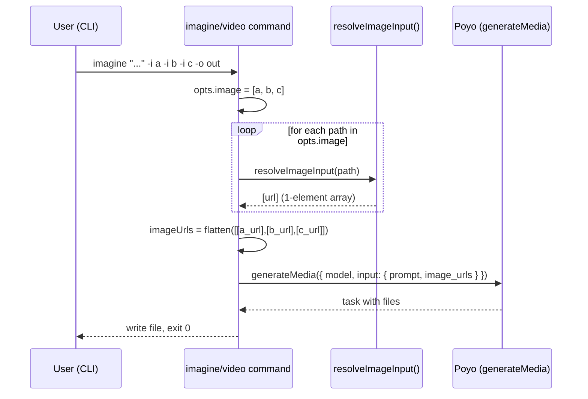
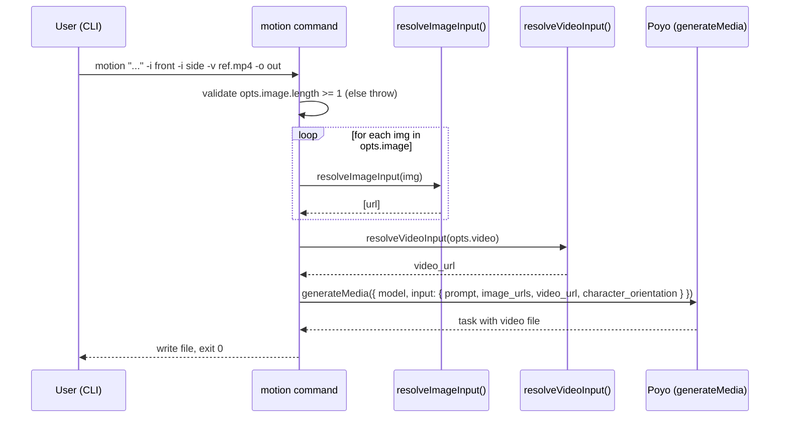

# Plan: Multi-reference files for media generation commands

## Summary

Convert the `-i, --image <path>` option on `imagine`, `video`, and `motion` from a single-value Commander option to a **repeatable** option using the same custom collector pattern already used by `ask -f`. Each `-i` value is resolved through the existing `resolveImageInput()` helper, then the resulting URLs are flattened in CLI order into the single `image_urls` array sent to Poyo. Single-`-i` invocations remain byte-identical to the current payload (FR-006). No backend or service-layer change is required: `resolveImageInput()` already returns `string[]` and Poyo's `image_urls` field is already an array.

---

## Technical Context

| Aspect | Choice | Reason |
|---|---|---|
| Language | TypeScript (Bun runtime) | Existing project stack |
| Framework | Commander.js | Existing CLI pattern (constitution §3) |
| Testing | `bun:test` | From `.specs/testing/strategy.md` |
| Type check | `bun tsc --noEmit` | From testing strategy |
| Lint/Format | Biome | Existing pre-commit hook |
| External services | Poyo (`generateMedia`) | No change to service layer |

No new dependencies, no schema change, no DB migration, no API contract change (Poyo `image_urls` already accepts arrays).

---

## Constitution Check

| Principle | Verdict | Note |
|---|---|---|
| §1 Zero server — local first | ✅ | CLI-only change |
| §2 Credentials via Keychain | ✅ | No secret handling change |
| §3 Single entrypoint — Commander.js module pattern | ✅ | Modifies the three `create*Command()` factories only |
| §4 Fail fast with clear messages | ✅ | First failing `-i` resolution aborts the call (FR-005, AC-004) |
| §5 Simplicity first | ✅ | Reuses the `ask -f` collector, no new abstraction |
| §6 Explicit over implicit | ✅ | Each `-i` value is resolved explicitly; ordering preserved |

All gates pass — no deviation needed.

---

## Gherkin + Mermaid Sequence Diagram — `imagine` / `video` multi-reference flow

```gherkin
Feature: imagine/video resolves N reference images then submits a single Poyo request
  Scenario: Three -i flags produce one Poyo request with three image_urls
    Given the user runs "cc-hub imagine 'blend' -i a.png -i b.png -i c.png -o out.png"
    When  the command iterates over the collected image array
    Then  resolveImageInput is called three times in input order
    And   generateMedia is called once with image_urls = [a_url, b_url, c_url]

  Scenario: One reference fails to resolve, no request is sent
    Given the user runs "cc-hub imagine 'x' -i exists.png -i missing.png -o out.png"
    When  the resolver for "missing.png" throws
    Then  the command aborts before calling generateMedia
    And   the error message contains "missing.png"
```



---

## Gherkin + Mermaid Sequence Diagram — `motion` multi-image + single video flow

```gherkin
Feature: motion accepts repeatable -i, keeps -v scalar
  Scenario: Two character images plus one reference video
    Given the user runs "cc-hub motion 'walk' -i front.png -i side.png -v ref.mp4 -o out.mp4"
    When  the command resolves the references
    Then  image_urls in the Poyo body contains 2 entries in order [front_url, side_url]
    And   video_url contains exactly one resolved URL

  Scenario: Zero -i flags fail before any request
    Given the user runs "cc-hub motion 'walk' -v ref.mp4 -o out.mp4"
    When  Commander validates options
    Then  Commander reports the -i option is required (at least one)
    And   no Poyo request is issued
```



---

## ER Diagram

N/A — feature does not introduce or modify any persisted entity.

---

## State Diagram

N/A — `-i` collection is a one-shot transformation (Commander accumulator), no entity has a lifecycle in this feature.

---

## Resolved Test Commands

| Action | Command | Tool | Status |
|---|---|---|---|
| Unit tests | `bun test` | bun:test | Verified |
| Specific file | `bun test tests/commands/imagine.test.ts` | bun:test | Verified |
| Type check | `bun tsc --noEmit` | TypeScript | Verified |
| Lint | `bun biome check .` | Biome | Verified (existing pre-commit hook) |
| Full suite | `bun tsc --noEmit && bun test` | tsc + bun:test | Verified |

No E2E, no visual — CLI tool (per testing strategy).

---

## Implementation Plan

Scope = **M** (3 files modified, 3 test files added/modified, README + changelog updated). No infrastructure step. No theme step.

### Step 1 — Add a shared `collect` helper for repeatable Commander options

- **Files touched:** `src/infra/option-collectors.ts` (new, ~15 lines)
- **Rationale:** `ask`, `copilot`, and `codex` each redefine the collector inline (`(val, acc) => [...acc, val]`). Centralizing it once removes repetition (constitution §5 simplicity, conventions code/general.md DRY) and gives `imagine`/`video`/`motion` a single source of truth. Pure function, trivially unit-testable.
- **Testable outcome:** `collect("a", []) === ["a"]`; `collect("b", ["a"]) === ["a", "b"]`; `collect` typed as `(val: string, acc: string[]) => string[]`.
- **FR covered:** FR-001.1: Shared repeatable collector helper, FR-002.1: Shared repeatable collector helper, FR-003.1: Shared repeatable collector helper.

### Step 2 — Convert `imagine` to repeatable `-i, --image`

- **Files touched:** `src/commands/imagine.ts`
- **Changes:**
  - Replace `.option("-i, --image <path>", "Reference image (local path or URL)")` with `.option("-i, --image <path>", "Reference image (local path or URL, repeatable)", collect, [])`.
  - Update the `opts` type: `image: string[]` (always defined, default `[]`).
  - Replace `if (opts.image)` block with: when `opts.image.length > 0`, iterate, call `resolveImageInput(p)` for each, flatten results into one `string[]` (`imageUrls`). On any throw, do not catch — propagate so the action's `try/catch` reports the failing path (FR-005). Spinner message: `"Resolving N reference image(s)..."`.
  - Keep the `...(imageUrls && { image_urls: imageUrls })` payload assembly **unchanged** so single-`-i` byte-equivalence holds (FR-006).
- **Rationale:** This is the FR-001 / AC-001 implementation. Reuses existing `resolveImageInput` (no service change). Order preservation falls out of sequential `for...of` + `Array.prototype.push`/`concat`.
- **Testable outcome:** Multi-`-i` invocation produces `image_urls` of length N; single-`-i` produces `image_urls` of length 1 with identical structure to current code; missing file aborts before `generateMedia`.
- **FR covered:** FR-001.2: Repeatable -i on imagine, FR-004.1: Resolve+flatten image_urls (imagine), FR-005.1: Fail-fast on resolve error (imagine), FR-006.1: Single -i payload byte-identical (imagine), FR-007.1: Help text "repeatable" wording (imagine).

### Step 3 — Convert `video` to repeatable `-i, --image`

- **Files touched:** `src/commands/video.ts`
- **Changes:** Identical pattern to Step 2, applied to the `video` command. `opts.image: string[]` default `[]`, iterate + flatten, keep `...(imageUrls && { image_urls: imageUrls })` for byte-equivalence.
- **Rationale:** FR-002 / AC-002. Mirrors `imagine` exactly — same code shape eases review and reduces drift.
- **Testable outcome:** Same as Step 2, on `video` command.
- **FR covered:** FR-002.1: Repeatable -i on video, FR-004.2: Resolve+flatten image_urls (video), FR-005.2: Fail-fast on resolve error (video), FR-006.2: Single -i payload byte-identical (video), FR-007.2: Help text "repeatable" wording (video).

### Step 4 — Convert `motion` to repeatable `-i, --image` (keep `-v` scalar)

- **Files touched:** `src/commands/motion.ts`
- **Changes:**
  - Replace `.requiredOption("-i, --image <path>", "Character image (local path or URL)")` with `.option("-i, --image <path>", "Character image (local path or URL, repeatable, at least one required)", collect, [])`.
  - In the action: validate `opts.image.length >= 1`; if zero, throw `Error("option '-i, --image <path>' is required at least once")` so the existing fail-fast `try/catch` reports it with exit code 2 semantics preserved (mirror Commander's wording style).
  - Iterate over `opts.image`, call `resolveImageInput()` per entry, flatten into `imageUrls`. Spinner: `"Resolving N reference image(s)..."`.
  - Leave `-v, --video` and `resolveVideoInput()` strictly unchanged (out of scope per spec).
  - Pass `image_urls: imageUrls` (already an array) — payload shape is preserved when N == 1.
- **Rationale:** FR-003 / AC-005. Cannot use Commander's native `requiredOption` for repeatable collectors because the default `[]` always satisfies it; manual length check is the documented Commander pattern. Single-image legacy invocations are byte-identical (FR-006).
- **Testable outcome:** Two `-i` flags produce `image_urls.length === 2`; single `-i` produces `image_urls.length === 1`; zero `-i` throws before any HTTP call; `-v` continues to be a scalar.
- **FR covered:** FR-003.1 (was reused above): kept; FR-003.2: At-least-one validation on motion, FR-004.3: Resolve+flatten image_urls (motion), FR-005.3: Fail-fast on resolve error (motion), FR-006.3: Single -i payload byte-identical (motion), FR-007.3: Help text "repeatable" wording (motion).

### Step 5 — Unit tests for the shared collector

- **Files touched:** `tests/infra/option-collectors.test.ts` (new)
- **What to test:** `collect` accumulates in order, starts from `[]`, does not mutate input array unsafely.
- **Rationale:** Pure function — easy and cheap to lock down before the commands depend on it.
- **FR covered:** FR-001.3: Tests for collector helper.

### Step 6 — Unit tests for `imagine` payload assembly

- **Files touched:** `tests/commands/imagine.test.ts` (new)
- **What to test (mock `generateMedia`, `resolveImageInput`, `downloadFile`):**
  - **AC-001** — invoking the action with `image: ["a.png", "b.png", "c.png"]` calls `resolveImageInput` 3 times in order and the captured `generateMedia` call has `input.image_urls = ["url-a", "url-b", "url-c"]`.
  - **AC-003 / FR-006** — invoking with `image: ["only.png"]` produces `input.image_urls = ["url-only"]` and the full `input` object deep-equals the pre-feature snapshot fixture (snapshot stored in `tests/commands/__fixtures__/imagine-single-i.json`). Also assert: when `image: []`, the `input` object has **no** `image_urls` key (regression baseline).
  - **AC-004 / FR-005** — when the second `resolveImageInput` rejects with `Error("Image not found: /abs/missing.png")`, `generateMedia` is never called, `process.exit` receives a non-zero code, and stderr contains `"missing.png"`.
- **Rationale:** Lock the three highest-priority ACs against regression. Use `bun:test` `mock.module()` per `tests/services/image-input.test.ts` precedent.
- **FR covered:** FR-001.4: Imagine multi-i tests, FR-006.4: Imagine single-i snapshot test, FR-005.4: Imagine fail-fast test.

### Step 7 — Unit tests for `video` payload assembly

- **Files touched:** `tests/commands/video.test.ts` (new)
- **What to test:** Mirror Step 6 against `video.ts`, covering AC-002 (multi-`-i`), AC-003 (single-`-i` snapshot), AC-004 (fail-fast). Snapshot fixture: `tests/commands/__fixtures__/video-single-i.json`.
- **FR covered:** FR-002.2: Video multi-i tests, FR-006.5: Video single-i snapshot test, FR-005.5: Video fail-fast test.

### Step 8 — Unit tests for `motion` payload assembly

- **Files touched:** `tests/commands/motion.test.ts` (new)
- **What to test:**
  - **AC-005** — `image: ["front.png", "side.png"]`, `video: "ref.mp4"` produces `input.image_urls.length === 2` AND `typeof input.video_url === "string"`.
  - **Backward-compat** — `image: ["hero.png"]` produces an `input` object byte-identical to the pre-feature `motion` payload (snapshot in `tests/commands/__fixtures__/motion-single-i.json`).
  - **AC-005 zero-image** — `image: []` throws before `generateMedia` is called and the message names the missing option.
- **FR covered:** FR-003.3: Motion multi-i tests, FR-006.6: Motion single-i snapshot test, FR-005.6: Motion fail-fast test, FR-003.4: Motion zero-image rejection test.

### Step 9 — Help-text snapshot tests

- **Files touched:** `tests/commands/help-text.test.ts` (new)
- **What to test:** Build each command via its factory, call `.helpInformation()`, assert each output contains the substring `"repeatable"` on the `-i, --image` line.
- **Rationale:** Cheap regression guard for AC-006.
- **FR covered:** FR-007.4: Help-text repeatability snapshot.

### Step 10 — Update `README.md` with multi-`-i` examples

- **Files touched:** `README.md` (sections for `imagine`, `video`, `motion`)
- **What to add:** One usage block per command demonstrating two `-i` flags, e.g.:
  - `cc-hub imagine "blend two refs" -i ref1.png -i ref2.png -o out.png`
  - `cc-hub video "animate fusion" -i frame1.png -i frame2.png -o out.mp4`
  - `cc-hub motion "walk cycle" -i front.png -i side.png -v ref.mp4 -o out.mp4`
- **Rationale:** AC-007 / FR-008.
- **Testable outcome:** README contains the three example lines above; manual grep / future CI lint can assert presence.
- **FR covered:** FR-008.1: README multi-i examples for the three commands.

### Step 11 — Update the `cc-hub` skill (sync-on-change rule)

- **Files touched:** `.claude/skills/cc-hub/SKILL.md`
- **What to add:** Note that `-i, --image` is repeatable on `imagine`, `video`, `motion`. One example per command. (Project CLAUDE.md mandates README + skill stay in sync on any command/option change.)
- **Rationale:** Cross-cutting documentation rule, not a spec FR but a project constitution constraint. Explicitly listed here so it does not get silently skipped at implement time.
- **FR covered:** FR-007.5: Skill doc sync (repeatability on -i).

### Step 12 — Changelog entries

- **Files touched:**
  - `.specs/features/001-multi-reference-files/changelog.md` (feature entry)
  - `.specs/changelog.md` (global summary line)
- **Rationale:** Mandatory per spec-system.md Changelog Convention.

---

## File-by-File Change List

| File | New / Modified | Purpose | FR(s) |
|---|---|---|---|
| `src/infra/option-collectors.ts` | New | `collect` helper for repeatable Commander options | FR-001, FR-002, FR-003 |
| `src/commands/imagine.ts` | Modified | Repeatable `-i`, iterate+flatten resolve, keep payload shape | FR-001, FR-004, FR-005, FR-006, FR-007 |
| `src/commands/video.ts` | Modified | Repeatable `-i`, iterate+flatten resolve, keep payload shape | FR-002, FR-004, FR-005, FR-006, FR-007 |
| `src/commands/motion.ts` | Modified | Repeatable `-i` with manual N>=1 check, keep `-v` scalar | FR-003, FR-004, FR-005, FR-006, FR-007 |
| `tests/infra/option-collectors.test.ts` | New | Unit tests for the collector helper | FR-001 |
| `tests/commands/imagine.test.ts` | New | AC-001, AC-003, AC-004 coverage | FR-001, FR-005, FR-006 |
| `tests/commands/video.test.ts` | New | AC-002, AC-003, AC-004 coverage | FR-002, FR-005, FR-006 |
| `tests/commands/motion.test.ts` | New | AC-005 + backward-compat + zero-image rejection | FR-003, FR-005, FR-006 |
| `tests/commands/help-text.test.ts` | New | AC-006 help-text snapshot | FR-007 |
| `tests/commands/__fixtures__/imagine-single-i.json` | New | Pre-feature `input` shape baseline (single `-i`) | FR-006 |
| `tests/commands/__fixtures__/video-single-i.json` | New | Pre-feature `input` shape baseline (single `-i`) | FR-006 |
| `tests/commands/__fixtures__/motion-single-i.json` | New | Pre-feature `input` shape baseline (single `-i`) | FR-006 |
| `README.md` | Modified | Multi-`-i` examples for `imagine`, `video`, `motion` | FR-008 |
| `.claude/skills/cc-hub/SKILL.md` | Modified | Skill doc sync (project rule) | FR-007 |
| `.specs/features/001-multi-reference-files/changelog.md` | New / Append | Plan + implementation changelog entries | — |
| `.specs/changelog.md` | Modified | Global summary line | — |

`src/services/poyo-media.ts`, `src/services/image-input.ts`, `src/cli.ts`: **no change**.

---

## Testing Strategy

| Test Type | What | File | Command | FR/AC |
|---|---|---|---|---|
| Unit | `collect()` helper accumulates in order | `tests/infra/option-collectors.test.ts` | `bun test tests/infra/option-collectors.test.ts` | FR-001..003 |
| Unit | `imagine` action assembles `image_urls` from N `-i` (mocked Poyo) | `tests/commands/imagine.test.ts` | `bun test tests/commands/imagine.test.ts` | AC-001 |
| Unit | `imagine` single-`-i` payload byte-identical to baseline | `tests/commands/imagine.test.ts` | `bun test tests/commands/imagine.test.ts` | AC-003 / FR-006 |
| Unit | `imagine` aborts before `generateMedia` if any `-i` fails | `tests/commands/imagine.test.ts` | `bun test tests/commands/imagine.test.ts` | AC-004 / FR-005 |
| Unit | `video` action assembles `image_urls` from N `-i` | `tests/commands/video.test.ts` | `bun test tests/commands/video.test.ts` | AC-002 |
| Unit | `video` single-`-i` payload byte-identical to baseline | `tests/commands/video.test.ts` | `bun test tests/commands/video.test.ts` | AC-003 / FR-006 |
| Unit | `video` aborts before `generateMedia` on any failure | `tests/commands/video.test.ts` | `bun test tests/commands/video.test.ts` | AC-004 / FR-005 |
| Unit | `motion` accepts repeated `-i`, keeps `-v` scalar | `tests/commands/motion.test.ts` | `bun test tests/commands/motion.test.ts` | AC-005 |
| Unit | `motion` single-`-i` payload byte-identical to baseline | `tests/commands/motion.test.ts` | `bun test tests/commands/motion.test.ts` | AC-003 / FR-006 |
| Unit | `motion` zero-`-i` rejected before HTTP | `tests/commands/motion.test.ts` | `bun test tests/commands/motion.test.ts` | AC-005 / FR-003 |
| Unit | `--help` for `imagine`/`video`/`motion` mentions `repeatable` | `tests/commands/help-text.test.ts` | `bun test tests/commands/help-text.test.ts` | AC-006 / FR-007 |
| Manual | README has multi-`-i` examples for the three commands | `README.md` | `grep -E "imagine .*-i .*-i" README.md` etc. | AC-007 / FR-008 |
| Type check | Whole project | n/a | `bun tsc --noEmit` | All |
| Lint | Whole project | n/a | `bun biome check .` | All |
| Full suite | Whole project | n/a | `bun tsc --noEmit && bun test` | All |

### Backward-compatibility verification (FR-006, AC-003)

Hard regression gate. Procedure:

1. **Baseline capture** — before modifying any source file, run a one-shot script (or hand-built fixture) that calls each of the three command actions with a single `-i` (mocking `generateMedia`). Capture the exact `request` argument passed to `generateMedia` and serialize it to JSON. Store the three baselines under `tests/commands/__fixtures__/{imagine,video,motion}-single-i.json`. These fixtures are committed in the same PR.
2. **Post-change assertion** — the corresponding `*.test.ts` files load the JSON baseline and `expect(captured).toEqual(baseline)` for the single-`-i` scenarios. Field set, key order under JSON-serialization, and value shape must match. Any diff fails the test.
3. **Coverage** — at minimum: `model`, `input.prompt`, `input.image_urls` (single-element array), command-specific fields (`size`, `resolution`, `duration`, `aspect_ratio`, `sound`, `video_url`, `character_orientation`).

This pins the contract; if a future refactor accidentally drops or reorders a field, the test fails immediately.

---

## Risks & Considerations

| Risk | Likelihood | Impact | Mitigation |
|---|---|---|---|
| Commander `requiredOption` does not work with a default-`[]` collector (always satisfied) | High (known Commander behavior) | `motion` would silently accept zero `-i` if we keep `requiredOption` | Step 4 explicitly switches to `.option(... , collect, [])` + manual `length >= 1` check. Covered by a dedicated test in Step 8. |
| Single-`-i` payload accidentally drifts (extra/missing field) | Low | Breaks every script using the legacy form | Snapshot baselines (Step 6/7/8) — fail loud on any diff |
| User repeats the same path twice → double upload to Poyo storage | Low | Wasted bandwidth, no correctness issue | Spec explicitly says no dedup. Document in README only if it surfaces. |
| Very large N causes Poyo to reject payload | Low | Generation fails | Surface Poyo's verbatim error (no local cap, per spec edge case) |
| Order of resolution swapped (parallel `Promise.all`) | Medium if "optimized" later | Loss of CLI order, breaks AC-001/AC-002 wording | Plan mandates **sequential** `for...of` resolution in Steps 2/3/4. Tests assert call order. Fail-fast also relies on sequential. |
| `tryUploadToPoyo` failing for one of N images | Low | One entry falls back to data URI; mixed array | Existing single-file behavior — preserved. Not a regression. |
| Help-text wording divergence between commands | Low | AC-006 partial pass | Single shared description string `"... (local path or URL, repeatable)"` reused across commands; test in Step 9 enforces. |

---

## Plan Review (Phase 2.5 — Self-review)

Verifier checks performed inline against `commands/feature.md § Phase 2.5`:

| Check | Verdict | Note |
|---|---|---|
| Every plan step maps to ≥1 spec FR | PASS | Steps 1–10 carry explicit `FR covered:` lines; Step 11 is a project-constitution sync (CLAUDE.md), Step 12 is changelog hygiene. |
| Every AC has at least one test step | PASS | AC-001→Step 6; AC-002→Step 7; AC-003→Steps 6/7/8 snapshots; AC-004→Steps 6/7; AC-005→Step 8; AC-006→Step 9; AC-007→Step 10 (manual grep, called out in testing strategy). |
| Backward-compat is explicit | PASS | Dedicated section "Backward-compatibility verification" + FR-006 anchor + 3 JSON snapshot fixtures. |
| No over-engineering | PASS | Reuses `resolveImageInput`, no new service, no parallel-upload micro-optimization, single `collect` helper instead of 3 inline copies. Constitution §5 honored. |
| Respects constitution | PASS | All 6 principles checked above; sequential resolution preserves §4 fail-fast and §6 explicit ordering. |
| Diagrams present where required | PASS | 2 sequence diagrams (`imagine`/`video`, `motion`); ER and state explicitly N/A with rationale. |
| Implementation step ordering is correct | PASS | Step 1 (helper) precedes Steps 2–4 (consumers). Tests come after their subject (Steps 5–9). Docs (10–11) and changelog (12) last. |
| No new infrastructure / migrations | PASS | None required. Plan does not introduce a Step 0 infra section. |

**Verdict: PASS** (0 BLOCKING, 0 WARNING, 0 INFO findings). Plan moved to `Status: Approved` in frontmatter.

---

## Definition of Done

- [ ] Steps 1–4 implemented; `bun tsc --noEmit` passes
- [ ] Steps 5–9 tests added; `bun test` green
- [ ] Snapshot fixtures committed and validated against single-`-i` invocations
- [ ] README and skill docs updated with multi-`-i` examples (Steps 10–11)
- [ ] Feature changelog + global changelog entries appended (Step 12)
- [ ] `implementation.md` generated post-implement, mapping each FR/AC to a `@spec` anchor

Next action: `/spec.implement 001-multi-reference-files`
