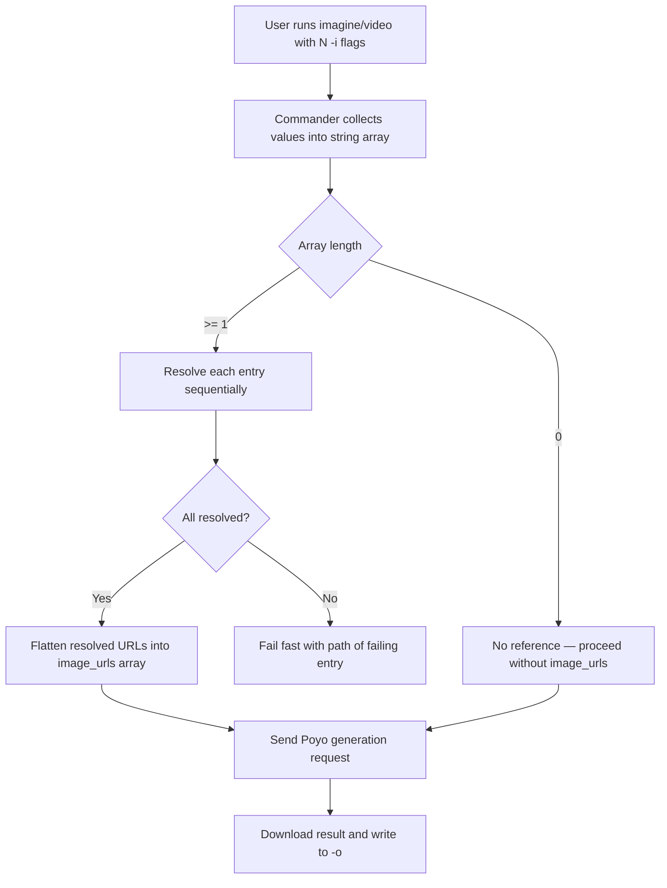
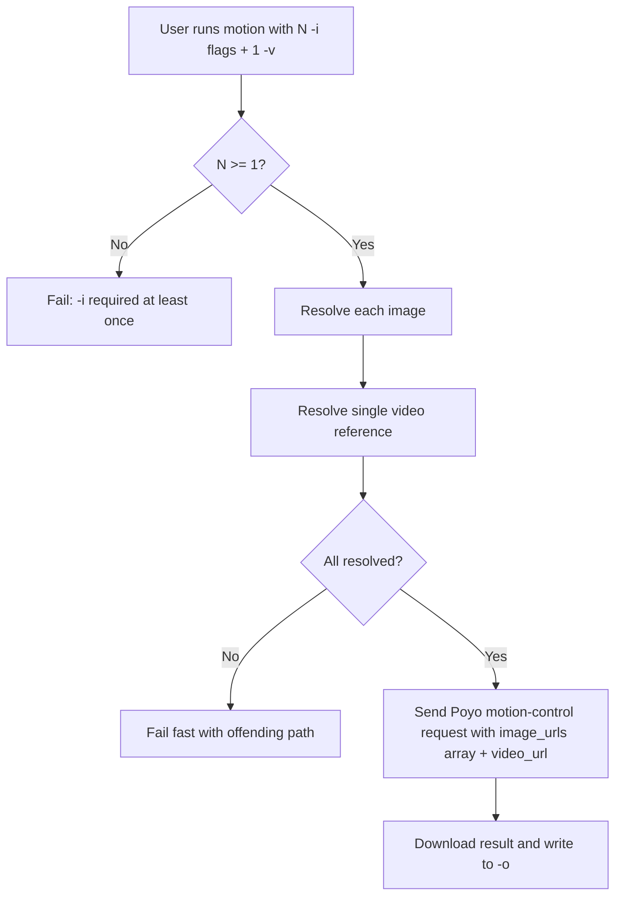
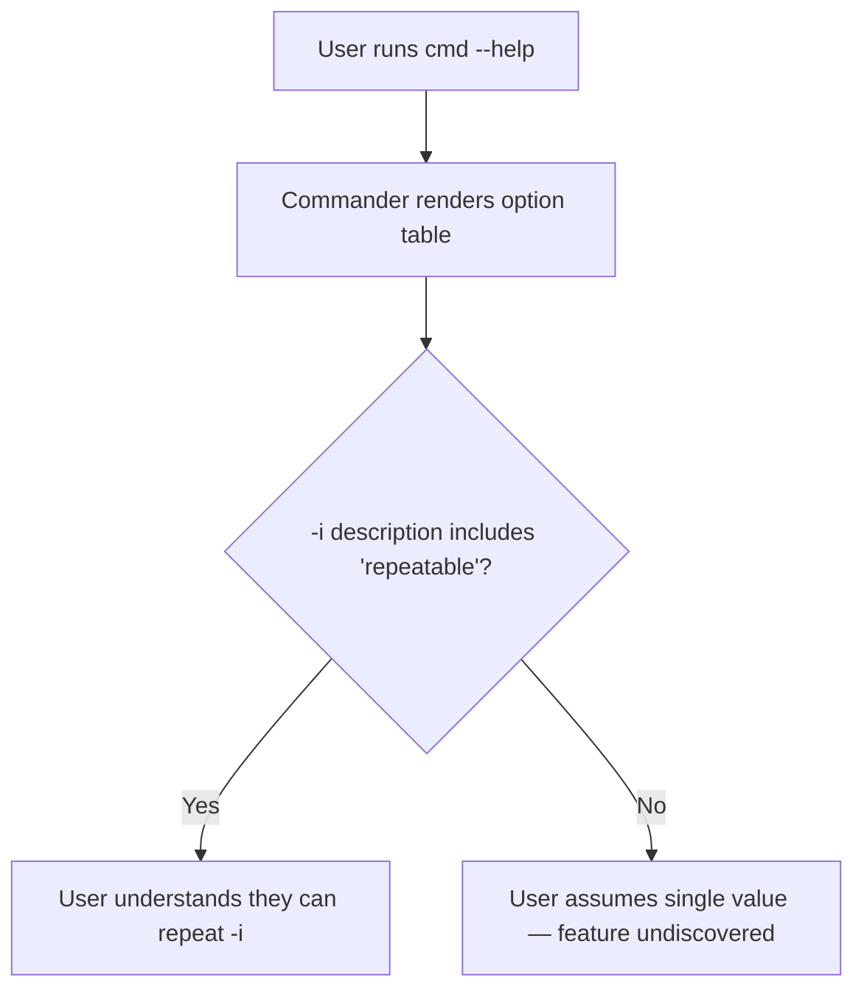

# Feature Spec: Multi-reference files for media generation commands

## Header

- **Feature:** Multi-reference files for media generation commands
- **Branch:** `feature/001-multi-reference-files`
- **Date:** 2026-05-04
- **Status:** Implemented
- **Updated:** 2026-05-04
- **Input:** Toutes les commandes cc-hub qui acceptent un fichier de référence (notamment `ask`, `imagine`, et toute autre commande type `video`, `motion`, `music` quand applicable) doivent pouvoir accepter plusieurs fichiers de référence (multi-fichiers) au lieu d'un seul. Conserver la rétro-compatibilité avec l'option singulier existante.
- **Feature Number:** 001

---

## Context — current state

Audit of `src/commands/` (2026-05-04):

| Command | Reference flag(s) | Variadic today? | Notes |
|---|---|---|---|
| `ask` | `-f, --file <path>` (text context) | Yes (repeatable, custom collector) | Already multi-file. Confirms target UX pattern. |
| `copilot` | `-f, --file <path>` (text context) | Yes (repeatable) | Already multi-file. |
| `codex` | `-f, --file <path>` (text context) | Yes (repeatable) | Already multi-file. |
| `imagine` | `-i, --image <path>` (reference image) | **No** — single value | Poyo payload `image_urls` is already an array. |
| `video` | `-i, --image <path>` (starting image) | **No** — single value | Poyo payload `image_urls` is already an array. |
| `motion` | `-i, --image <path>` (required), `-v, --video <path>` (required) | **No** — single values | `image_urls` is array; `video_url` is scalar in Poyo schema. |
| `music` | — | N/A | No reference flag today. Out of scope. |
| `transcribe` | `<file>` (positional, required) | N/A | The file IS the input being transcribed, not a "reference". Out of scope. |

**The work covers `imagine`, `video`, and `motion` — the three commands that today accept a *single* media reference but are wired to a backend that already takes an array (or could take one for `motion`'s reference video).**

---

## User Scenarios & Testing

### Story 1 — Pass multiple reference images to `imagine` and `video` `P1`

**As a** developer using cc-hub from the terminal or a script, **I want to** pass several reference images to `imagine` and `video`, **so that** the model can blend or fuse multiple visual references in a single generation call instead of forcing me to chain calls or pre-composite images myself.

**Priority reason:** This is the core of the request. `imagine` and `video` are the two most-used media commands, their underlying Poyo payload field (`image_urls`) is already an array — only the CLI surface is artificially restricted. Without this story the feature has no value.

**Independent test:** Run `cc-hub imagine "fuse these styles" -i ref1.png -i ref2.png -o out.png` (and the same with `video`). Verify that two reference images are uploaded/resolved and that `image_urls` in the Poyo request body contains both. Run `cc-hub imagine "..." -i single.png -o out.png` and verify the legacy single-file form still works unchanged.

#### Acceptance Scenarios (Gherkin — source of truth for tests)

```gherkin
Feature: Multi-reference images on imagine and video
  Scenario: Multiple -i flags are collected into image_urls
    Given the user runs "cc-hub imagine 'blend' -i a.png -i b.png -i c.png -o out.png"
    When  the command resolves the reference images
    Then  the Poyo request body contains image_urls with three entries in order [a, b, c]
    And   the command exits with code 0

  Scenario: Single -i flag remains backward compatible
    Given the user runs "cc-hub imagine 'one ref' -i only.png -o out.png"
    When  the command resolves the reference image
    Then  the Poyo request body contains image_urls with exactly one entry
    And   no warning about deprecation is printed

  Scenario: Mixing local paths and HTTPS URLs
    Given the user runs "cc-hub video 'animate' -i ./local.png -i https://example.com/r.png -o out.mp4"
    When  the command resolves each reference
    Then  the local file is uploaded or encoded as data URI
    And   the URL is passed through as-is
    And   image_urls preserves the input order

  Scenario: One reference fails to resolve
    Given the user runs "cc-hub imagine 'x' -i exists.png -i missing.png -o out.png"
    When  the second reference cannot be found on disk
    Then  the command fails fast with a clear error pointing to "missing.png"
    And   no Poyo generation request is sent
    And   the exit code is non-zero
```

#### User Flow



---

### Story 2 — Pass multiple reference images to `motion` (character orientation) `P2`

**As a** developer generating motion-controlled video, **I want to** pass several character reference images to `motion -i`, **so that** I can give the model multiple angles or expressions of the same character for a more robust motion transfer.

**Priority reason:** P2 because `motion` is less frequently used than `imagine`/`video` and because `image_urls` already accepts an array on the Poyo side, so the change is mechanically identical to Story 1 but on a less-trafficked command. Single-video reference (`-v`) is intentionally **not** extended in this feature — see Out of Scope.

**Independent test:** Run `cc-hub motion "walk cycle" -i front.png -i side.png -v ref.mp4 -o out.mp4`. Verify `image_urls` in the Poyo request body has two entries, `video_url` remains scalar, and the existing single-`-i` form still works.

#### Acceptance Scenarios (Gherkin — source of truth for tests)

```gherkin
Feature: Multi-reference character images on motion
  Scenario: Multiple -i flags are accepted on motion
    Given the user runs "cc-hub motion 'walk' -i front.png -i side.png -v ref.mp4 -o out.mp4"
    When  the command resolves the references
    Then  the Poyo request body contains image_urls with two entries
    And   video_url contains exactly one resolved URL

  Scenario: Single -i flag on motion remains backward compatible
    Given the user runs "cc-hub motion 'walk' -i hero.png -v ref.mp4 -o out.mp4"
    When  the command resolves the references
    Then  the Poyo request body contains image_urls with one entry
    And   the command behaves identically to the previous single-file implementation
```

#### User Flow



---

### Story 3 — Discoverable, consistent help text across media commands `P3`

**As a** developer reading `cc-hub <cmd> --help`, **I want to** see a consistent indication that `-i, --image` is repeatable, **so that** I do not have to read the code or guess from `ask`/`copilot`/`codex` whether the flag accepts multiple values.

**Priority reason:** P3 because it is purely documentation/UX polish — the feature works without it. But without it, users will not discover the new capability, defeating the point.

**Independent test:** Run `cc-hub imagine --help`, `cc-hub video --help`, `cc-hub motion --help`. Verify each `-i, --image` line states "repeatable" (or equivalent wording matching the project's existing style for `ask -f`).

#### Acceptance Scenarios (Gherkin — source of truth for tests)

```gherkin
Feature: Help text discoverability for multi-reference flags
  Scenario: imagine --help advertises repeatability
    Given the user runs "cc-hub imagine --help"
    When  the help output is rendered
    Then  the line for "-i, --image" mentions that the flag is repeatable

  Scenario: README documents multi-file usage
    Given the user reads README.md
    When  they navigate to the imagine/video/motion sections
    Then  at least one example uses two -i flags
```

#### User Flow



---

## Acceptance Criteria

| ID | Criterion | Priority | Story |
|---|---|---|---|
| AC-001 | `imagine` accepts repeated `-i, --image <path>` flags and forwards every resolved entry into the Poyo `image_urls` array, preserving CLI order | P1 | Story 1 |
| AC-002 | `video` accepts repeated `-i, --image <path>` flags and forwards every resolved entry into the Poyo `image_urls` array, preserving CLI order | P1 | Story 1 |
| AC-003 | A single `-i` flag on `imagine` or `video` produces the exact same Poyo payload shape as before this feature (regression-free) | P1 | Story 1 |
| AC-004 | If any `-i` value cannot be resolved (missing file, unsupported extension), the command fails fast with a message naming the offending path and never sends a generation request | P1 | Story 1 |
| AC-005 | `motion` accepts repeated `-i, --image <path>` flags; `-v, --video <path>` remains a single scalar | P2 | Story 2 |
| AC-006 | Help text for `imagine`, `video`, `motion` describes `-i` as repeatable, in the same wording style as `ask -f` | P3 | Story 3 |
| AC-007 | README.md documents the multi-file usage with at least one example per affected command | P3 | Story 3 |

### AC-001
**Criterion:** `imagine` accepts repeated `-i, --image <path>` flags and forwards every resolved entry into the Poyo `image_urls` array, preserving CLI order
**Priority:** P1 | **Story:** Story 1

### AC-002
**Criterion:** `video` accepts repeated `-i, --image <path>` flags and forwards every resolved entry into the Poyo `image_urls` array, preserving CLI order
**Priority:** P1 | **Story:** Story 1

### AC-003
**Criterion:** A single `-i` flag on `imagine` or `video` produces the exact same Poyo payload shape as before this feature (regression-free)
**Priority:** P1 | **Story:** Story 1

### AC-004
**Criterion:** If any `-i` value cannot be resolved (missing file, unsupported extension), the command fails fast with a message naming the offending path and never sends a generation request
**Priority:** P1 | **Story:** Story 1

### AC-005
**Criterion:** `motion` accepts repeated `-i, --image <path>` flags; `-v, --video <path>` remains a single scalar
**Priority:** P2 | **Story:** Story 2

### AC-006
**Criterion:** Help text for `imagine`, `video`, `motion` describes `-i` as repeatable, in the same wording style as `ask -f`
**Priority:** P3 | **Story:** Story 3

### AC-007
**Criterion:** README.md documents the multi-file usage with at least one example per affected command
**Priority:** P3 | **Story:** Story 3

---

## Functional Requirements

| ID | Requirement | AC References |
|---|---|---|
| FR-001 | `imagine` MUST declare `-i, --image <path>` as a repeatable Commander option using the same custom collector pattern as `ask -f` (initial value `[]`, push on each invocation) | AC-001, AC-003 |
| FR-002 | `video` MUST declare `-i, --image <path>` as a repeatable Commander option using the same collector pattern | AC-002, AC-003 |
| FR-003 | `motion` MUST declare `-i, --image <path>` as a repeatable Commander option, keeping at-least-one validation (the current `requiredOption` semantics — N >= 1) | AC-005 |
| FR-004 | The three commands MUST resolve each `-i` entry through `resolveImageInput()` and concatenate the resulting URLs into a single ordered `image_urls` array passed to `generateMedia()` | AC-001, AC-002, AC-005 |
| FR-005 | When any single `-i` entry fails to resolve, the command MUST throw before issuing the generation request and the error message MUST contain the offending input path | AC-004 |
| FR-006 | A backward-compatibility contract MUST hold: when exactly one `-i` is provided, the resulting Poyo request body is byte-identical to the pre-feature payload (same field set, same ordering of `image_urls` with one entry) | AC-003 |
| FR-007 | Help text descriptions for `-i, --image` on `imagine`, `video`, `motion` MUST include the word "repeatable" (or matching project wording) | AC-006 |
| FR-008 | README.md MUST be updated with at least one multi-`-i` usage example per affected command | AC-007 |

### FR-001
**Requirement:** `imagine` MUST declare `-i, --image <path>` as a repeatable Commander option using the same custom collector pattern as `ask -f` (initial value `[]`, push on each invocation)
**AC References:** [AC-001](#ac-001), [AC-003](#ac-003)

### FR-002
**Requirement:** `video` MUST declare `-i, --image <path>` as a repeatable Commander option using the same collector pattern
**AC References:** [AC-002](#ac-002), [AC-003](#ac-003)

### FR-003
**Requirement:** `motion` MUST declare `-i, --image <path>` as a repeatable Commander option, keeping at-least-one validation (the current `requiredOption` semantics — N >= 1)
**AC References:** [AC-005](#ac-005)

### FR-004
**Requirement:** The three commands MUST resolve each `-i` entry through `resolveImageInput()` and concatenate the resulting URLs into a single ordered `image_urls` array passed to `generateMedia()`
**AC References:** [AC-001](#ac-001), [AC-002](#ac-002), [AC-005](#ac-005)

### FR-005
**Requirement:** When any single `-i` entry fails to resolve, the command MUST throw before issuing the generation request and the error message MUST contain the offending input path
**AC References:** [AC-004](#ac-004)

### FR-006
**Requirement:** A backward-compatibility contract MUST hold: when exactly one `-i` is provided, the resulting Poyo request body is byte-identical to the pre-feature payload (same field set, same ordering of `image_urls` with one entry)
**AC References:** [AC-003](#ac-003)

### FR-007
**Requirement:** Help text descriptions for `-i, --image` on `imagine`, `video`, `motion` MUST include the word "repeatable" (or matching project wording)
**AC References:** [AC-006](#ac-006)

### FR-008
**Requirement:** README.md MUST be updated with at least one multi-`-i` usage example per affected command
**AC References:** [AC-007](#ac-007)

---

## Key Entities

| Entity | Description | Key Fields |
|---|---|---|
| ImageReferenceList | The ordered list of reference inputs collected from repeated `-i` flags | entries (string[]), each entry is a local path or HTTP(S) URL |
| ResolvedReferenceList | The ordered list of resolved URLs ready for the Poyo `image_urls` field | urls (string[]), each is a Poyo-hosted URL or data URI |
| PoyoMediaPayload (existing) | Body passed to `generateMedia()` | model, input.prompt, input.image_urls (string[]), input.video_url (string, motion only), other model-specific fields |

---

## Out of Scope

- **`transcribe`** — its positional `<file>` is the *input* being transcribed, not a reference, and Soniox only accepts one audio file per transcription job. No change.
- **`music`** — has no reference-file flag today. Adding one is a separate feature.
- **`motion -v, --video`** — remains a single scalar reference. Multi-video motion transfer is not supported by the underlying `kling-3.0-motion-control` model. Out of scope.
- **`ask`, `copilot`, `codex`** — already accept multi-file via repeated `-f`. No change required; they are listed only as the *reference pattern* to align media commands with.
- **Per-reference weighting / role labeling** (e.g., "this one is the style ref, that one is the content ref"). Out of scope — pass-through arrays only.
- **Globbing of `-i` values** (e.g., `-i 'refs/*.png'`). Out of scope; users repeat the flag explicitly. (`ask -f` does support glob expansion via `loadFileContext`, but that path is text-only and unrelated to media URLs.)

---

## Edge Cases

- **Zero `-i` flags on `imagine`/`video`:** existing behavior preserved — generation runs without `image_urls`. No regression.
- **Zero `-i` flags on `motion`:** must continue to fail with the existing `requiredOption` error ("required option '-i, --image <path>' not specified" or equivalent). The collector pattern still enforces N >= 1.
- **Same path passed twice (`-i a.png -i a.png`):** both entries are resolved and forwarded; no deduplication. The model decides what to do with duplicates.
- **Mix of local paths and URLs:** resolved independently; URLs pass through, local files are uploaded or encoded. Order preserved.
- **One of N references fails to resolve:** fail fast on first failure, no generation request issued, exit code non-zero, error message names the offending path.
- **Very large number of references (e.g., 20 images):** no hard cap is introduced by this feature. If the Poyo backend rejects the payload, surface its error verbatim — do not pre-validate count locally.
- **Unsupported extension on one of the references:** caught by `validateImageExtension()` inside `resolveImageInput()`; failure path is the same as a missing file (AC-004).

---

## Success Criteria

| ID | Criterion | How to Measure |
|---|---|---|
| SC-001 | All P1 acceptance criteria pass automated tests | `bun test` green on new unit tests covering imagine/video option collection and payload assembly |
| SC-002 | Backward compatibility verified | Snapshot/contract test: single-`-i` payload byte-identical to pre-feature baseline (AC-003) |
| SC-003 | Help output regression-checked | `cc-hub imagine --help`, `... video --help`, `... motion --help` snapshots assert "repeatable" wording |
| SC-004 | Documentation in sync | README.md sections for `imagine`, `video`, `motion` each contain at least one multi-`-i` example, manually grepped in CI or pre-commit |

---

*Generated by `/spec.specify` — LiveSpec v1.0*
