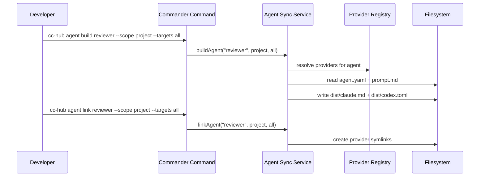
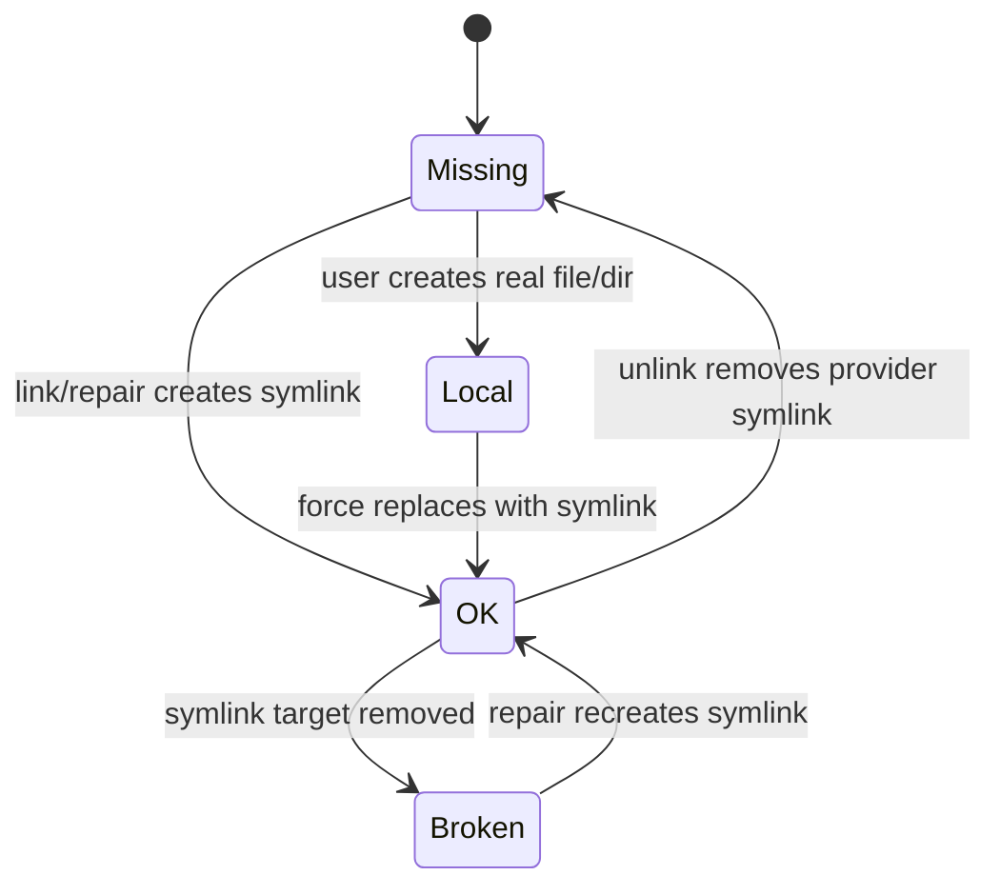
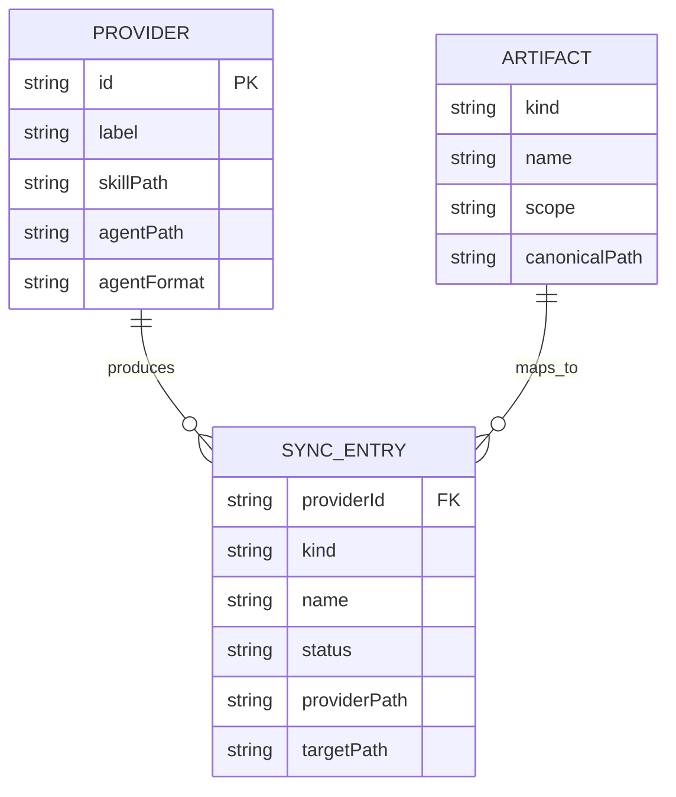

# Multi-provider Agent Sync for Claude and Codex Skills and Agents — Plan

- **Feature:** `002-multi-provider-agent-sync-for-claude-and-codex-skills-and-agents`
- **Status:** Approved
- **Date:** 2026-05-17

---

## Summary

Replace the Claude-only link helper with a provider-driven sync service that uses `.agent-sync` / `~/.agent-sync` as canonical sources, renders provider-native agent files, and exposes link/build/status/repair/clean workflows for skills and agents.

## Technical Context

| Aspect | Choice | Reason |
|---|---|---|
| Language | TypeScript | Existing strict Bun/TS CLI |
| CLI framework | Commander.js | Existing `create*Command()` pattern |
| Filesystem | Node `fs`/`path` | Symlink and temp-directory operations |
| Config | Constants/provider registry | Personal CLI; no DB or server needed |
| Tests | `bun:test` | Existing test strategy |
| Docs | `README.md`, `.agents/skills/cc-hub/SKILL.md` | Required by project instructions when commands/options change |

## Constitution Check

| Principle | Decision |
|---|---|
| Zero Server | Pass — all state is filesystem-local. |
| Credentials via Keychain | Pass — no secrets involved. |
| Single Entrypoint | Pass — commands remain Commander factories in `src/commands/`. |
| Fail Fast | Pass — invalid targets, missing `SKILL.md`, missing `agent.yaml`, and local path conflicts throw actionable errors. |
| Simplicity First | Pass — no database/config daemon; provider registry is static TypeScript data. |
| Explicit Over Implicit | Pass — sync scope and targets are explicit options with documented defaults. |

## Interaction Scenarios

```gherkin
Feature: Build and link project agent
  Scenario: Project agent sync succeeds
    Given the project has ".agent-sync/agents/reviewer/agent.yaml"
    And   the project has ".agent-sync/agents/reviewer/prompt.md"
    When  the developer runs "cc-hub agent build reviewer --scope project --targets all"
    And   the developer runs "cc-hub agent link reviewer --scope project --targets all"
    Then  generated Claude and Codex files exist in the agent dist directory
    And   provider paths are symlinks to those generated files

  Scenario: Unsupported target is rejected
    Given supported targets are "claude" and "codex"
    When  the developer asks for "--targets unknown-ai"
    Then  the command fails with supported target names
```



```gherkin
Feature: Sync status lifecycle
  Scenario: Broken link repaired
    Given an expected provider symlink points to a missing target
    When  status is computed
    Then  the entry state is BROKEN
    When  repair is executed
    Then  the symlink is recreated
    And   the entry state becomes OK

  Scenario: Local file protected
    Given a provider path exists as a normal file
    When  repair is executed without force
    Then  the entry state is LOCAL
    And   the file is not replaced
```



## Data Model



No persisted database entities are introduced; this ER diagram documents in-memory planning objects.

## Files

| File | Action | Responsibility |
|---|---|---|
| `src/services/agent-sync.ts` | Create | Provider registry, scope roots, parsing/rendering, symlink planning/execution, status formatting. |
| `src/commands/skill.ts` | Modify | Wire skill link/list/status/repair/unlink to agent-sync service. |
| `src/commands/agent.ts` | Modify | Wire agent create/build/link/list/status/repair/unlink to agent-sync service. |
| `src/commands/sync.ts` | Modify | Aggregate skill + agent run/status/repair/clean. |
| `src/commands/claude-link.ts` | Retain or deprecate | Keep if still referenced by command/rule; do not use for new skill/agent flows. |
| `tests/services/agent-sync.test.ts` | Create | Unit/integration filesystem tests for service behavior. |
| `tests/commands/agent-sync-cli.test.ts` | Create | Commander command-level tests in temp HOME/project. |
| `README.md` | Modify | Document new commands/options/locations. |
| `.agents/skills/cc-hub/SKILL.md` | Modify | Update cc-hub skill command reference. |
| `.specs/features/002.../progress.md` | Create | Implementation checkpoints. |
| `.specs/features/002.../implementation.md` | Create | FR/AC mapping. |
| `.specs/features/002.../changelog.md` | Create | Feature changelog. |

## Implementation Plan

### Step 1 — Agent-sync service types and provider registry

**FR covered:** FR-001.1: Canonical roots, FR-009.1: Target validation, FR-010.1: Provider registry

Create `src/services/agent-sync.ts` with:
- `SyncScope = "project" | "global" | "all"`
- `ProviderId = "claude" | "codex"`
- `ArtifactKind = "skill" | "agent"`
- `ProviderDefinition`
- `resolveScopes()`, `resolveProviders()`, `getCanonicalRoot()`
- provider definitions for:
  - Claude skills: `.claude/skills`, `~/.claude/skills`
  - Codex skills: `.agents/skills`, `~/.agents/skills`
  - Claude agents: `.claude/agents/*.md`, `~/.claude/agents/*.md`
  - Codex agents: `.codex/agents/*.toml`, `~/.codex/agents/*.toml`

### Step 2 — Portable source canonicalization

**FR covered:** FR-002.1: Skill canonicalization, FR-003.1: Agent source creation

Implement:
- `createAgentSource(name, options)`
- `canonicalizeSkillSource(pathOrName, options)`
- validation for `SKILL.md`, `agent.yaml`, `prompt.md`
- directory copy/symlink policy: canonical skill source is a symlink to the provided folder when source is outside `.agent-sync`; already-canonical folders remain unchanged.

### Step 3 — Agent rendering

**FR covered:** FR-004.1: Claude render, FR-004.2: Codex render

Implement:
- YAML-lite parser for simple `agent.yaml` metadata (`name`, `description`, `model`, `effort`, `tools`, `skills`, `targets`)
- `renderClaudeAgent(source)`
- `renderCodexAgent(source)`
- `buildAgent(name, options)` writes `dist/claude.md` and/or `dist/codex.toml`

### Step 4 — Symlink actions, status, repair, clean

**FR covered:** FR-005.1: Agent provider symlinks, FR-006.1: Status classification, FR-007.1: Repair, FR-008.1: Sync aggregation

Implement:
- `linkSkill()`, `linkAgent()`
- `statusSkills()`, `statusAgents()`, `statusAll()`
- `repairSkills()`, `repairAgents()`, `repairAll()`
- `cleanAll({ dryRun })`
- status values: `OK`, `MISSING`, `BROKEN`, `LOCAL`, `ERROR`
- `--force` replaces `LOCAL`; without force it reports and preserves.

### Step 5 — Command wiring

**FR covered:** FR-008.2: Sync commands, FR-009.2: CLI validation

Modify:
- `skill` command: `link`, `list`, `status`, `repair`, `unlink`
- `agent` command: `create`, `build`, `link`, `list`, `status`, `repair`, `unlink`
- `sync` command: `run`, `status`, `repair`, `clean`

Common options:
- `--scope <project|global|all>` default `global` for backward compatibility on link/list/unlink, `all` for sync
- `--targets <claude|codex|all>` default `claude` for backward compatibility on skill/agent direct commands, `all` for sync
- `--name <name>`
- `--force`
- `--dry-run`
- `--json`

### Step 6 — Tests

**FR covered:** FR-012.1: Real symlink tests

Create isolated temp filesystem tests:
- Project skill link creates `.claude` and `.agents` symlinks.
- Global skill link uses injected HOME.
- Agent create writes `agent.yaml` + `prompt.md`.
- Agent build writes Claude Markdown and Codex TOML with shared prompt.
- Agent link creates `.claude/agents/*.md` and `.codex/agents/*.toml` symlinks.
- Status detects OK/MISSING/BROKEN/LOCAL.
- Repair recreates missing/broken links.
- Fake provider registry test proves extensibility.
- CLI smoke tests execute command factories against temp cwd/HOME.

### Step 7 — Documentation and traceability

**FR covered:** FR-011.1: README docs, FR-011.2: cc-hub skill docs

Update:
- `README.md` skill/agent/sync sections.
- `.agents/skills/cc-hub/SKILL.md` command reference.
- `implementation.md`, feature changelog, global changelog, registry row.

## Testing Strategy

| Test | Command |
|---|---|
| Targeted service tests | `bun test tests/services/agent-sync.test.ts` |
| Targeted command tests | `bun test tests/commands/agent-sync-cli.test.ts` |
| Full typecheck | `bun tsc --noEmit` |
| Full suite | `bun test` |
| Real smoke project | Run built command with `HOME=<tmp-home>` in a temp project and inspect symlinks with `test -L`/`readlink` |

## Risks & Considerations

- Existing `claude-link.ts` also backs `command` and `rule`; do not break those commands while moving `skill` and `agent`.
- Existing default behavior installs globally for Claude. Preserve simple old invocations by defaulting direct `skill` and `agent` targets to Claude/global.
- TOML output must escape triple quotes or backslashes in prompts safely.
- Tests must never touch the real `~/.claude`, `~/.agents`, or `~/.codex`; inject `homeDir` in service options and set `HOME` in smoke tests.
