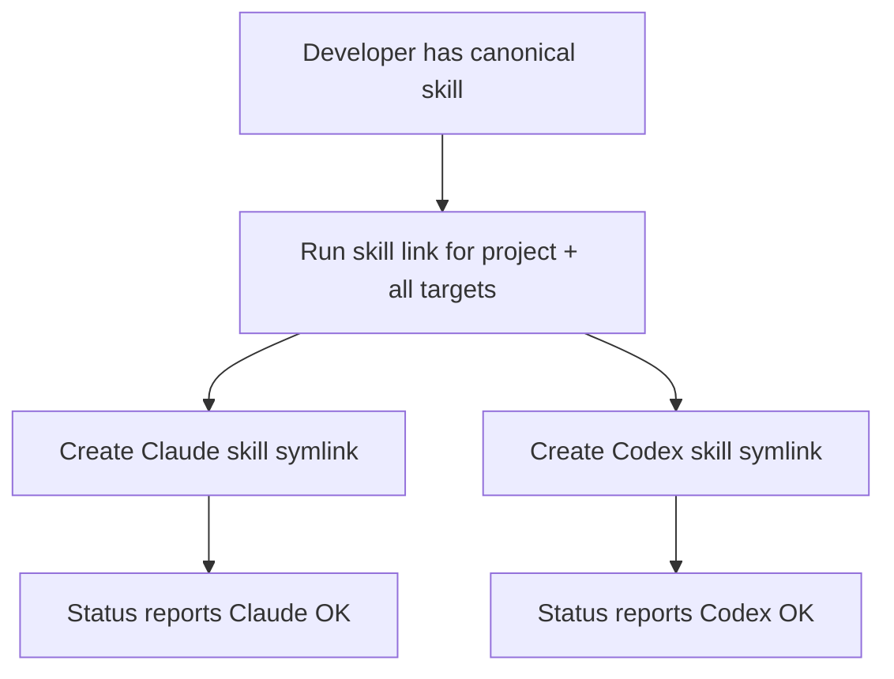
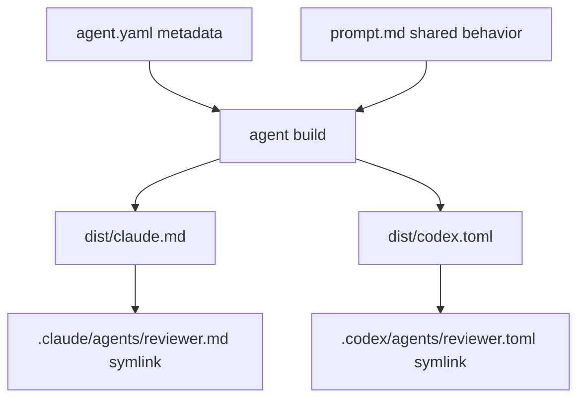
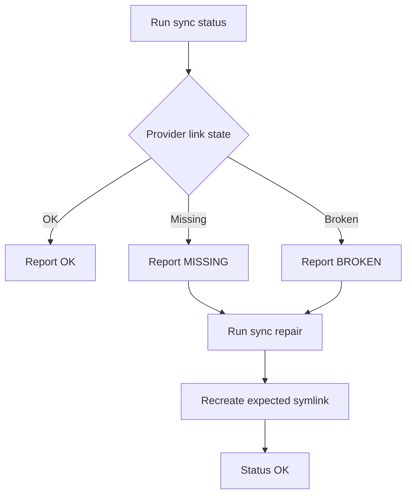
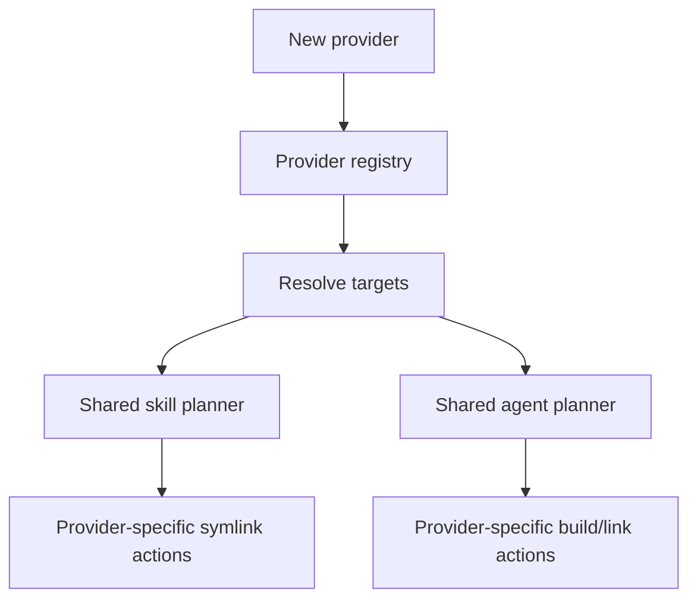

# Multi-provider Agent Sync for Claude and Codex Skills and Agents

- **Branch:** `main`
- **Date:** 2026-05-17
- **Status:** Implemented
- **Input:** The user wants cc-hub's existing Claude-only symlink commands revised so one canonical `.agent-sync` source can publish skills and agents to both Claude Code and Codex, globally and per project. Skills should be symlinked as folders because Claude and Codex both consume `SKILL.md` folders. Agents should use a single editable source (`agent.yaml` + `prompt.md`) and generate provider-native files (`claude.md`, `codex.toml`) because Claude and Codex agent formats differ. The feature must expose status/repair commands, verify real symlink behavior, verify generated Claude/Codex agents, and keep the system open for future providers.

---

## User Scenarios & Testing

### Story 1 — Link a portable skill to Claude and Codex (P1)

**Description:** As the developer, I can link a skill once from a canonical `.agent-sync` source and have it appear in both Claude and Codex provider locations.

**Priority reason:** This is the core compatibility use case. Skills are the easiest portable artifact and should work through symlinks without format conversion.

**Independent test:** In a temporary project, create `.agent-sync/skills/example-skill/SKILL.md`, run the link/sync command for project scope and all targets, and assert that `.claude/skills/example-skill` and `.agents/skills/example-skill` are symlinks to the canonical skill directory.

```gherkin
Feature: Portable skill symlinks
  Scenario: Link one project skill to Claude and Codex
    Given a project contains ".agent-sync/skills/example-skill/SKILL.md"
    When  the developer runs "cc-hub skill link .agent-sync/skills/example-skill --scope project --targets all"
    Then  ".claude/skills/example-skill" is a symlink to ".agent-sync/skills/example-skill"
    And   ".agents/skills/example-skill" is a symlink to ".agent-sync/skills/example-skill"

  Scenario: Report an existing portable skill in status
    Given a project has valid Claude and Codex skill symlinks for "example-skill"
    When  the developer runs "cc-hub skill status --scope project --targets all"
    Then  the output reports the Claude skill link as OK
    And   the output reports the Codex skill link as OK
```



### Story 2 — Generate provider-native agents from one source (P1)

**Description:** As the developer, I can define an agent once with `agent.yaml` and `prompt.md`, then generate and link provider-native Claude and Codex agent files.

**Priority reason:** Claude and Codex agent formats are not the same. The feature must prevent duplicated manual maintenance while still respecting provider-native file formats.

**Independent test:** In a temporary project, create `.agent-sync/agents/reviewer/agent.yaml` and `prompt.md`, run `agent build` and `agent link`, and assert that `dist/claude.md`, `dist/codex.toml`, `.claude/agents/reviewer.md`, and `.codex/agents/reviewer.toml` exist with correct generated content and symlink targets.

```gherkin
Feature: Portable agent generation
  Scenario: Generate Claude and Codex agent files from one source
    Given ".agent-sync/agents/reviewer/agent.yaml" declares name "reviewer"
    And   ".agent-sync/agents/reviewer/prompt.md" contains the shared instructions
    When  the developer runs "cc-hub agent build reviewer --scope project --targets all"
    Then  ".agent-sync/agents/reviewer/dist/claude.md" contains Claude frontmatter and the shared prompt
    And   ".agent-sync/agents/reviewer/dist/codex.toml" contains Codex TOML and the shared prompt as developer instructions

  Scenario: Ignore Claude model aliases when generating Codex TOML
    Given ".agent-sync/agents/reviewer/agent.yaml" declares model "sonnet"
    When  the developer runs "cc-hub agent build reviewer --scope project --targets codex"
    Then  ".agent-sync/agents/reviewer/dist/codex.toml" is generated
    And   the Codex TOML does not contain a model entry copied from the Claude alias

  Scenario: Create and publish one project-scoped Codex agent
    Given a project has no agent named "reviewer"
    When  the developer runs "cc-hub agent create reviewer --scope project --targets codex"
    Then  ".agent-sync/agents/reviewer/agent.yaml" and "prompt.md" exist
    And   ".agent-sync/agents/reviewer/dist/codex.toml" is generated
    And   ".codex/agents/reviewer.toml" is a symlink to the generated Codex TOML file

  Scenario: Link generated agent files to both providers
    Given provider-native agent files exist in ".agent-sync/agents/reviewer/dist"
    When  the developer runs "cc-hub agent link reviewer --scope project --targets all"
    Then  ".claude/agents/reviewer.md" is a symlink to the generated Claude file
    And   ".codex/agents/reviewer.toml" is a symlink to the generated Codex file
```



### Story 3 — Inspect, repair, and clean sync state (P1)

**Description:** As the developer, I can ask cc-hub what is currently synced, detect broken/missing links, repair expected links, and remove orphaned provider links.

**Priority reason:** Symlink systems fail silently when files move. The CLI must make state visible and recoverable.

**Independent test:** Create valid links, remove one target manually, run status and repair, and assert that status reports the missing/broken link before repair and OK after repair.

```gherkin
Feature: Sync status and repair
  Scenario: Status detects a broken project skill link
    Given ".claude/skills/example-skill" points to a missing target
    When  the developer runs "cc-hub sync status --scope project --targets all"
    Then  the output reports the Claude skill link as BROKEN
    And   the command exits successfully for inspection

  Scenario: Repair recreates a missing provider link
    Given ".agent-sync/skills/example-skill" exists
    And   ".agents/skills/example-skill" is missing
    When  the developer runs "cc-hub sync repair --scope project --targets codex"
    Then  ".agents/skills/example-skill" is recreated as a symlink
    And   a subsequent "cc-hub sync status --scope project --targets codex" reports OK
```



### Story 4 — Keep provider support extensible (P2)

**Description:** As a maintainer, I can add another provider later by adding a provider definition and renderer without rewriting skill/agent command logic.

**Priority reason:** The user explicitly asked to open the system so a future agent/provider can be added easily.

**Independent test:** Add a fake provider in tests with skill and agent locations, run the service layer against a temp project, and assert that the same sync planner produces provider-specific actions without changing command code.

```gherkin
Feature: Extensible sync providers
  Scenario: Sync planner accepts a new provider definition
    Given a test provider named "example-ai" defines skill and agent destinations
    When  the sync planner computes actions for an existing skill and agent
    Then  the planner returns symlink actions for the new provider
    And   existing Claude and Codex provider behavior remains unchanged

  Scenario: Unsupported target names fail clearly
    Given the developer asks for target "unknown-ai"
    When  cc-hub resolves sync targets
    Then  the command fails with an actionable error listing supported targets
```



---

## Acceptance Criteria

| ID | Given | When | Then | Priority | Story |
|---|---|---|---|---|---|
| AC-001 | a canonical `.agent-sync/skills/<name>` exists in the project | the developer runs `cc-hub skill link <path-or-name> --scope project --targets all` | `.claude/skills/<name>` and `.agents/skills/<name>` are symlinks to the canonical skill | P1 | Story 1 |
| AC-002 | a canonical `~/.agent-sync/skills/<name>` exists in HOME | the developer runs `cc-hub skill link <path-or-name> --scope global --targets all` | `~/.claude/skills/<name>` and `~/.agents/skills/<name>` are symlinks to the canonical skill | P1 | Story 1 |
| AC-003 | a project with no agent named `<name>` | the developer runs `cc-hub agent create <name> --scope project --targets codex` | `.agent-sync/agents/<name>/agent.yaml`, `prompt.md`, `dist/codex.toml`, and `.codex/agents/<name>.toml` exist, with the provider path symlinked to the generated TOML | P1 | Story 2 |
| AC-004 | `.agent-sync/agents/<name>/agent.yaml` and `prompt.md` exist | the developer runs `cc-hub agent build <name> --scope project --targets all` | `dist/claude.md` and `dist/codex.toml` are generated without manual duplication; Claude-only model aliases are not copied into Codex TOML | P1 | Story 2 |
| AC-005 | generated `dist/claude.md` and `dist/codex.toml` exist | the developer runs `cc-hub agent link <name> --scope project --targets all` | `.claude/agents/<name>.md` and `.codex/agents/<name>.toml` are symlinks to the generated files | P1 | Story 2 |
| AC-006 | provider symlinks are in mixed states (valid, missing, broken, local) | the developer runs a status command with scope/target filters | each provider path is reported as OK, MISSING, BROKEN, or LOCAL | P1 | Story 3 |
| AC-007 | a canonical source exists and a provider symlink is missing or broken | the developer runs a repair command | the missing/broken symlink is recreated to the canonical source | P1 | Story 3 |
| AC-008 | a project has skills and agents with multiple providers | the developer runs `sync run`, `sync status`, `sync repair`, or `sync clean --dry-run` | the command operates across skills and agents using the same provider registry as `skill`/`agent` | P1 | Story 3 |
| AC-009 | the developer passes an unsupported target name | target resolution executes | the command fails with a clear error listing supported targets | P2 | Story 4 |
| AC-010 | a new provider definition is added with destinations and renderer | the sync planner runs | provider-specific actions are produced without changing command handlers | P2 | Story 4 |
| AC-011 | a command, option, or model-neutral behavior is added or changed | the change is committed | `README.md` and `.agents/skills/cc-hub/SKILL.md` are updated to reflect it | P1 | Documentation |
| AC-012 | a temporary HOME and project directory are provisioned | filesystem tests run | project-scope and global-scope symlink creation are verified without touching the user's real provider directories | P1 | Testing |

---

## Functional Requirements

| ID | Requirement | Maps To |
|---|---|---|
| FR-001 | The system MUST introduce a canonical `.agent-sync` root for project scope and `~/.agent-sync` root for global scope. | AC-001, AC-002 |
| FR-002 | Skill linking MUST canonicalize a source skill into the canonical sync root and then symlink provider skill directories from that canonical source. | AC-001, AC-002 |
| FR-003 | Agent creation MUST produce a portable source directory containing `agent.yaml` and `prompt.md`, then build and link the selected provider outputs for the selected scope. | AC-003 |
| FR-004 | Agent building MUST render Claude Markdown and Codex TOML provider files from the portable source. | AC-004 |
| FR-005 | Agent linking MUST symlink provider agent files to generated provider-native files, not to the whole agent source directory. | AC-005 |
| FR-006 | Status reporting MUST inspect canonical sources and provider symlinks and classify each provider path as OK, MISSING, BROKEN, LOCAL, or ERROR. | AC-006 |
| FR-007 | Repair MUST recreate missing/broken symlinks using the same sync planning logic as link/sync run. | AC-007, AC-008 |
| FR-008 | Sync commands MUST aggregate skill and agent synchronization across scope and target filters. | AC-008 |
| FR-009 | Target resolution MUST validate supported targets and report actionable errors. | AC-009 |
| FR-010 | Provider definitions MUST be data-driven enough to add another provider with destinations and render behavior without changing command handlers. | AC-010 |
| FR-011 | Documentation MUST describe all changed commands/options in both `README.md` and `.agents/skills/cc-hub/SKILL.md`. | AC-011 |
| FR-012 | Tests MUST exercise real symlink creation and generated agent files inside isolated temporary directories. | AC-012 |

---

## Key Entities

- **Sync Scope:** `project`, `global`, or `all`; determines whether roots are relative to the current project or user home.
- **Provider Target:** A supported AI tool target such as `claude` or `codex`.
- **Artifact Kind:** `skill` or `agent`.
- **Canonical Skill Source:** `.agent-sync/skills/<name>` or `~/.agent-sync/skills/<name>`.
- **Portable Agent Source:** `.agent-sync/agents/<name>/agent.yaml` and `prompt.md`.
- **Generated Agent Output:** `.agent-sync/agents/<name>/dist/claude.md` and `dist/codex.toml`.
- **Sync Status:** `OK`, `MISSING`, `BROKEN`, `LOCAL`, or `ERROR`.

---

## Edge Cases

- Existing provider path is a real directory or file, not a symlink: report `LOCAL` and require `--force` before replacement.
- A skill source lacks `SKILL.md`: fail before creating provider links.
- An agent source lacks `agent.yaml` or `prompt.md`: fail before build/link with the missing file path.
- A generated agent file is stale after prompt/config edits: `agent build` rewrites generated files before link/sync run.
- Claude-only agent models (`haiku`, `sonnet`, `opus`, or Claude IDs) are valid for Claude outputs but omitted from generated Codex TOML.
- Codex-compatible OpenAI canonical IDs are translated to Codex-native model names when rendered in Codex TOML.
- `--targets all` expands only to providers that support the requested artifact kind.
- Global-scope tests must use an injected/test HOME so they never mutate `~/.claude`, `~/.agents`, or `~/.codex` during automated tests.
- Existing Claude-only command behavior should remain usable for simple `cc-hub skill link <path>` and `cc-hub agent link <path>` invocations through sensible defaults.

---

## Success Criteria

| ID | Criterion | Measurement |
|---|---|---|
| SC-001 | Project and global skill symlink tests pass. | `bun test` includes isolated filesystem tests for Claude and Codex skill links. |
| SC-002 | Agent generation and symlink tests pass. | `bun test` verifies Claude Markdown, Codex TOML, and provider symlinks. |
| SC-003 | Real CLI smoke tests pass in temporary HOME/project directories. | Manual or scripted runs create/list/status/repair without touching real provider directories. |
| SC-004 | Full validation passes. | `bun tsc --noEmit && bun test` passes. |
| SC-005 | LiveSpec traceability is complete. | `implementation.md` maps all FR and AC to files/tests with implemented status. |
