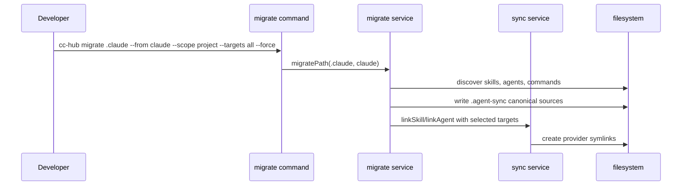
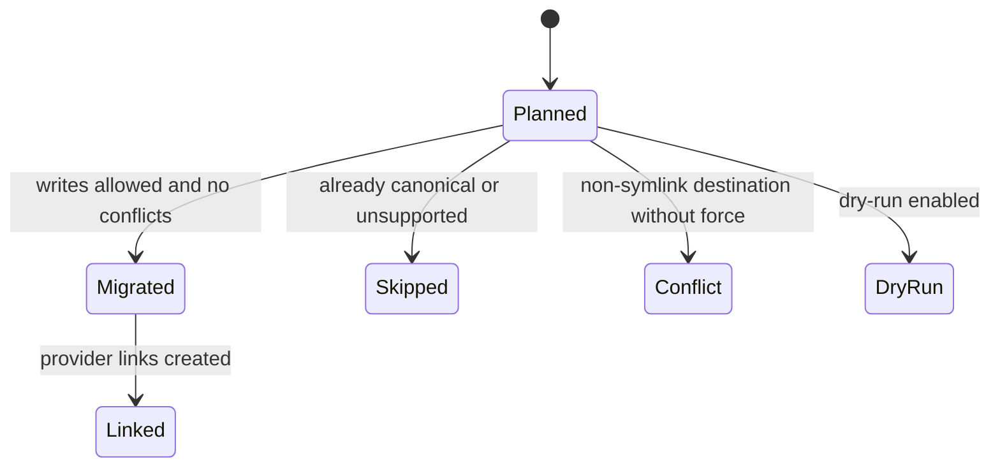
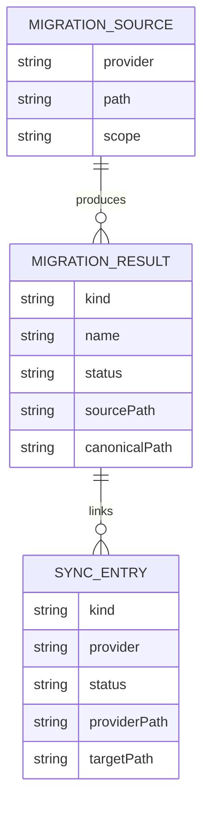

# Migrate Provider Folders to Agent Sync — Plan

- **Feature:** `003-migrate-provider-folders-to-agent-sync`
- **Status:** Approved
- **Date:** 2026-05-18

---

## Summary

Add a `cc-hub migrate` command that imports provider folders or individual provider artifacts into `.agent-sync`, converts Claude commands into portable skills, converts Claude/Codex agents into portable sources, and recreates provider links with the existing sync service.

## Technical Context

| Aspect | Choice | Reason |
|---|---|---|
| Language | TypeScript | Existing Bun CLI codebase |
| CLI | Commander.js | Existing `create*Command()` factories |
| Filesystem | Node `fs`/`path` | Migration is local file discovery, copying, rendering, and symlinking |
| Parsing | Small frontmatter/TOML parsers | Agent formats are constrained and no parser dependency exists today |
| Tests | `bun:test` | Existing test suite |
| Docs | `README.md`, `.agent-sync/skills/cc-hub/SKILL.md` | Required for command changes |

## Constitution Check

| Principle | Decision |
|---|---|
| Zero Server | Pass — migration is local only. |
| Credentials via Keychain | Pass — no secrets are introduced. |
| Single Entrypoint | Pass — command remains under `cc-hub migrate`. |
| Fail Fast | Pass — invalid provider origins, missing paths, and unsafe conflicts fail or report clearly. |
| Simplicity First | Pass — folder discovery delegates to the existing link/build service. |
| Explicit Over Implicit | Pass — `--from`, `--scope`, `--targets`, `--force`, and `--dry-run` make migration behavior visible. |

## Interaction Scenarios

```gherkin
Feature: Folder migration service
  Scenario: Claude folder migration creates portable artifacts
    Given a ".claude" folder contains skills, agents, and commands
    When the migrate service runs with provider "claude"
    Then canonical skill and agent sources are created
    And requested provider links are created or reported
```



```gherkin
Feature: Migration result state
  Scenario: Dry run preserves filesystem
    Given a source provider folder exists
    When migration runs with "--dry-run"
    Then result records planned writes and links
    And no file is created or replaced
```



## Data Model



No persisted data model is added; these are in-memory result records.

## Files

| File | Action | Responsibility |
|---|---|---|
| `src/services/agent-sync.ts` | Modify | Export safe path/render helpers needed by migration. |
| `src/services/agent-sync-migrate.ts` | Create | Discover provider folders, convert artifacts, copy canonical sources, call link/build functions, format results. |
| `src/commands/migrate.ts` | Create | Commander entrypoint for folder and targeted migrations. |
| `src/cli.ts` | Modify | Register `createMigrateCommand()`. |
| `tests/services/agent-sync-migrate.test.ts` | Create | Filesystem migration tests for folder, targeted, dry-run, and conflicts. |
| `tests/commands/agent-sync-cli.test.ts` | Modify | CLI wiring tests for `migrate`. |
| `README.md` | Modify | Document command syntax and migration behavior. |
| `.agent-sync/skills/cc-hub/SKILL.md` | Modify | Update canonical skill reference. |
| `.specs/features/003-migrate-provider-folders-to-agent-sync/*` | Create/modify | Feature spec, plan, progress, implementation, changelog. |

## Implementation Plan

1. Write failing service tests for folder migration from `.claude`, folder migration from `.codex`, targeted command migration, dry-run, and conflict preservation.
2. Export only the helper functions needed from `agent-sync.ts` or duplicate small parsing helpers if exporting would expose too much.
3. Create `agent-sync-migrate.ts` with discovery for Claude `skills`, `agents`, `commands` and Codex `agents`.
4. Implement conversion:
   - skills copy recursively into `.agent-sync/skills/<name>`;
   - Claude commands become `.agent-sync/skills/<name>/SKILL.md`;
   - Claude agents become `.agent-sync/agents/<name>/agent.yaml` and `prompt.md`;
   - Codex agents become `.agent-sync/agents/<name>/agent.yaml` and `prompt.md`.
5. Call existing `linkSkill()` and `linkAgent()` after each write unless `--dry-run`.
6. Create `src/commands/migrate.ts` with folder default action plus `skill`, `agent`, and `command` subcommands.
7. Register the command in `src/cli.ts`.
8. Update README and `.agent-sync/skills/cc-hub/SKILL.md`.
9. Complete implementation mapping and changelog, then run typecheck, tests, LiveSpec validation, and CLI smoke tests.

## Testing Strategy

| Layer | Coverage |
|---|---|
| Service tests | Direct migration behavior with injected temp project and home roots. |
| CLI tests | Commander options, output, and command registration. |
| Typecheck | Full TypeScript validation via `bun tsc --noEmit`. |
| Smoke test | Real `bun bin/cc-hub.ts migrate` against temp `.claude` folder. |
| LiveSpec | Validate feature 003 artifacts with `livespec validate`. |

## Risks & Considerations

- Replacing a real provider directory is destructive if done incorrectly; migration must preserve by default and only replace with `--force`.
- Codex TOML parsing is intentionally limited to the fields cc-hub emits and common quoted/triple-quoted values.
- Claude commands do not map perfectly to Codex commands, so command migration intentionally wraps them as skills.
