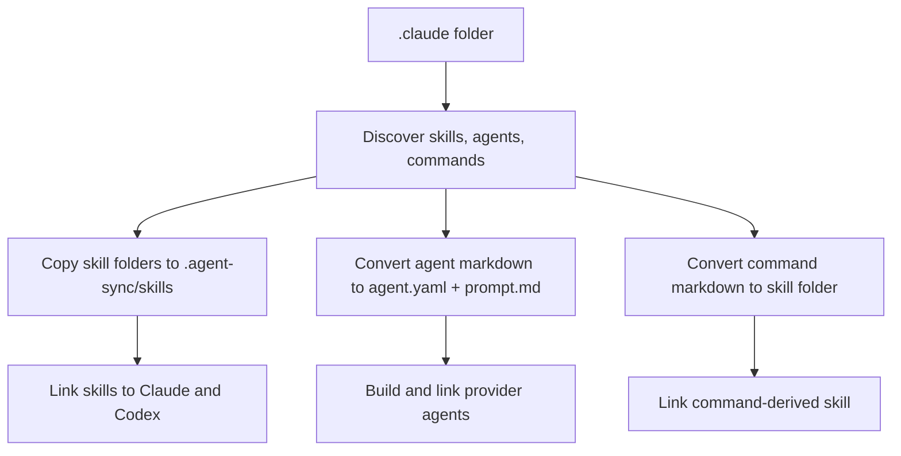
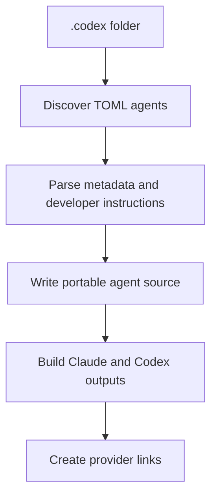
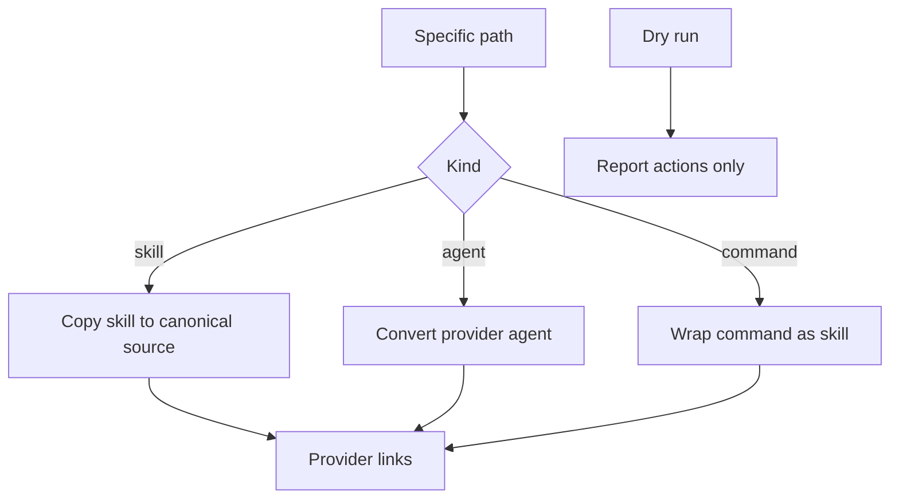
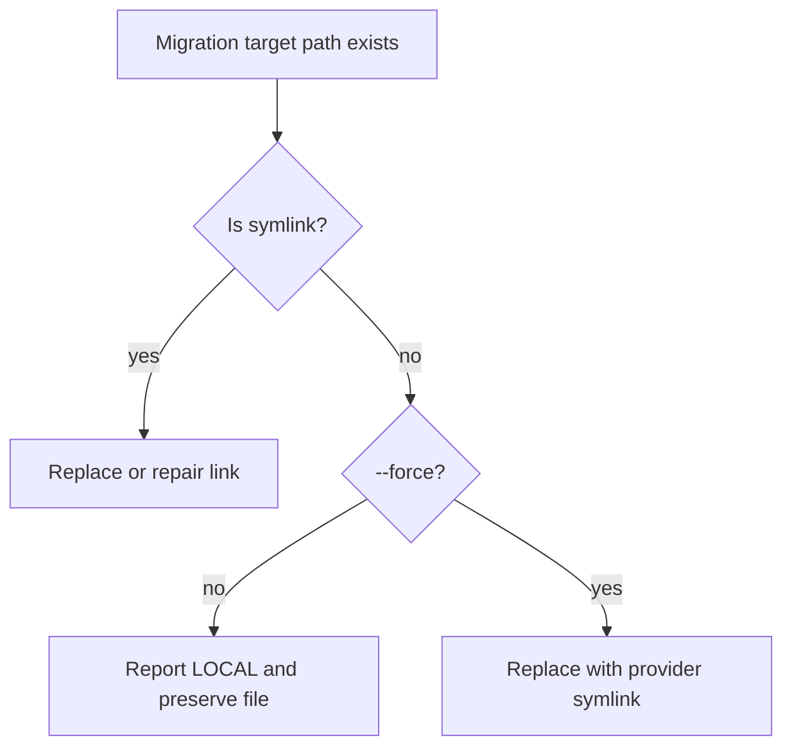

# Migrate Provider Folders to Agent Sync

- **Branch:** `main`
- **Date:** 2026-05-18
- **Status:** Implemented
- **Input:** The user wants a `cc-hub migrate` command that can import existing Claude Code or Codex configuration into `.agent-sync` instead of forcing item-by-item migration. When a developer passes a provider folder such as `.claude` or `.codex`, cc-hub should discover skills, agents, and Claude commands, convert them into portable agent-sync sources where possible, and recreate provider links locally or globally. Claude commands should become skills because Codex has no command equivalent.

---

## User Scenarios & Testing

### Story 1 — Migrate an entire Claude folder (P1)

**Description:** As the developer, I can run one command on `.claude` and import all supported Claude artifacts into `.agent-sync`.

**Priority reason:** The easiest workflow is folder-first migration from an existing Claude Code setup.

**Independent test:** In a temporary project, create `.claude/skills/reviewer`, `.claude/agents/reviewer.md`, and `.claude/commands/review.md`, run `cc-hub migrate .claude --from claude --scope project --targets all --force`, and assert canonical sources plus Claude/Codex provider links exist.

```gherkin
Feature: Folder migration
  Scenario: Migrate a project Claude folder
    Given a project contains ".claude/skills/reviewer/SKILL.md"
    And   a project contains ".claude/agents/reviewer.md"
    And   a project contains ".claude/commands/review.md"
    When  the developer runs "cc-hub migrate .claude --from claude --scope project --targets all --force"
    Then  ".agent-sync/skills/reviewer/SKILL.md" exists
    And   ".agent-sync/agents/reviewer/agent.yaml" exists
    And   ".agent-sync/skills/review/SKILL.md" exists
    And   Claude and Codex provider links point to the canonical agent-sync outputs
```



### Story 2 — Migrate an entire Codex folder (P1)

**Description:** As the developer, I can run one command on `.codex` and import Codex agents into portable agent-sync agents.

**Priority reason:** Codex stores agents differently from Claude, so the migration must preserve useful metadata and instructions.

**Independent test:** In a temporary project, create `.codex/agents/reviewer.toml`, run `cc-hub migrate .codex --from codex --scope project --targets all --force`, and assert `agent.yaml`, `prompt.md`, generated Claude/Codex files, and provider links exist.

```gherkin
Feature: Codex folder migration
  Scenario: Migrate a project Codex folder
    Given a project contains ".codex/agents/reviewer.toml"
    When  the developer runs "cc-hub migrate .codex --from codex --scope project --targets all --force"
    Then  ".agent-sync/agents/reviewer/agent.yaml" contains "name: reviewer"
    And   ".agent-sync/agents/reviewer/prompt.md" contains the Codex developer instructions
    And   ".claude/agents/reviewer.md" is linked to generated Claude output
    And   ".codex/agents/reviewer.toml" is linked to generated Codex output
```



### Story 3 — Migrate a specific artifact when needed (P2)

**Description:** As the developer, I can migrate one skill, one agent, or one Claude command when a full folder migration is too broad.

**Priority reason:** Some projects need incremental migration without touching every provider file at once.

**Independent test:** Run `cc-hub migrate skill .claude/skills/a`, `cc-hub migrate agent .claude/agents/a.md`, and `cc-hub migrate command .claude/commands/a.md` in temp workspaces and assert each creates only the expected canonical artifact and links.

```gherkin
Feature: Targeted migration
  Scenario: Migrate one Claude command as a skill
    Given ".claude/commands/audit.md" contains command instructions
    When  the developer runs "cc-hub migrate command .claude/commands/audit.md --scope project --targets all --force"
    Then  ".agent-sync/skills/audit/SKILL.md" exists
    And   ".agents/skills/audit" is a symlink to ".agent-sync/skills/audit"

  Scenario: Dry-run reports planned migration without writing
    Given ".claude/skills/audit/SKILL.md" exists
    When  the developer runs "cc-hub migrate skill .claude/skills/audit --scope project --targets all --dry-run"
    Then  the output reports planned canonical and provider paths
    And   no ".agent-sync/skills/audit" directory is created
```



### Story 4 — Protect existing local files and report status (P1)

**Description:** As the developer, I can see what migrate changed or skipped, and local non-symlink provider files are only replaced when I opt in with `--force`.

**Priority reason:** Migration touches real configuration folders; it must be inspectable and conservative unless forced.

**Independent test:** Put a real provider file at a target path, run migrate without `--force`, and assert the result reports a protected local conflict. Re-run with `--force` and assert the provider path becomes a symlink.

```gherkin
Feature: Migration conflict handling
  Scenario: Existing provider file is protected without force
    Given ".agents/skills/audit" exists as a real directory
    And   ".claude/commands/audit.md" exists
    When  the developer runs "cc-hub migrate command .claude/commands/audit.md --scope project --targets codex"
    Then  the output reports the Codex provider path as LOCAL
    And   ".agents/skills/audit" remains a real directory

  Scenario: Existing provider file is replaced with force
    Given ".agents/skills/audit" exists as a real directory
    And   ".claude/commands/audit.md" exists
    When  the developer runs "cc-hub migrate command .claude/commands/audit.md --scope project --targets codex --force"
    Then  ".agents/skills/audit" is a symlink to ".agent-sync/skills/audit"
```



---

## Acceptance Criteria

| ID | Criterion | Priority | Story |
|---|---|---|---|
| AC-001 | `cc-hub migrate <folder> --from claude --scope project --targets all --force` discovers `skills`, `agents`, and `commands` under a `.claude` folder and migrates supported entries into project `.agent-sync`. | P1 | Story 1 |
| AC-002 | Claude command markdown files are converted to canonical skills in `.agent-sync/skills/<command-name>/SKILL.md` because Codex has no command primitive. | P1 | Story 1 |
| AC-003 | `cc-hub migrate <folder> --from codex --scope project --targets all --force` discovers Codex TOML agents and migrates them into portable agent sources. | P1 | Story 2 |
| AC-004 | Claude Markdown agents are converted into `.agent-sync/agents/<name>/agent.yaml` and `prompt.md` while preserving frontmatter metadata and body instructions. | P1 | Story 1 |
| AC-005 | Codex TOML agents are converted into `.agent-sync/agents/<name>/agent.yaml` and `prompt.md` while preserving `name`, `description`, `model`, `reasoning_effort`, and `developer_instructions`. | P1 | Story 2 |
| AC-006 | Targeted `migrate skill`, `migrate agent`, and `migrate command` subcommands migrate one artifact and then recreate requested provider links. | P2 | Story 3 |
| AC-007 | `--dry-run` reports planned actions without creating, replacing, or deleting files. | P1 | Story 3 |
| AC-008 | Existing provider files or directories are protected unless `--force` is passed; conflicts are visible in the output. | P1 | Story 4 |
| AC-009 | Migration outputs include enough structured data for JSON output and readable tabular status for humans. | P2 | Story 4 |
| AC-010 | README and the canonical cc-hub skill documentation describe migrate syntax, folder behavior, command conversion, and conflict options. | P1 | Documentation |
| AC-011 | Tests cover folder migration, targeted migration, dry-run behavior, conflict handling, and CLI command wiring in isolated temp project/HOME directories. | P1 | Testing |

## Functional Requirements

| ID | Requirement | Maps To |
|---|---|---|
| FR-001 | The system MUST add a top-level `cc-hub migrate` command that accepts a provider folder path and `--from claude|codex`. | AC-001, AC-003 |
| FR-002 | Claude folder migration MUST discover `skills/*`, `agents/*.md`, and `commands/*.md`. | AC-001 |
| FR-003 | Claude commands MUST be converted into portable skill folders with valid `SKILL.md` frontmatter and the original command content. | AC-002 |
| FR-004 | Claude Markdown agents MUST be parsed into portable `agent.yaml` metadata and `prompt.md` instructions. | AC-004 |
| FR-005 | Codex TOML agents MUST be parsed into portable `agent.yaml` metadata and `prompt.md` instructions. | AC-003, AC-005 |
| FR-006 | Migrated artifacts MUST be linked or repaired for requested scope and provider targets using the same provider paths as feature 002. | AC-001, AC-003, AC-006 |
| FR-007 | Targeted subcommands MUST support migrating one skill, one provider agent, or one Claude command. | AC-006 |
| FR-008 | Dry-run mode MUST avoid all filesystem writes and report planned operations. | AC-007 |
| FR-009 | Non-symlink provider conflicts MUST be preserved unless `--force` is provided. | AC-008 |
| FR-010 | Migration results MUST be printable as JSON or human-readable rows. | AC-009 |
| FR-011 | Documentation MUST be updated when the migrate command and options are added. | AC-010 |
| FR-012 | Automated tests MUST verify real filesystem behavior without touching the user's real home configuration. | AC-011 |

## Key Entities

- **Migration Source:** A provider folder or artifact path supplied to `cc-hub migrate`.
- **Provider Origin:** `claude` or `codex`; determines discovery and parsing rules.
- **Migrated Artifact:** A skill or agent created in `.agent-sync`.
- **Command-Derived Skill:** A Claude command converted into a `SKILL.md` folder.
- **Migration Result:** A record containing kind, name, source path, canonical path, status, and provider link entries.

## Edge Cases

- A folder contains unsupported files: skip them and report only supported entries.
- A source skill is already a symlink to `.agent-sync`: treat it as already canonical and repair requested provider links.
- A provider agent lacks optional description/model fields: use the filename-derived name and a conservative default description.
- A Claude command file has no frontmatter: create skill frontmatter from the filename.
- A canonical destination already exists: require `--force` unless it is already the same symlink/real path.
- A provider target exists as a real file or directory: report `LOCAL` unless `--force` is passed.
- Global migration must use `~/.agent-sync` and global provider folders, while tests inject HOME.

## Success Criteria

- **SC-001:** Full `bun test` passes after implementation.
- **SC-002:** `bun tsc --noEmit` passes.
- **SC-003:** LiveSpec validation for feature 003 passes in warn-only mode.
- **SC-004:** A real CLI smoke test migrates a temporary `.claude` folder with a skill, agent, and command into project `.agent-sync`.
