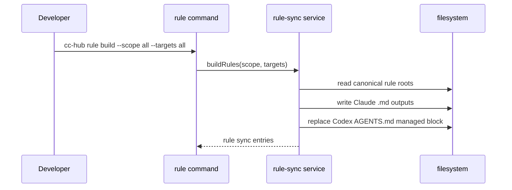
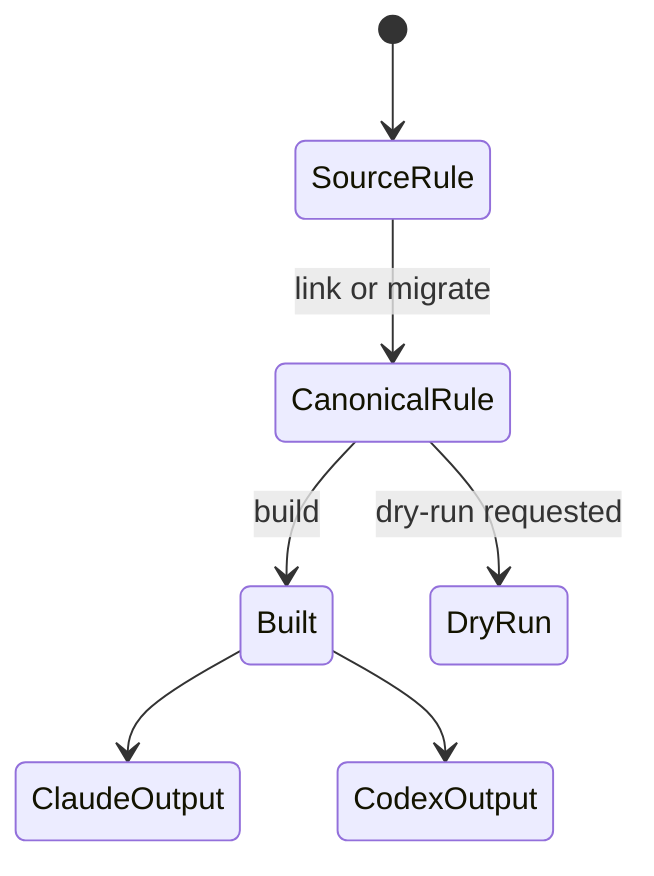
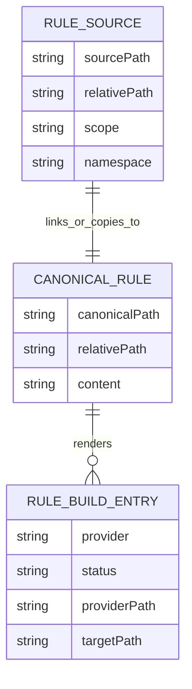

# Portable Agent Sync Rules — Plan

- **Feature:** `004-portable-agent-sync-rules`
- **Status:** Approved
- **Date:** 2026-05-18

---

## Summary

Add canonical rule management under `.agent-sync/rules` and `~/.agent-sync/rules`, generate Claude-native rule files plus managed Codex `AGENTS.md` blocks, and extend rule/migrate CLI commands with scoped, target-aware rule workflows.

## Technical Context

| Aspect | Choice | Reason |
|---|---|---|
| Language | TypeScript | Existing Bun CLI codebase |
| CLI | Commander.js | Existing command factory pattern |
| Filesystem | Node `fs`/`path` | Rules are local Markdown files and symlinks |
| Rendering | Deterministic Markdown generation | Codex rules are prompt guidance, not executable config |
| Tests | `bun:test` | Existing test suite |
| Docs | `README.md`, `.agent-sync/skills/cc-hub/SKILL.md` | Required when command behavior changes |

## Constitution Check

| Principle | Decision |
|---|---|
| Zero Server | Pass — all rule sync is local filesystem work. |
| Credentials via Keychain | Pass — no credentials are introduced. |
| Single Entrypoint | Pass — behavior remains under `cc-hub rule`, `cc-hub migrate`, and `cc-hub sync`. |
| Fail Fast | Pass — missing files, unsupported targets, and unsafe local conflicts report clearly. |
| Simplicity First | Pass — one canonical source, generated provider outputs. |
| Explicit Over Implicit | Pass — scope, targets, namespace, dry-run, and force are explicit flags. |

## Interaction Scenarios

```gherkin
Feature: Rule build service
  Scenario: Build project rule outputs
    Given canonical project rules exist
    When the build service runs for project scope and all targets
    Then Claude rule files are generated
    And the project AGENTS.md managed block is replaced

  Scenario: Build global rule outputs
    Given canonical global rules exist
    When the build service runs for global scope and all targets
    Then global Claude rule files are generated
    And the global Codex AGENTS.md managed block is replaced
```



```gherkin
Feature: Rule artifact state
  Scenario: Link one rule
    Given a source rule file exists
    When rule link runs
    Then a canonical symlink is created
    And generated outputs are rebuilt

  Scenario: Migrate Claude rules
    Given Claude rule files exist
    When rule migration runs
    Then canonical rules are written
    And generated outputs are rebuilt
```



## Data Model



No database schema is added. These entities are in-memory records and filesystem artifacts.

## Files

| File | Action | Responsibility |
|---|---|---|
| `src/services/agent-sync-rules.ts` | Create | Canonical rule roots, linking, listing, status, build, unlink, managed block rendering. |
| `src/services/agent-sync-migrate.ts` | Modify | Add targeted and folder rule migration into canonical rules. |
| `src/commands/rule.ts` | Replace legacy wrapper | Expose portable rule `link`, `build`, `list`, `status`, `repair`, `unlink`. |
| `src/commands/migrate.ts` | Modify | Add `migrate rule` and `migrate rules`. |
| `src/commands/sync.ts` | Modify | Include rules in aggregate sync/status/repair when practical. |
| `tests/services/agent-sync-rules.test.ts` | Create | Rule build/link/status/unlink filesystem tests. |
| `tests/services/agent-sync-migrate.test.ts` | Modify | Rule migration tests. |
| `tests/commands/agent-sync-cli.test.ts` | Modify | CLI wiring coverage for rule and migrate rules. |
| `README.md` | Modify | Document portable rule workflow. |
| `.agent-sync/skills/cc-hub/SKILL.md` | Modify | Update canonical skill reference. |
| `.specs/features/004-portable-agent-sync-rules/*` | Create | LiveSpec artifacts and traceability. |

## Implementation Plan

1. Write failing tests for project rule build into `.claude/rules` and `AGENTS.md`.
2. Write failing tests for global rule build from `~/.agent-sync/rules` into `~/.claude/rules` and `~/.codex/AGENTS.md`.
3. Write failing tests for individual `rule link` project/global behavior and namespace handling.
4. Write failing tests for `migrate rule` and `migrate rules`, including dry-run.
5. Implement `agent-sync-rules.ts` service with deterministic rendering and managed block replacement.
6. Replace `src/commands/rule.ts` with portable rule subcommands while preserving sensible defaults.
7. Extend `agent-sync-migrate.ts` and `src/commands/migrate.ts` for rule migration.
8. Update aggregate sync/status/repair if needed for rules.
9. Update README and `.agent-sync/skills/cc-hub/SKILL.md`.
10. Create `implementation.md`, update changelogs, then run typecheck, tests, and smoke checks.

## Testing Strategy

| Layer | Coverage |
|---|---|
| Service tests | Isolated temp project/HOME for rule build/link/status/unlink/migration. |
| CLI tests | Commander parsing and output for `rule` and `migrate rule(s)`. |
| Typecheck | `bun run typecheck`. |
| Smoke tests | Real `bun bin/cc-hub.ts rule build/link` against temp roots where feasible. |
| LiveSpec | Validate feature artifacts and implementation mapping. |

## Risks & Considerations

- Codex has no native path-scoped rules. The generated `AGENTS.md` block must explicitly label path-specific guidance as textual behavior.
- Rebuilding generated Claude rules must not delete user-owned local files unless they are managed by cc-hub or `--force` is provided.
- Global rules may be symlinks to project files; builds must dereference content but preserve source traceability in rendered headings.
- Existing `cc-hub rule link` is Claude-only. Replacing it is a behavioral change and must be documented clearly.
