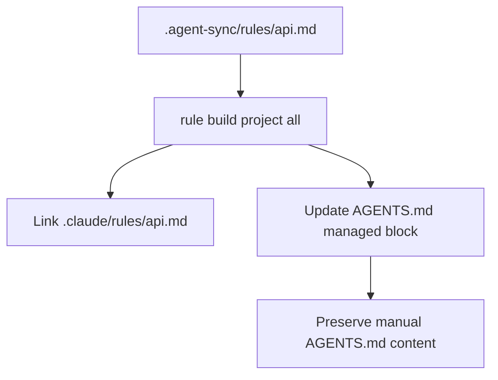
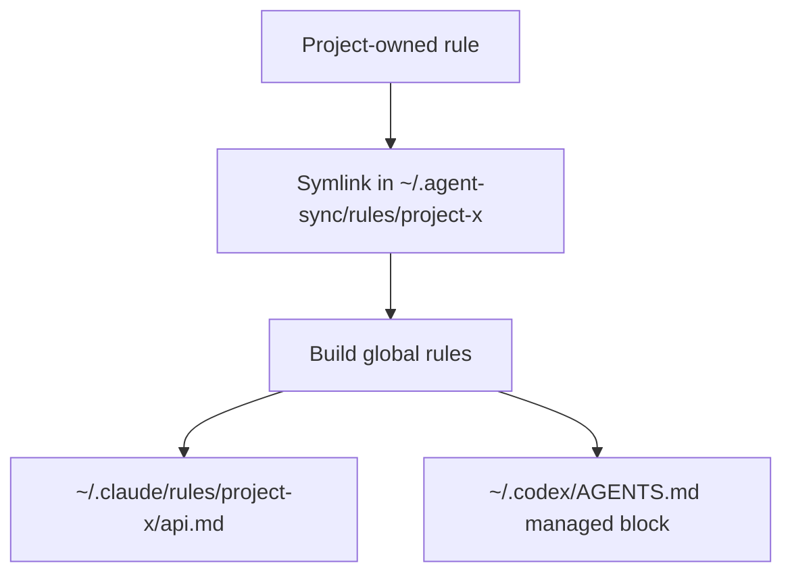
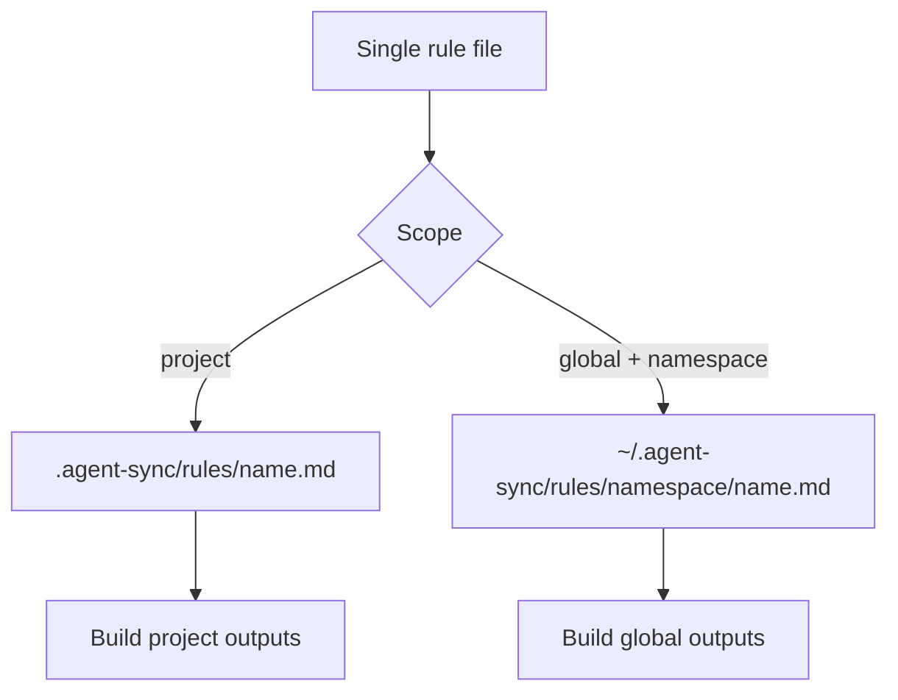
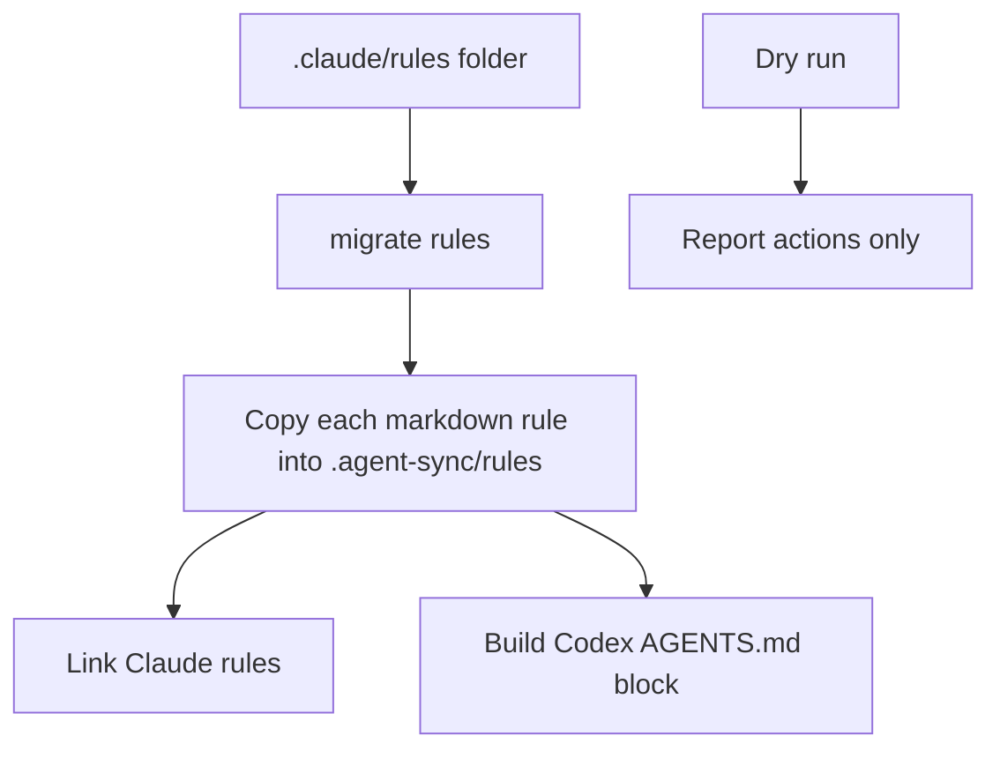

# Portable Agent Sync Rules

- **Branch:** `main`
- **Date:** 2026-05-18
- **Status:** Approved
- **Input:** The user wants cc-hub to make `.agent-sync/rules` the source of truth for behavioral rules shared between Claude Code and Codex. Project rules should live under `.agent-sync/rules`; global rules should live under `~/.agent-sync/rules`. cc-hub should publish Claude `.claude/rules/*.md` as symlinks to canonical rules, preserving Claude `paths:` frontmatter without copies, and generate managed rule blocks inside `AGENTS.md` / `~/.codex/AGENTS.md` so Codex sees the same guidance. Rule linking must support individual project/global rules, including symlinked global rules sourced from a project. Rule migration must import `.claude/rules/**/*.md` into `.agent-sync/rules`.

---

## User Scenarios & Testing

### Story 1 — Build provider outputs from canonical project rules (P1)

**Description:** As the developer, I can place rules under `.agent-sync/rules` and generate both Claude and Codex project outputs from that source.

**Priority reason:** This is the core portability behavior. Rules should not be manually duplicated in `.claude/rules` and `AGENTS.md`.

**Independent test:** In a temporary project, create `.agent-sync/rules/api.md` with `paths:` frontmatter, run rule build for project scope and all targets, and assert `.claude/rules/api.md` symlinks to the canonical rule while `AGENTS.md` contains a managed rule block.

```gherkin
Feature: Project rule generation
  Scenario: Publish Claude and Codex outputs from one project rule
    Given ".agent-sync/rules/api.md" contains paths frontmatter and rule content
    When  the developer runs "cc-hub rule build --scope project --targets all"
    Then  ".claude/rules/api.md" is a symlink to ".agent-sync/rules/api.md"
    And   "AGENTS.md" contains a cc-hub managed rules block
    And   the managed block includes the path-specific API rule

  Scenario: Rebuild replaces only the managed Codex block
    Given "AGENTS.md" contains human-authored instructions before and after the cc-hub rules block
    When  the developer runs "cc-hub rule build --scope project --targets codex"
    Then  the human-authored instructions are preserved
    And   only the cc-hub managed rules block is replaced
```



### Story 2 — Build global rules from the global registry (P1)

**Description:** As the developer, I can make rules global by placing or linking them under `~/.agent-sync/rules`, then regenerate global Claude and Codex outputs from that registry.

**Priority reason:** The user manages some globally relevant rules from project folders but wants one deterministic global registry for generated outputs.

**Independent test:** In a temporary HOME, create `~/.agent-sync/rules/project-x/api.md`, run rule build for global scope, and assert `~/.claude/rules/project-x/api.md` symlinks to the canonical rule while `~/.codex/AGENTS.md` is generated.

```gherkin
Feature: Global rule generation
  Scenario: Publish global provider outputs from the global rules registry
    Given "~/.agent-sync/rules/project-x/api.md" exists
    When  the developer runs "cc-hub rule build --scope global --targets all"
    Then  "~/.claude/rules/project-x/api.md" is a symlink to "~/.agent-sync/rules/project-x/api.md"
    And   "~/.codex/AGENTS.md" contains a cc-hub managed global rules block

  Scenario: Global registry can contain symlinks to project-owned rules
    Given "~/.agent-sync/rules/project-x/api.md" is a symlink to a project rule
    When  the project rule content changes
    And   the developer runs "cc-hub rule build --scope global --targets all"
    Then  "~/.codex/AGENTS.md" reflects the updated rule content
```



### Story 3 — Link one rule into canonical rules (P1)

**Description:** As the developer, I can link a single Markdown rule into the project or global canonical rule registry without migrating an entire folder.

**Priority reason:** Existing cc-hub workflows support individual skills, agents, and commands. Rules need the same incremental workflow.

**Independent test:** Create a project rule source file, run `cc-hub rule link` with project and global scopes, and assert the canonical source is a symlink with provider outputs generated.

```gherkin
Feature: Individual rule linking
  Scenario: Link a local rule into project canonical rules
    Given "rules/api.md" exists in the project
    When  the developer runs "cc-hub rule link rules/api.md --scope project --targets all"
    Then  ".agent-sync/rules/api.md" is a symlink to "rules/api.md"
    And   project Claude and Codex outputs are regenerated

  Scenario: Link a project rule into the global registry with a namespace
    Given ".agent-sync/rules/api.md" exists in a project
    When  the developer runs "cc-hub rule link .agent-sync/rules/api.md --scope global --targets all --namespace project-x"
    Then  "~/.agent-sync/rules/project-x/api.md" is a symlink to the project rule
    And   global Claude and Codex outputs are regenerated
```



### Story 4 — Migrate Claude rules into portable rules (P1)

**Description:** As the developer, I can import `.claude/rules/**/*.md` into `.agent-sync/rules` and rebuild provider outputs.

**Priority reason:** Existing projects already have Claude rules. Migration must preserve them while making them portable to Codex.

**Independent test:** In a temporary project, create `.claude/rules/api.md`, run targeted and folder rule migration, and assert canonical rule files plus provider outputs exist. Dry-run must report without writing.

```gherkin
Feature: Claude rule migration
  Scenario: Migrate a Claude rules folder into canonical project rules
    Given ".claude/rules/api.md" exists
    When  the developer runs "cc-hub migrate rules .claude/rules --scope project --targets all --force"
    Then  ".agent-sync/rules/api.md" exists with the original rule content
    And   project Claude and Codex outputs are regenerated

  Scenario: Dry-run rule migration reports actions without writing
    Given ".claude/rules/api.md" exists
    When  the developer runs "cc-hub migrate rules .claude/rules --scope project --targets all --dry-run"
    Then  the output reports the planned canonical rule path
    And   no ".agent-sync/rules/api.md" file is created
```



---

## Acceptance Criteria

| ID | Given | When | Then | Priority | Story |
|---|---|---|---|---|---|
| AC-001 | `.agent-sync/rules/<name>.md` exists in the project | the developer runs `cc-hub rule build --scope project --targets all` | `.claude/rules/<name>.md` symlinks to the canonical rule and `AGENTS.md` contains the managed block | P1 | Story 1 |
| AC-002 | `AGENTS.md` contains existing human-authored content | project Codex rules are rebuilt | content outside the cc-hub managed rules block is preserved | P1 | Story 1 |
| AC-003 | `~/.agent-sync/rules/<namespace>/<name>.md` exists | the developer runs `cc-hub rule build --scope global --targets all` | `~/.claude/rules/<namespace>/<name>.md` symlinks to the canonical rule and `~/.codex/AGENTS.md` contains the managed block | P1 | Story 2 |
| AC-004 | a global canonical rule is a symlink to a project-owned file | the target file changes and global rules are rebuilt | generated global outputs reflect the updated content | P1 | Story 2 |
| AC-005 | a Markdown rule file exists outside the canonical registry | the developer runs `cc-hub rule link <path> --scope project --targets all` | `.agent-sync/rules/<name>.md` is a symlink to the source and provider outputs are rebuilt | P1 | Story 3 |
| AC-006 | a project rule should become global | the developer runs `cc-hub rule link <path> --scope global --targets all --namespace <namespace>` | `~/.agent-sync/rules/<namespace>/<name>.md` links to the source and global outputs are rebuilt | P1 | Story 3 |
| AC-007 | `.claude/rules/**/*.md` exists | the developer runs `cc-hub migrate rules <folder> --scope project --targets all --force` | supported rules are copied into `.agent-sync/rules` and provider outputs are rebuilt | P1 | Story 4 |
| AC-008 | rule migration is invoked with `--dry-run` | the command runs | planned actions are reported and no files are created, replaced, or deleted | P1 | Story 4 |
| AC-009 | a rule has `paths:` frontmatter | Claude output is linked | the frontmatter is preserved for Claude-native path-scoped loading | P1 | Stories 1, 2 |
| AC-010 | a rule has `paths:` frontmatter | Codex output is generated | the managed `AGENTS.md` block renders the paths as textual "When modifying..." guidance | P1 | Stories 1, 2 |
| AC-011 | rule commands/options are added or changed | the change is committed | `README.md` and `.agent-sync/skills/cc-hub/SKILL.md` describe the syntax and generated outputs | P1 | Documentation |
| AC-012 | isolated temp project/HOME directories are provisioned | the test suite runs | project and global rule linking, building, migration, dry-run, and generated output behavior are verified without touching real provider directories | P1 | Testing |
| AC-013 | a Claude provider rule path exists | `cc-hub rule status --targets claude` runs | valid expected symlinks report OK; physical files report LOCAL; wrong symlinks report ERROR; broken symlinks report BROKEN | P1 | Status |

## Functional Requirements

| ID | Requirement | Maps To |
|---|---|---|
| FR-001 | The system MUST introduce canonical rule roots at `.agent-sync/rules` and `~/.agent-sync/rules`. | AC-001, AC-003 |
| FR-002 | Rule build MUST create Claude rule symlinks to canonical rules for project and global scopes. | AC-001, AC-003, AC-009 |
| FR-003 | Rule build MUST generate managed Codex rules blocks in `AGENTS.md` and `~/.codex/AGENTS.md`. | AC-001, AC-002, AC-003, AC-010 |
| FR-004 | Managed Codex block replacement MUST preserve content outside cc-hub markers. | AC-002 |
| FR-005 | Rule linking MUST support one source file into project or global canonical roots using symlinks. | AC-005, AC-006 |
| FR-006 | Global rule linking MUST support a namespace so project-owned global rules remain traceable. | AC-006 |
| FR-007 | Rule migration MUST import Claude `.md` rules from a file or folder into canonical `.agent-sync/rules`. | AC-007 |
| FR-008 | Rule migration dry-run MUST avoid all writes and report planned actions. | AC-008 |
| FR-009 | Rule rendering MUST preserve Claude `paths:` frontmatter while adapting paths into Codex textual guidance. | AC-009, AC-010 |
| FR-010 | Rule status/list/unlink MUST operate against canonical rules and provider outputs. | AC-001, AC-003, AC-005, AC-006 |
| FR-011 | Documentation MUST describe canonical rules, generated outputs, scopes, targets, migration, and limitations. | AC-011 |
| FR-012 | Automated tests MUST verify real filesystem behavior in isolated project/HOME directories. | AC-012 |
| FR-013 | Rule status MUST validate Claude provider symlinks against the expected canonical target. | AC-013 |

## Key Entities

- **Canonical Rule:** A Markdown file under `.agent-sync/rules` or `~/.agent-sync/rules`.
- **Rule Scope:** `project`, `global`, or `all`; determines canonical root and provider outputs.
- **Rule Target:** `claude`, `codex`, or `all`.
- **Rule Namespace:** Optional global path prefix used to preserve the project or topic origin of a globally linked rule.
- **Managed Codex Block:** The cc-hub generated section between HTML markers in `AGENTS.md` or `~/.codex/AGENTS.md`.
- **Claude Rule Symlink:** A provider path under `.claude/rules` or `~/.claude/rules` pointing to the expected canonical rule.

## Edge Cases

- If `AGENTS.md` does not exist, rule build creates it with only the managed rules block.
- If `AGENTS.md` exists without markers, rule build appends a managed block after existing content.
- If a canonical rule is deleted, unlink removes the corresponding Claude symlink when requested; unrelated local files are preserved unless `--force` is passed.
- Existing Claude provider files are preserved unless `--force`, `repair`, or identical old-copy conversion applies.
- Nested canonical rules preserve their relative path in Claude outputs and are shown with namespace-like headings in Codex output.
- `paths:` frontmatter is advisory in Codex output because Codex has no Claude-equivalent path-scoped rule loading.
- Global tests must inject HOME so no automated test mutates the user's real `~/.claude`, `~/.codex`, or `~/.agent-sync`.

## Success Criteria

| ID | Criterion | Measurement |
|---|---|---|
| SC-001 | Project rule publishing works. | Service tests verify `.claude/rules` symlinks and `AGENTS.md` outputs from `.agent-sync/rules`. |
| SC-002 | Global rule publishing works. | Service tests verify `~/.claude/rules` symlinks and `~/.codex/AGENTS.md` outputs from `~/.agent-sync/rules`. |
| SC-003 | Individual rule linking and migration work. | Service and CLI tests cover `rule link`, `rule build`, `migrate rule`, and `migrate rules`. |
| SC-004 | Full validation passes. | `bun test` and `bun run typecheck` pass. |
| SC-005 | LiveSpec traceability is complete. | `implementation.md` maps all FR and AC to code/tests with implemented status. |
