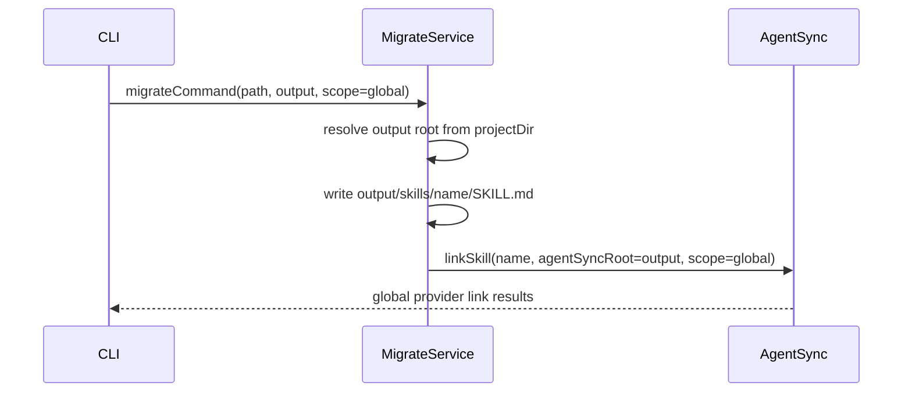
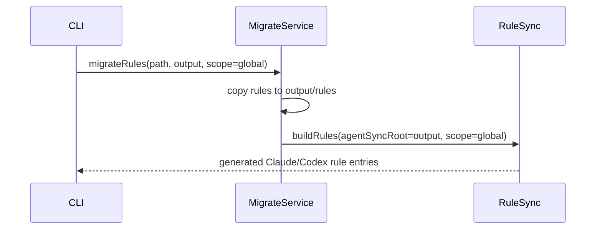
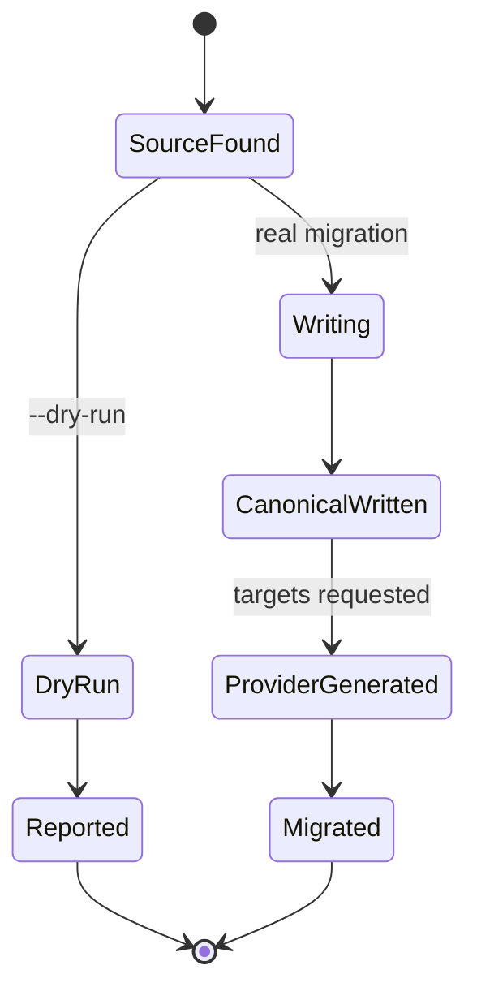

# Plan: Migration Output Root Override

## Summary

Add an optional migration output root that decouples canonical agent-sync write location from provider publication scope.

## Technical Context

- **Language:** TypeScript
- **Runtime:** Bun
- **CLI:** Commander
- **Storage:** local filesystem and symlinks
- **Tests:** `bun:test`
- **Existing modules:** `src/services/agent-sync-migrate.ts`, `src/services/agent-sync.ts`, `src/services/agent-sync-rules.ts`, `src/commands/migrate.ts`

## Constitution Check

- CLI commands remain thin and delegate behavior to services.
- Filesystem behavior is tested in isolated temporary project/HOME roots.
- Existing default migration paths remain backward-compatible.
- No network or credential dependencies are introduced.

## Gherkin Scenarios + Mermaid Sequence Diagrams

```gherkin
Scenario: Command migration writes to custom output and links globally
  Given a Claude command file exists
  When migrate command runs with --output and --scope global
  Then the command-derived skill is written under the custom output root
  And global provider links point to that custom source
```



```gherkin
Scenario: Rule migration reads custom output for generated provider files
  Given Claude rules exist
  When migrate rules runs with --output and global targets
  Then rules are copied to output/rules
  And provider rule outputs are generated from output/rules
```



## Mermaid State Diagrams



## Implementation Plan

| File | Action | Notes |
|---|---|---|
| `src/services/agent-sync.ts` | Modify | Add optional `agentSyncRoot` support for canonical skill/agent source resolution. |
| `src/services/agent-sync-rules.ts` | Modify | Add optional `agentSyncRoot` support for canonical rule reads/writes. |
| `src/services/agent-sync-migrate.ts` | Modify | Add `output` option, resolve it from projectDir, and pass it to canonical path/link/build helpers. |
| `src/commands/migrate.ts` | Modify | Add `--output <dir>` option. |
| `tests/services/agent-sync-migrate.test.ts` | Modify | Add RED tests for custom command/rule output and dry-run. |
| `tests/commands/agent-sync-cli.test.ts` | Modify | Add RED CLI test for `--output`. |
| `README.md` | Modify | Document custom output root migration workflow. |
| `.agent-sync/skills/cc-hub/SKILL.md` | Modify | Update command reference. |

## Testing Strategy

- Add service-level tests before implementation to prove missing `--output` support.
- Add CLI factory tests to verify Commander wiring and real behavior.
- Run focused tests first, then full `bun test`.
- Run `bun run typecheck`, `bunx biome check .`, and LiveSpec validation.

## Risks & Considerations

- `--scope` must continue to control provider output locations, not canonical write location, when `--output` is set.
- Custom output roots should not affect non-migration sync commands unless passed explicitly by migration internals.
- Rules are generated files for Claude/Codex, so `buildRules` must read from the same custom source root used by migration.
