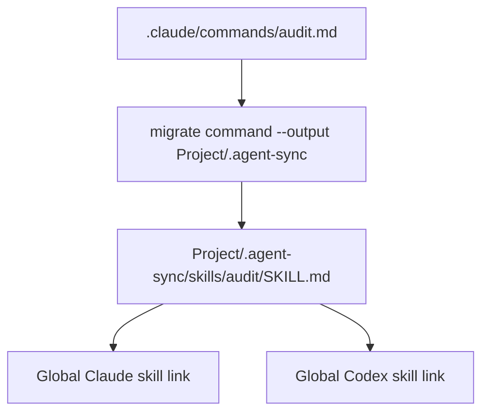
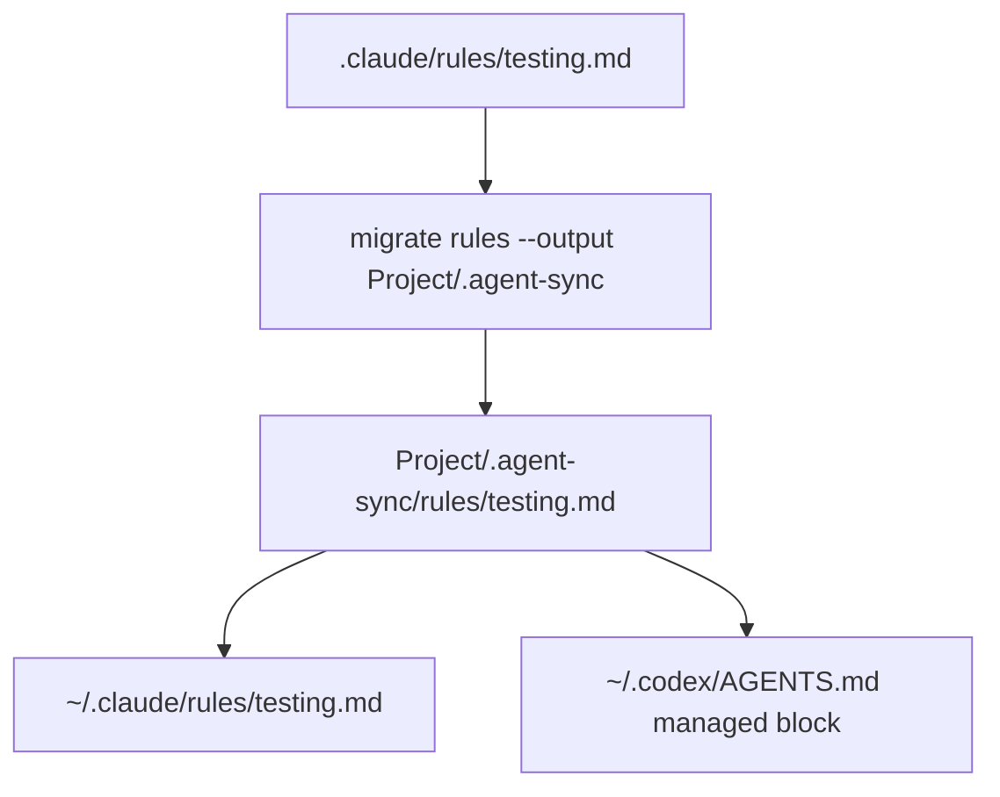
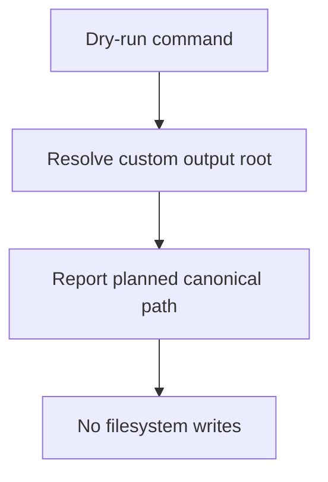

# Feature: Migration Output Root Override

- **Branch:** main
- **Date:** 2026-05-18
- **Status:** Approved
- **Input:** The user needs `cc-hub migrate` to write canonical agent-sync artifacts into a caller-selected directory instead of always writing into the current project `.agent-sync` or global `~/.agent-sync`. This supports projects that own a curated collection folder, such as `Project/.agent-sync`, and later publish/link those artifacts globally without polluting the repository root `.agent-sync`.

## User Scenarios & Testing

### Story 1 — Migrate a command into a custom collection root (P1)

**Description:** As the developer, I can migrate a Claude command into `./Project/.agent-sync/skills` while exposing provider outputs according to the selected scope.

**Priority reason:** Commands are a common asset type in the user's source projects and must not be forced into the repository root `.agent-sync`.

**Independent test:** In a temporary project, create `.claude/commands/audit.md`, run targeted command migration with `--output Project/.agent-sync --scope global --targets all`, and assert the skill is written under `Project/.agent-sync` while global provider links target that custom root.

```gherkin
Feature: Custom migration output for commands
  Scenario: A Claude command migrates into a custom agent-sync root
    Given ".claude/commands/audit.md" exists
    When the developer runs "cc-hub migrate command .claude/commands/audit.md --output Project/.agent-sync --scope global --targets all --force"
    Then "Project/.agent-sync/skills/audit/SKILL.md" exists
    And ".agent-sync/skills/audit" does not exist
    And the global Claude skill link targets "Project/.agent-sync/skills/audit"
    And the global Codex skill link targets "Project/.agent-sync/skills/audit"
```



### Story 2 — Migrate rules into a custom collection root (P1)

**Description:** As the developer, I can migrate Claude rules into a custom `rules` folder and generate Claude/Codex outputs from that custom source.

**Priority reason:** Rules are source-of-truth content and must remain in the curated folder when that folder is the user's ownership boundary.

**Independent test:** In a temporary project and HOME, migrate `.claude/rules` with `--output Project/.agent-sync --scope global --targets all`, then assert the canonical rule is under `Project/.agent-sync/rules` and global provider outputs are generated from it.

```gherkin
Feature: Custom migration output for rules
  Scenario: A Claude rules folder migrates into a custom agent-sync root
    Given ".claude/rules/testing.md" exists
    When the developer runs "cc-hub migrate rules .claude/rules --output Project/.agent-sync --scope global --targets all --force"
    Then "Project/.agent-sync/rules/testing.md" exists
    And "~/.agent-sync/rules/testing.md" does not exist
    And "~/.claude/rules/testing.md" contains the migrated rule
    And "~/.codex/AGENTS.md" contains the migrated rule
```



### Story 3 — Preview custom output without writes (P1)

**Description:** As the developer, I can dry-run a migration and see the custom canonical destination before approving the real run.

**Priority reason:** The user's migration workflow requires a review/GO gate before changing many projects.

**Independent test:** Run migration with `--output Project/.agent-sync --dry-run` and assert the result reports the custom path while no files are created.

```gherkin
Feature: Dry-run with custom migration output
  Scenario: Dry-run reports the custom destination without writing
    Given ".claude/commands/audit.md" exists
    When the developer runs "cc-hub migrate command .claude/commands/audit.md --output Project/.agent-sync --scope project --dry-run"
    Then the output reports "Project/.agent-sync/skills/audit"
    And "Project/.agent-sync/skills/audit" does not exist
    And ".agent-sync/skills/audit" does not exist
```



## Acceptance Criteria

| AC | Given | When | Then | Priority | Story |
|---|---|---|---|---|---|
| AC-001 | a targeted Claude command exists | migration runs with `--output <dir>` | the generated skill is written under `<dir>/skills/<name>` | P1 | Story 1 |
| AC-002 | `--output <dir>` is used with `--scope global --targets all` | provider links are generated | global Claude/Codex skill links target `<dir>/skills/<name>` | P1 | Story 1 |
| AC-003 | a Claude rules folder exists | migration runs with `--output <dir>` | migrated rules are written under `<dir>/rules` | P1 | Story 2 |
| AC-004 | rules are migrated with custom output and global targets | provider rule outputs are built | `~/.claude/rules` and `~/.codex/AGENTS.md` are generated from `<dir>/rules` | P1 | Story 2 |
| AC-005 | `--dry-run` is passed with `--output <dir>` | migration is previewed | result paths use `<dir>` and no canonical or provider files are written | P1 | Story 3 |
| AC-006 | the CLI help is shown | user inspects migrate options | `--output <dir>` is documented for root and subcommands | P2 | Story 3 |

## Functional Requirements

| ID | Requirement | Acceptance Criteria |
|---|---|---|
| FR-001 | `cc-hub migrate` MUST accept `--output <dir>` on folder and targeted migration commands. | AC-001, AC-003, AC-006 |
| FR-002 | When `--output` is provided, canonical skill, command-derived skill, agent, and rule writes MUST use that directory as the agent-sync root. | AC-001, AC-003 |
| FR-003 | Relative `--output` paths MUST resolve from the project directory, not from HOME. | AC-001, AC-003 |
| FR-004 | Provider links generated by migration MUST target the custom output root when `--output` is provided. | AC-002 |
| FR-005 | Rule provider generation triggered by migration MUST read canonical rules from the custom output root when `--output` is provided. | AC-004 |
| FR-006 | Dry-run results MUST report the custom canonical path and avoid all writes. | AC-005 |
| FR-007 | Existing default behavior without `--output` MUST remain unchanged. | AC-001, AC-003 |
| FR-008 | Documentation and the cc-hub skill MUST describe `--output <dir>` and its separation from `--scope`. | AC-006 |

## Key Entities

- **Output Root:** A user-selected agent-sync root directory containing `skills`, `rules`, and `agents` subdirectories.
- **Publication Scope:** The provider output location selected by `--scope project|global|all`.
- **Provider Link:** A Claude/Codex output symlink or generated file pointing at or derived from the canonical source.

## Edge Cases

- Relative output paths are resolved from `projectDir`.
- Absolute output paths are preserved.
- `--output` does not imply global publication; `--scope` still controls provider output scope.
- `--dry-run` must not create the output root.
- Existing canonical paths under the output root respect the existing `--force` conflict behavior.

## Success Criteria

| ID | Metric |
|---|---|
| SC-001 | Service tests cover command and rule migration with custom output. |
| SC-002 | CLI tests cover `--output` parsing and help text. |
| SC-003 | Full typecheck, test suite, Biome, LiveSpec validation, and commit hook pass. |
