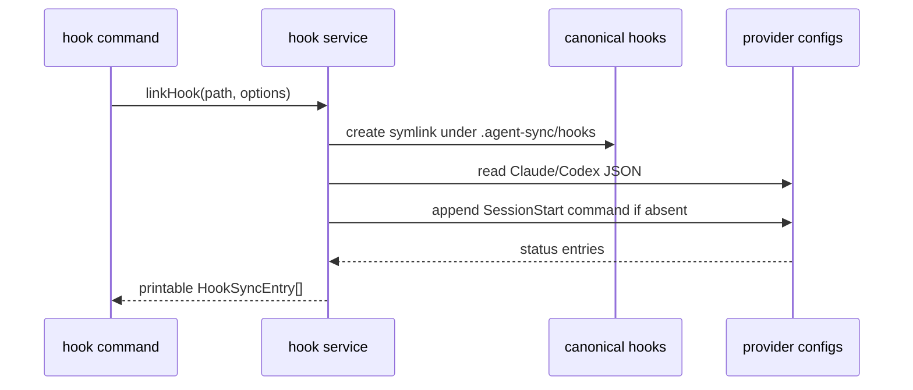
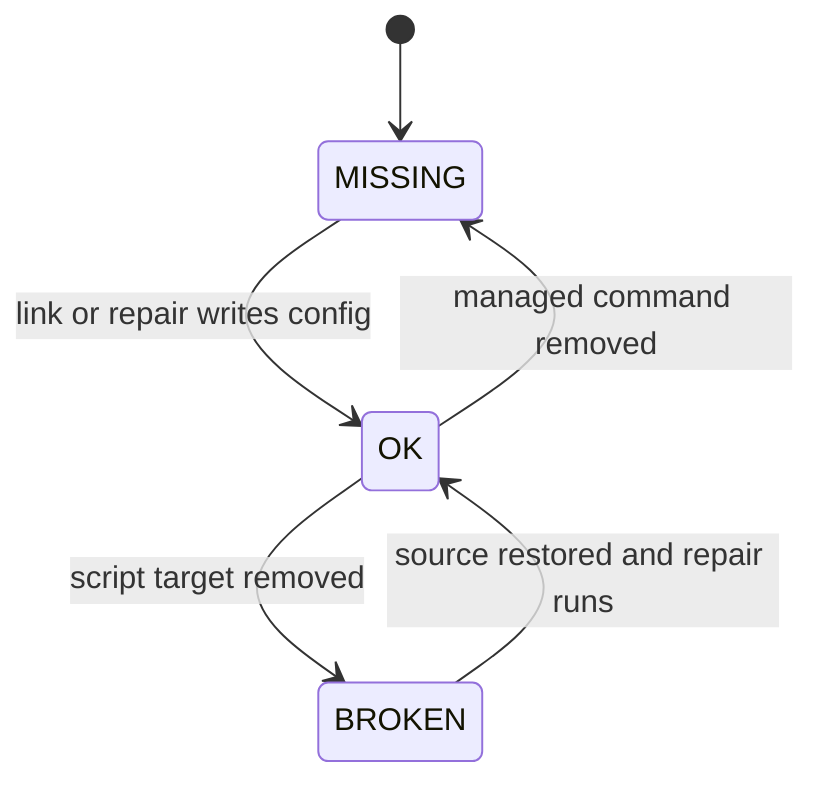

# Plan - Agent Sync Hooks

## Summary

Add a focused hook service and `hook` command group that canonicalizes hook sources, merges `SessionStart` commands into Claude/Codex JSON configs, and plugs hooks into aggregate sync operations.

## Technical Context

- Language: TypeScript on Bun.
- CLI: Commander command factories in `src/commands/`.
- Storage: filesystem JSON config files and symlinks.
- Tests: `bun test` with temporary project and HOME directories.
- Providers: Claude Code `~/.claude/settings.json`; Codex `~/.codex/hooks.json`.

## Constitution Check

- Explicit boundaries: command handlers stay thin; filesystem/config logic lives in `src/services/agent-sync-hooks.ts`.
- Idempotency: config merge checks existing command strings before appending.
- Preservation: writes modify only `hooks.SessionStart` entries related to the managed command.
- Test isolation: all tests inject temporary project/HOME roots.

## Gherkin Scenarios + Mermaid Sequence Diagrams

```gherkin
Feature: Hook publish sequence
  Scenario: Link a hook source
    Given a source directory has "session-start.sh"
    When  the hook service links the source for Claude and Codex
    Then  it creates the canonical hook path
    And   it merges the SessionStart command into both provider configs

  Scenario: Repair a missing provider config entry
    Given the canonical hook path exists
    And   Codex config lacks the managed command
    When  hook repair runs
    Then  Codex config gains the command
    And   Claude config remains unchanged if already OK
```



## Gherkin Scenarios + Mermaid State Diagrams

```gherkin
Feature: Hook status lifecycle
  Scenario: A configured hook is healthy
    Given the canonical script exists
    And   the provider config contains the expected SessionStart command
    When  status runs
    Then  the provider state is OK

  Scenario: A configured hook source is missing
    Given the provider config contains the expected command
    But   the canonical script target is gone
    When  status runs
    Then  the provider state is BROKEN
```



## Mermaid ER Diagrams

No persistent database entities are introduced.

## Implementation Plan

1. Add `src/services/agent-sync-hooks.ts` with canonical path helpers, provider config merge, status, repair, unlink, and formatting.
2. Add `src/commands/hook.ts` exposing `link`, `list`, `status`, `repair`, and `unlink`.
3. Register the hook command in `src/cli.ts` and include hooks in `src/commands/sync.ts`.
4. Add service and CLI tests for config preservation, idempotence, targets, status, repair, unlink, and aggregate sync.
5. Update README, `.agent-sync/skills/cc-hub/SKILL.md`, `.specs/README.md`, feature changelog, global changelog, and implementation mapping.

## Testing Strategy

- Unit-style service tests with real temp files for canonical hooks and provider configs.
- CLI command factory tests for help/options and end-to-end temp workspace invocation.
- Typecheck and LiveSpec structural validation after implementation.

## Risks & Considerations

- Claude and Codex hook schemas may evolve; the implementation preserves unknown top-level config keys and only relies on the shared `hooks.<event>[]` shape already present locally.
- Hook source script behavior belongs to the versioned hook source; cc-hub only installs the configured shell command.
- Provider hook configs are user-level even when the canonical source is project-scoped.
