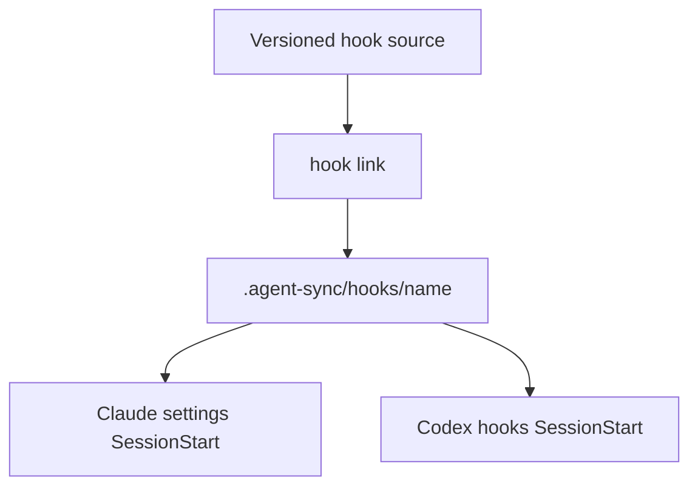
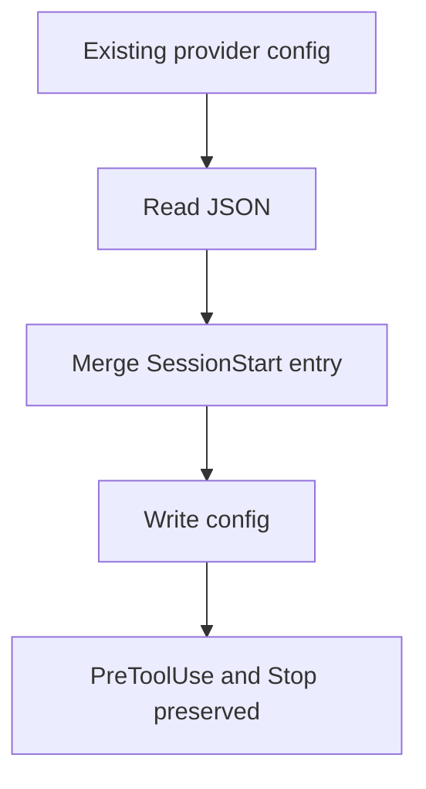
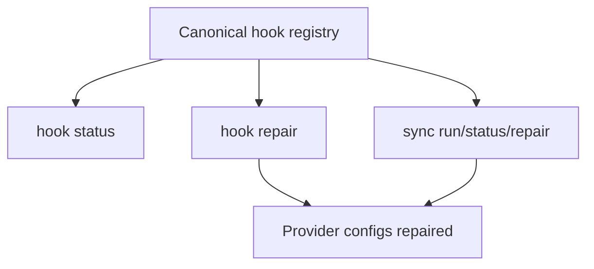

# Agent Sync Hooks

- **Branch:** `main`
- **Date:** 2026-06-30
- **Status:** Implemented
- **Input:** Add a first-class agent-sync hook artifact so versioned hook sources, such as `projects/core/kit/hooks/workflow-router/`, can be installed from canonical `.agent-sync/hooks` or `~/.agent-sync/hooks` into Claude Code and Codex `SessionStart` hook configuration without overwriting existing hooks.

## User Scenarios & Testing

### Story 1 - Link a versioned hook source (P1)

**Description:** As the developer, I can link a hook source directory into a canonical hook registry and publish it to Claude Code and Codex.

**Priority reason:** Hooks are runtime artifacts, not skills/rules/agents, and must remain versioned separately.

**Independent test:** In a temporary project and HOME, link a source directory containing `session-start.sh`, then assert canonical hook paths and both provider configs.

```gherkin
Feature: Hook linking
  Scenario: Link one SessionStart hook to both providers
    Given a source directory contains "session-start.sh"
    When  the developer runs "cc-hub hook link <path> --scope project --targets all"
    Then  ".agent-sync/hooks/<name>" points to the source
    And   "~/.claude/settings.json" contains a SessionStart command for the canonical script
    And   "~/.codex/hooks.json" contains a SessionStart command for the canonical script

  Scenario: Linking the same hook twice is idempotent
    Given Claude and Codex already contain the expected SessionStart hook command
    When  the developer links the same hook again
    Then  neither config gains a duplicate SessionStart entry
```



### Story 2 - Preserve existing provider hooks (P1)

**Description:** As the developer, I can publish a new hook while existing PreToolUse, Stop, and unrelated SessionStart hooks stay intact.

**Priority reason:** User hook files often contain guards, stop hooks, and local automation that must not be overwritten.

**Independent test:** Seed Claude and Codex config files with existing hooks, run link/repair, and assert unrelated arrays and entries remain byte-equivalent at the semantic level.

```gherkin
Feature: Hook config preservation
  Scenario: Merge SessionStart without overwriting existing hooks
    Given Claude and Codex configs contain PreToolUse and Stop hooks
    When  a hook is linked to both providers
    Then  the existing PreToolUse hooks are preserved
    And   the existing Stop hooks are preserved
    And   only the new SessionStart command is appended when absent

  Scenario: Repair restores missing SessionStart config
    Given a canonical hook exists
    And   one provider config is missing the expected SessionStart command
    When  the developer runs "cc-hub hook repair --scope project --targets all"
    Then  the missing provider config entry is recreated
    And   existing unrelated hooks remain present
```



### Story 3 - Inspect hook sync state (P1)

**Description:** As the developer, I can list, status, repair, and unlink canonical hooks just like other agent-sync artifacts.

**Priority reason:** Hook state must be visible and recoverable when source scripts move or configs drift.

**Independent test:** Link a hook, remove one provider config entry, run status/repair/unlink, and assert expected state transitions.

```gherkin
Feature: Hook lifecycle commands
  Scenario: Status reports provider hook state
    Given a canonical hook exists
    When  the developer runs "cc-hub hook status --scope project --targets all"
    Then  each selected provider reports OK, MISSING, BROKEN, or ERROR

  Scenario: Sync run includes canonical hooks
    Given canonical skills, rules, agents, and hooks exist
    When  the developer runs "cc-hub sync run --scope project --targets all"
    Then  hook SessionStart entries are published with the other agent-sync artifacts
```



## Acceptance Criteria

| ID | Given | When | Then | Priority | Story |
|---|---|---|---|---|---|
| AC-001 | a hook source directory contains `session-start.sh` | `cc-hub hook link <path> --scope project --targets all` runs | `.agent-sync/hooks/<name>` points to the source and Claude/Codex `SessionStart` commands are created | P1 | Story 1 |
| AC-002 | the same hook is linked more than once | link or repair runs again | provider configs do not gain duplicate commands | P1 | Story 1 |
| AC-003 | provider configs contain existing PreToolUse and Stop hooks | hook link or repair runs | existing hook arrays and entries are preserved | P1 | Story 2 |
| AC-004 | a canonical hook exists but a provider config is missing the SessionStart command | hook repair runs | the missing command is recreated without overwriting other hooks | P1 | Story 2 |
| AC-005 | a canonical hook exists | hook status runs | selected providers report OK, MISSING, BROKEN, or ERROR with script and config paths | P1 | Story 3 |
| AC-006 | canonical hooks exist with skills, agents, and rules | sync run/status/repair runs | aggregate sync includes hook entries | P1 | Story 3 |
| AC-007 | hook commands/options are added | the change is committed | `README.md` and `.agent-sync/skills/cc-hub/SKILL.md` document hook roots, commands, and subagent propagation note | P1 | Documentation |
| AC-008 | temporary HOME/project dirs are used | tests run | config preservation, idempotence, targets, status, repair, unlink, and sync aggregation are covered without touching real provider configs | P1 | Testing |

## Functional Requirements

| ID | Requirement | Maps To |
|---|---|---|
| FR-001 | The system MUST add canonical hook roots at `.agent-sync/hooks` and `~/.agent-sync/hooks`, distinct from skills, rules, and agents. | AC-001 |
| FR-002 | Hook link MUST canonicalize a source hook directory and publish a `SessionStart` shell command to Claude and Codex targets. | AC-001 |
| FR-003 | Hook config writes MUST merge into existing JSON and preserve unrelated hook events and commands. | AC-002, AC-003 |
| FR-004 | Hook status/repair/list/unlink MUST operate against canonical hooks and provider configs. | AC-004, AC-005 |
| FR-005 | Aggregate sync run/status/repair MUST include hook artifacts. | AC-006 |
| FR-006 | Documentation MUST describe canonical hook structure, provider config behavior, and delegation/subagent propagation boundaries. | AC-007 |
| FR-007 | Automated tests MUST cover isolated filesystem and config behavior for Claude and Codex targets. | AC-008 |

## Key Entities

- **Canonical Hook:** A versioned source directory under `.agent-sync/hooks/<name>` or `~/.agent-sync/hooks/<name>`.
- **SessionStart Script:** The executable script selected from `session-start.sh`, `hook.sh`, or `<name>.sh`.
- **Provider Hook Config:** Claude `~/.claude/settings.json` or Codex `~/.codex/hooks.json`.
- **Hook Sync Entry:** Status row describing the canonical script and provider config entry.

## Edge Cases

- Missing provider config files are created with a minimal `hooks` object.
- Invalid provider config JSON reports `ERROR` in status and throws during writes.
- Existing `SessionStart` commands with different command strings are preserved.
- `unlink` removes only the command managed for the selected canonical hook.
- Project-scoped canonical hooks still write provider configs under the injected HOME because Claude/Codex hook config is user-level.

## Success Criteria

| ID | Criterion | Measurement |
|---|---|
| SC-001 | Hook link publishes to both providers. | Service and CLI tests assert config entries and canonical source paths. |
| SC-002 | Existing hooks are preserved. | Tests seed PreToolUse and Stop hooks and assert they remain after link/repair. |
| SC-003 | Hook state is inspectable and repairable. | Tests cover status, repair, unlink, and aggregate sync. |
| SC-004 | Full validation passes. | `bun test`, `bun run typecheck`, and `livespec validate` pass or documented with exact limits. |
