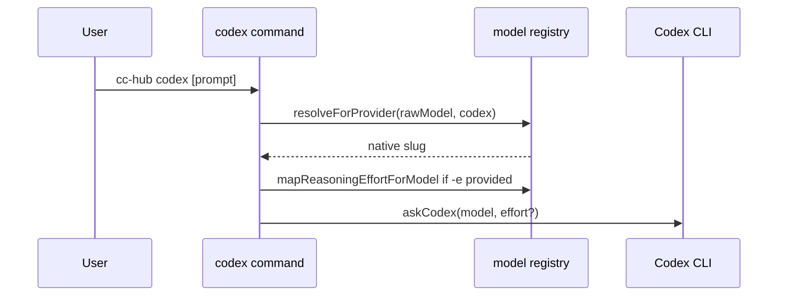
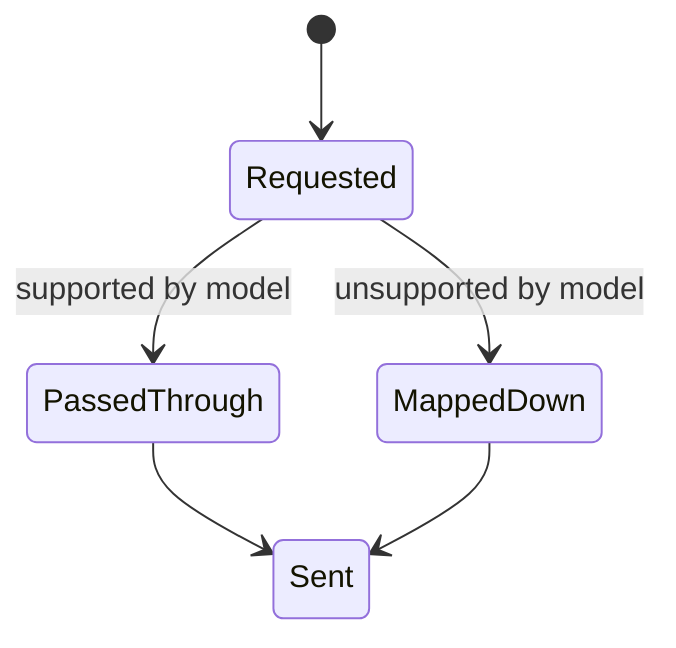

# Plan - Add GPT-5.6 Sol/Terra/Luna to Codex Provider

## Summary

Extend the cc-hub model registry and Codex command default to GPT-5.6 Sol/Terra/Luna, preserve GPT-5.5 compatibility, add `ultra` as an opt-in effort capability, and update tests/docs.

## Technical Context

- Language: TypeScript on Bun.
- CLI: Commander command factory in `src/commands/codex.ts`.
- Registry: static typed model catalog in `src/data/models.ts`.
- Mapping logic: `src/services/models.ts`.
- Tests: `bun test` targeted and full suite; `bunx tsc --noEmit`; `bunx biome check .`.
- Docs: README and `.agent-sync/skills/cc-hub/`.

## Constitution Check

- Explicit source of truth: model IDs live in `src/data/models.ts`, default in `src/commands/codex.ts`.
- Backward compatibility: `openai/gpt-5.5` remains in the registry and has a regression test.
- Provider boundaries: unverified OpenRouter/Copilot 5.6 mappings are not invented.
- No secret/config mutation: no automation, machine config, or user config files are edited.

## Gherkin Scenarios + Mermaid Sequence Diagrams

```gherkin
Feature: Codex model resolution
  Scenario: Default Sol request
    Given no model override is provided
    When  the codex command resolves its model
    Then  it selects canonical ID "openai/gpt-5.6-sol"
    And   it maps that ID to native slug "gpt-5.6-sol"

  Scenario: Explicit legacy request
    Given the user provides "-m openai/gpt-5.5"
    When  the codex command resolves its model
    Then  it maps that ID to native slug "gpt-5.5"
```



## Gherkin Scenarios + Mermaid State Diagrams

```gherkin
Feature: Effort mapping
  Scenario: Supported effort passes through
    Given a model supports the requested effort
    When  effort mapping runs
    Then  the requested effort is returned unchanged

  Scenario: Unsupported effort maps down
    Given Luna supports up to max
    When  effort mapping receives ultra for Luna
    Then  max is returned
```



## Mermaid ER Diagrams

No persistent database entities are introduced.

## Implementation Plan

1. Update `src/data/models.ts`: add `ultra` to the effort type/list and register Sol/Terra/Luna under provider `codex`.
2. Update `src/commands/codex.ts`: switch `CODEX_DEFAULT_MODEL` to `openai/gpt-5.6-sol`.
3. Update `tests/commands/codex.test.ts`: cover default Sol, explicit GPT-5.5, Sol ultra passthrough, and Luna ultra-to-max mapping.
4. Update `tests/services/models.test.ts`: cover 5.6 Codex resolution, OpenRouter unavailability, and max effort behavior.
5. Update README and `.agent-sync/skills/cc-hub/{SKILL.md,references/models.md}`.
6. Run targeted tests, typecheck, full test suite, model listing, and the requested live smoke when credentials/runtime allow.

## Testing Strategy

- Target command behavior with mocked `askCodex`.
- Target registry behavior with direct pure-function tests.
- Run `bunx tsc --noEmit`, `bunx biome check .`, and full `bun test`.
- Run `bun bin/cc-hub.ts models list --provider codex` as a CLI smoke.
- Run `bun bin/cc-hub.ts codex -m openai/gpt-5.6-luna -e high "Réponds exactement: OK"` for live verification when Codex auth/model access is available.

## Risks & Considerations

- Live smoke can fail because of local Codex auth, model access, or network; this does not invalidate unit coverage but must be reported verbatim.
- Adding `ultra` affects all cc-hub effort validation. Existing mappers cap it for finite model effort lists and pass it through for unknown lists.
- Docs archives under `docs/superpowers/` are intentionally not modified.
