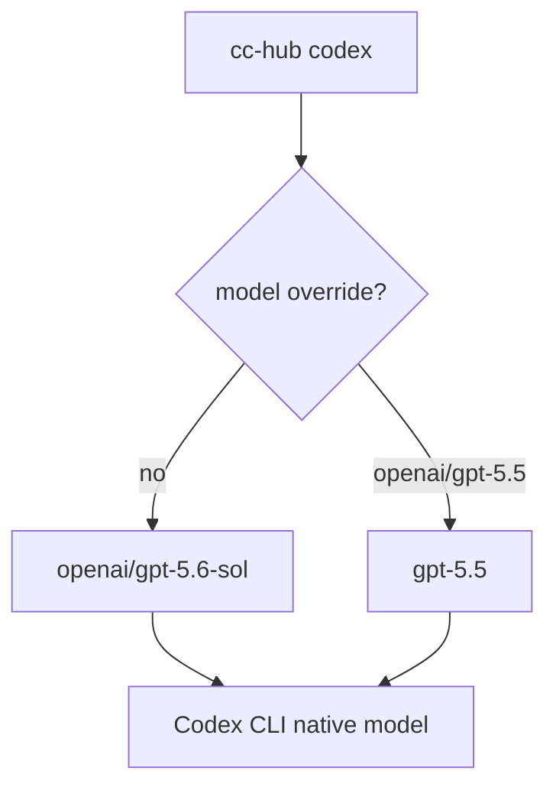
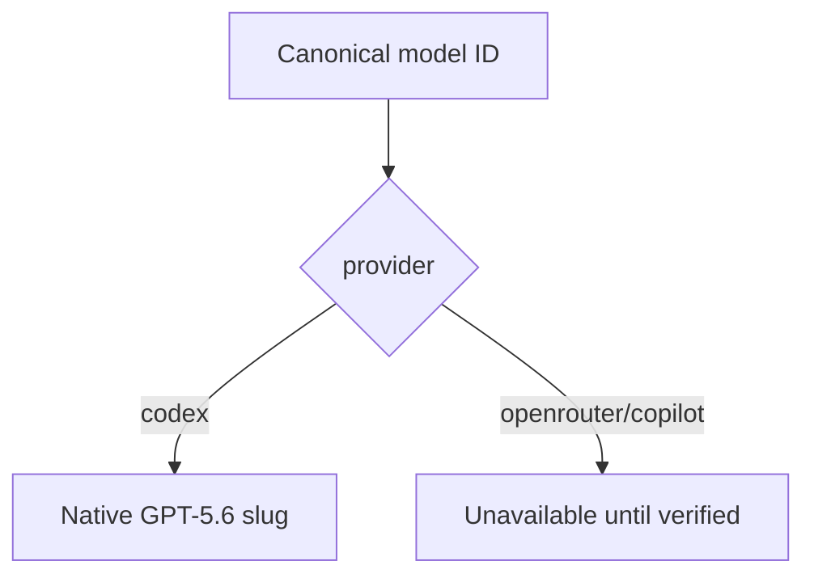
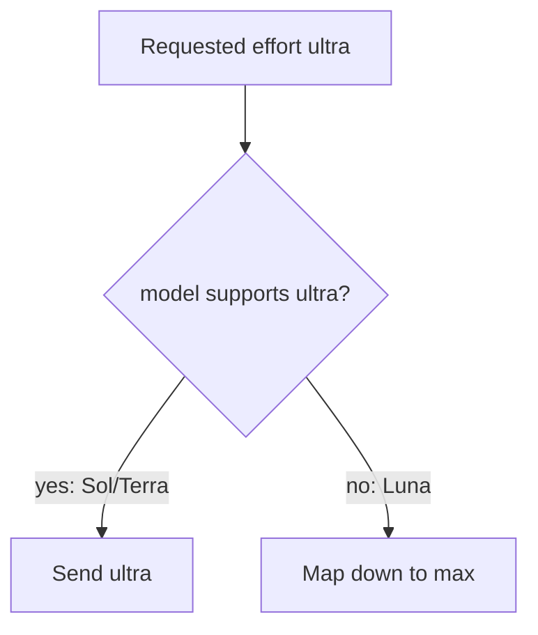

# Add GPT-5.6 Sol/Terra/Luna to Codex Provider

- **Branch:** `main`
- **Date:** 2026-07-11
- **Status:** Implemented
- **Input:** Add `gpt-5.6-sol`, `gpt-5.6-terra`, and `gpt-5.6-luna` to cc-hub's Codex provider, make Sol the default, expose `ultra` as a supported capability, preserve GPT-5.5 compatibility, and update tests/docs.

## User Scenarios & Testing

### Story 1 - Use the new Codex default (P1)

**Description:** As the developer, I can run `cc-hub codex` without a model override and get `gpt-5.6-sol`.

**Priority reason:** The model migration requires Sol to be the canonical default for Codex calls.

**Independent test:** Command tests assert the default resolves to native `gpt-5.6-sol`.

```gherkin
Feature: Codex default model
  Scenario: Default Codex call uses Sol
    Given no CODEX_MODEL environment override is configured
    When  the developer runs "cc-hub codex question"
    Then  cc-hub calls Codex with native model "gpt-5.6-sol"

  Scenario: Explicit GPT-5.5 override still works
    Given scripts still pass "-m openai/gpt-5.5"
    When  the developer runs "cc-hub codex question -m openai/gpt-5.5"
    Then  cc-hub calls Codex with native model "gpt-5.5"
```



### Story 2 - Select any GPT-5.6 Codex variant (P1)

**Description:** As the developer, I can explicitly select Sol, Terra, or Luna using canonical IDs.

**Priority reason:** The migration exposes all three verified Codex variants while keeping OpenRouter/Copilot entries out until verified.

**Independent test:** Registry tests assert the three canonical IDs resolve only for the Codex provider.

```gherkin
Feature: GPT-5.6 Codex registry
  Scenario: Resolve all three GPT-5.6 variants for Codex
    Given the cc-hub model registry contains the three GPT-5.6 variants
    When  the developer resolves each canonical ID for the Codex provider
    Then  Sol maps to "gpt-5.6-sol"
    And   Terra maps to "gpt-5.6-terra"
    And   Luna maps to "gpt-5.6-luna"

  Scenario: Reject unverified OpenRouter mapping
    Given OpenRouter GPT-5.6 slugs are not verified
    When  the developer resolves "openai/gpt-5.6-sol" for OpenRouter
    Then  cc-hub reports that the model is not available on OpenRouter
```



### Story 3 - Use ultra effort safely (P1)

**Description:** As the developer, I can pass `-e ultra` for capable models, while Luna caps the request at `max`.

**Priority reason:** `ultra` is a declared capability for Sol/Terra, not a default, and Luna must never receive an unsupported effort.

**Independent test:** Command and registry tests assert Sol keeps `ultra`, Luna maps `ultra` down to `max`, and no default effort is introduced.

```gherkin
Feature: Ultra reasoning effort
  Scenario: Sol accepts ultra
    Given Sol supports ultra
    When  the developer runs "cc-hub codex question -m openai/gpt-5.6-sol -e ultra"
    Then  cc-hub passes effort "ultra" to Codex

  Scenario: Luna caps ultra to max
    Given Luna does not support ultra
    When  the developer runs "cc-hub codex question -m openai/gpt-5.6-luna -e ultra"
    Then  cc-hub passes effort "max" to Codex
```



## Acceptance Criteria

| ID | Given | When | Then | Priority | Story |
|---|---|---|---|---|---|
| AC-001 | no explicit Codex model override exists | `cc-hub codex` runs | native Codex model is `gpt-5.6-sol` | P1 | Story 1 |
| AC-002 | a script passes `-m openai/gpt-5.5` | `cc-hub codex` runs | native Codex model remains `gpt-5.5` | P1 | Story 1 |
| AC-003 | Sol, Terra, and Luna canonical IDs are used | registry resolves for provider `codex` | native slugs are `gpt-5.6-sol`, `gpt-5.6-terra`, and `gpt-5.6-luna` | P1 | Story 2 |
| AC-004 | OpenRouter/Copilot 5.6 slugs are unverified | a 5.6 canonical ID is resolved for OpenRouter | cc-hub rejects it as unavailable | P1 | Story 2 |
| AC-005 | Sol is requested with `-e ultra` | `cc-hub codex` maps effort | effort remains `ultra` | P1 | Story 3 |
| AC-006 | Luna is requested with `-e ultra` | `cc-hub codex` maps effort | effort is capped to `max` | P1 | Story 3 |
| AC-007 | docs are read by users or agents | README or cc-hub skill docs are opened | Codex default, available models, and effort vocabulary include the new values | P1 | Documentation |

## Functional Requirements

| ID | Requirement | Maps To |
|---|---|---|
| FR-001 | The model registry MUST include `openai/gpt-5.6-sol`, `openai/gpt-5.6-terra`, and `openai/gpt-5.6-luna` for provider `codex` only. | AC-003, AC-004 |
| FR-002 | The Codex command default MUST be `openai/gpt-5.6-sol` while explicit `openai/gpt-5.5` continues to resolve. | AC-001, AC-002 |
| FR-003 | The effort vocabulary MUST include `ultra`, with Sol/Terra supporting it and Luna capped at `max`. | AC-005, AC-006 |
| FR-004 | README and cc-hub skill documentation MUST list the new Codex default, variants, and effort vocabulary. | AC-007 |
| FR-005 | Automated tests MUST cover default selection, backward compatibility, provider resolution, and effort mapping. | AC-001-AC-006 |

## Key Entities

- **Codex Model Variant:** A canonical model entry with a `codex` native slug.
- **Codex Default Model:** The fallback model used when neither CLI option nor `CODEX_MODEL` is set.
- **Reasoning Effort Capability:** The supported effort list used to map a requested effort to the closest valid value.

## Edge Cases

- OpenRouter/Copilot mappings for GPT-5.6 remain absent until verified.
- Luna does not advertise `ultra`; requests above `max` are lowered.
- Existing `openai/gpt-5.5` canonical IDs remain valid for scripts and environment overrides.
- No default effort is introduced; effort is only sent when the user passes `-e`.

## Success Criteria

| ID | Criterion | Measurement |
|---|---|
| SC-001 | New variants are present and listable. | `cc-hub models list --provider codex` includes the three `openai/gpt-5.6-*` IDs. |
| SC-002 | Default and compatibility behavior are tested. | `bun test tests/commands/codex.test.ts` passes. |
| SC-003 | Registry effort behavior is tested. | `bun test tests/services/models.test.ts` passes. |
| SC-004 | Project validation passes. | `bunx tsc --noEmit`, `bunx biome check .`, and `bun test` pass. |
