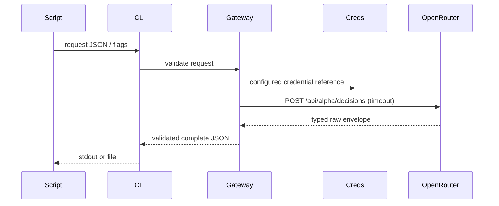

# Jev Decisions — Technical Plan
## Summary
Dedicated lightweight Commander decide/jev factory and validated raw HTTP gateway, no SDK/dependency addition.
## Technical Context
Bun, strict TypeScript ESM, Commander, fetch, bun:test, macOS creds; no persistent data migration.
## Constitution Check
Local CLI only; existing Keychain-backed getEnv; create*Command factory; explicit failures; minimal dependencies; preserve existing layer/ADR conventions.
## API Behavior
```gherkin
Feature: API transport
 Scenario: Successful request
  Given a valid typed request
  When CC Hub submits to OpenRouter
  Then the response is validated and emitted as complete JSON
 Scenario: Failed request
  Given a provider error
  When CC Hub receives the response
  Then stderr reports a safe error and no successful result is emitted
```

## Implementation Plan
1. src/types/decisions.ts and src/services/decisions.ts: typed extensible request/answer contract, runtime validation, bounded safe gateway.
2. src/services/decision-input.ts and src/commands/decide.ts: input resolution/overrides, output control; register src/cli.ts.
3. src/data/models.ts: decision registry; prompt fallback; ask/openrouter guards. README and cc-hub skill/references updated.
4. tests/services/decisions.test.ts and tests/commands/decide.test.ts: full contract/error/stdin/file/overrides coverage; models/ask regression tests.
5. Validate static/full suites, review, live CLI proof, map requirements and push isolated main commit.
## Testing Strategy
Bun unit validation, fake external HTTP boundary and CLI factory/subprocess behavior, static tsc/Biome, full regression suite; one installed/live API proof with timing. No browser surface.
## Risks & Considerations
Alpha API can evolve; preserve extension fields. No raw request/response error logging, no automatic retries/cost duplication. Existing unrelated working-tree changes excluded.
