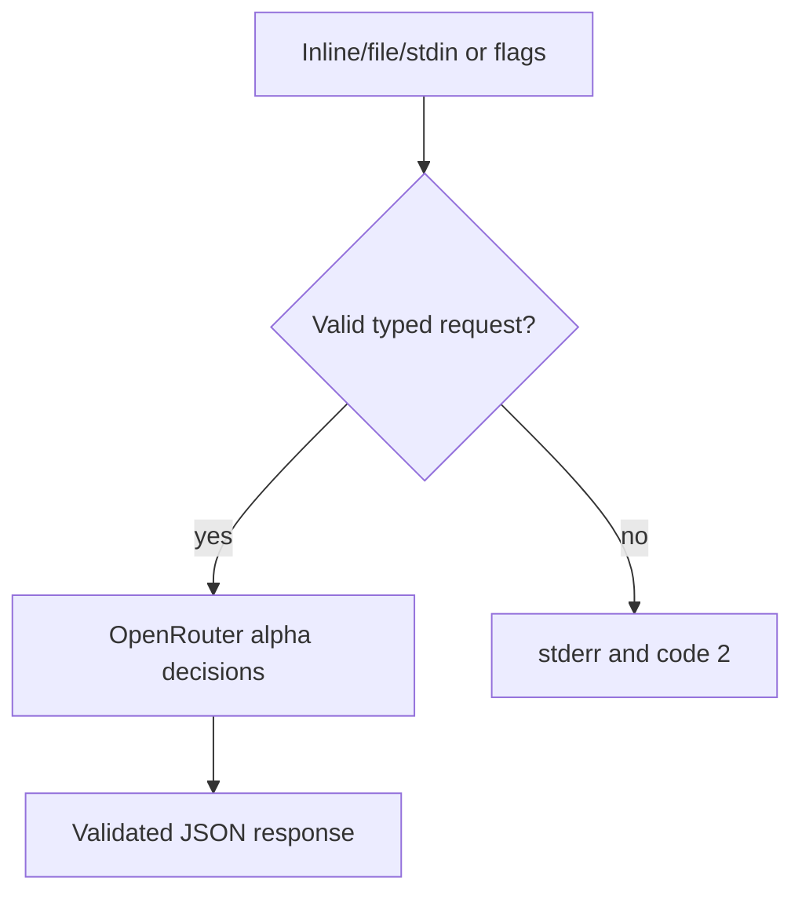
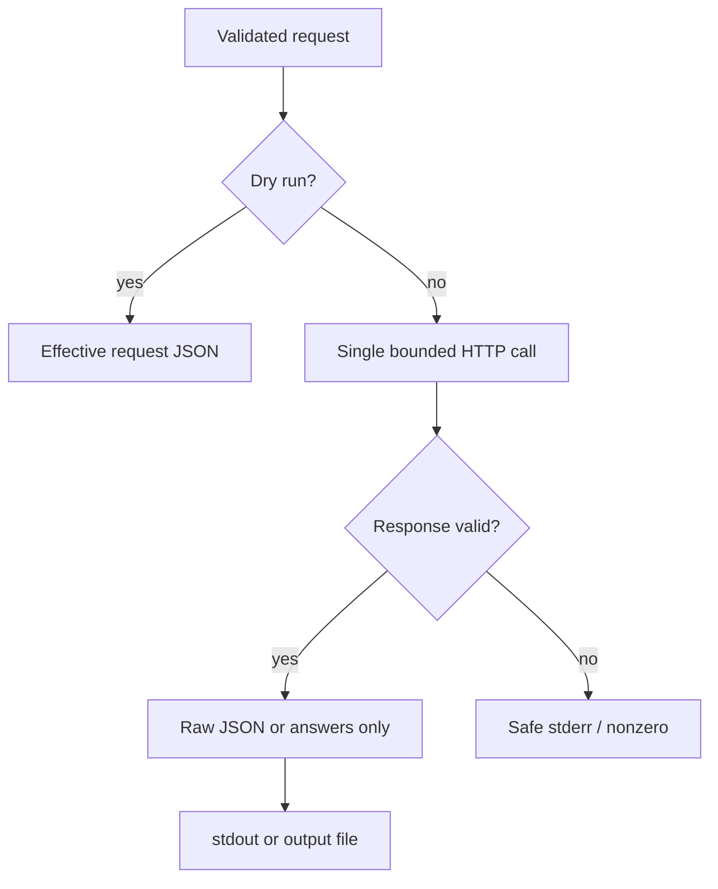
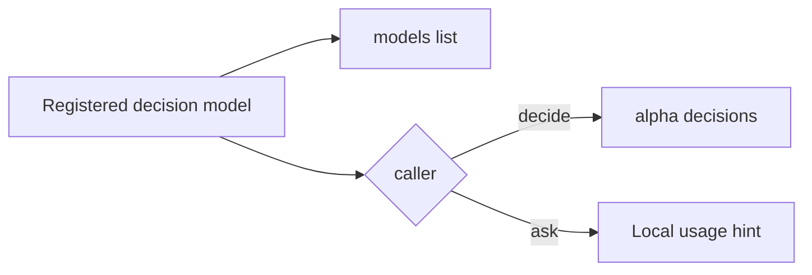

# Jev OpenRouter Decisions
- Branch: main
- Status: Implemented
- Input: integrate the Jev model used for X/Facebook filtering into CC Hub, rapid full input/output, APEX goal, commit and push main.
## User Scenarios & Testing
### Story 1 — Decide from typed input (P1)
- Description: developer sends a full JSON request or state/questions flags in one command.
- Priority reason: primary requested model integration.
- Independent test: API boundary and CLI input tests.
```gherkin
Feature: Typed decisions
 Scenario: Full request with all primitives
  Given a request with choice, score and noul questions and structured state
  When the developer runs cc-hub jev --input request.json
  Then one request reaches the OpenRouter alpha decisions endpoint
  And model, state, questions, provider, session_id, trace and user are retained
 Scenario: Invalid question
  Given a choice question without criteria
  When the developer submits the request
  Then the command fails with exit code 2 before network or credentials
  And stdout is empty
 Scenario: Structured guidance
  Given instructions and criteria containing objects, arrays and nullable choice criteria
  When the developer submits the request
  Then their JSON shapes are preserved
```

### Story 2 — Consume complete output quickly (P1)
- Description: scripts read complete decision metadata, or only answers, through stdout or a specified output file.
- Priority reason: user asks full parameters in output and rapid use.
- Independent test: CLI serialization and service response/error tests.
```gherkin
Feature: Decision outputs
 Scenario: Complete response
  Given a successful provider result with answer probabilities and optional metadata
  When the command completes
  Then stdout contains the complete JSON response including unknown extension fields
  And score values retain decimal precision
 Scenario: Answers only
  Given a valid decision response
  When the developer passes --answers-only --output answers.json
  Then the file contains the answers object
  And stdout is empty
 Scenario: Provider failure
  Given a failed, timed-out or malformed provider response
  When the command runs
  Then it fails with an actionable error and nonzero exit code
  And no successful output file or JSON is emitted
 Scenario: Dry run
  Given a complete request and no configured key
  When the developer passes --dry-run
  Then the validated effective request is emitted without network or credential lookup
```

### Story 3 — Discover the decision model without breaking chat (P1)
- Description: developer lists decision models and gets a helpful message if using a decision model with ask.
- Priority reason: complete catalog integration and compatibility.
- Independent test: registry, models listing and ask guard tests.
```gherkin
Feature: Decision model discovery
 Scenario: List Jev
  Given the model registry includes Jev
  When models list --provider openrouter --type decision runs
  Then typesafe/jev-1.13 and ~typesafe/jev-latest are listed
 Scenario: Reject chat misuse
  Given Jev is selected through ask
  When the chat command runs
  Then the command fails locally with a decide usage hint
  And no chat request is sent
```

## Acceptance Criteria
| ID | Given / When / Then |
|---|---|
| AC-001 | Given registry, when filtered by decision/OpenRouter, then pinned Jev and latest alias are available. |
| AC-002 | Given full inline/file/stdin JSON or flags, when invoked, then all documented request fields and structured guidance pass unchanged, explicit flags override body. |
| AC-003 | Given valid response, when output serialized, then answers, decimals, probabilities/confidence, usage, id/provider/model and extra fields are retained; answers-only/pretty/file output work. |
| AC-004 | Given invalid input/missing key/provider error/timeout/malformed response, when invoked, then safe stderr, empty success stdout and meaningful nonzero code; timeout is configurable and no auto retry. |
| AC-005 | Given Jev through ask, when executed, then it fails locally with decide hint; existing text model paths/defaults remain compatible. |
| AC-006 | Given installed cc-hub, when help/catalog and live three-primitive call run, then command is usable without reinstall and elapsed duration recorded. |
| AC-007 | Given validated implementation, when task delivered, then README/skill/spec mappings are current and isolated commit pushed to main. |
## Functional Requirements
| ID | Requirement | AC |
|---|---|---|
| FR-001 | Add decision model type, pinned Jev and official latest alias for OpenRouter only. | AC-001,AC-005 |
| FR-002 | Provide decide with jev alias, full JSON body inline/file/stdin, state/questions and all metadata overrides, validation before auth. | AC-002,AC-004 |
| FR-003 | Submit one bounded POST /api/alpha/decisions, all choice/score/noul question forms supported, safe auth/errors. | AC-002,AC-004,AC-006 |
| FR-004 | Validate response core and matching answer types while preserving complete extensible raw envelope; JSON/pretty/answers-only/file and dry-run. | AC-003,AC-004 |
| FR-005 | Prevent registered Jev models from using chat completion endpoint, keep text behavior. | AC-005 |
| FR-006 | Synchronize user/agent docs, tests, spec mapping, installed/live verification and main delivery. | AC-006,AC-007 |
## Key Entities
- DecisionRequest: model/state/questions plus provider/session_id/trace/user and additional JSON fields.
- Question: choice categorical guidance; score ordered levels; noul proposition and optional true/false guidance.
- DecisionResponse: typed answers and usage, optional metadata and additional JSON fields.
## Edge Cases
- Latest alias includes leading tilde; explicit flags take priority over body.
- Instructions may be structured JSON; choice criteria can be null; noul criteria must include both true and false if supplied.
- OpenRouter makes choice/score confidence, probabilities and score legend optional; do not reject absent optional fields.
- Provider preferences include all OpenAPI routing fields and retain additional parameters.
- No UI/persistent schema, direct TypeSafe provider, chat streaming, batch daemon or unrelated CI changes.
## Success Criteria
- SC-001: targeted/full Bun tests and tsc/Biome pass.
- SC-002: installed CLI help/list plus one live all-primitives response, timing recorded.
- SC-003: pushed isolated main commit verified by remote SHA.
## API Sources
- Read [OpenRouter Decisions reference](https://openrouter.ai/docs/api/api-reference/alphadecisions/submit-a-decisions-request) and [official OpenAPI](https://openrouter.ai/openapi.json), checked 2026-10-01.
