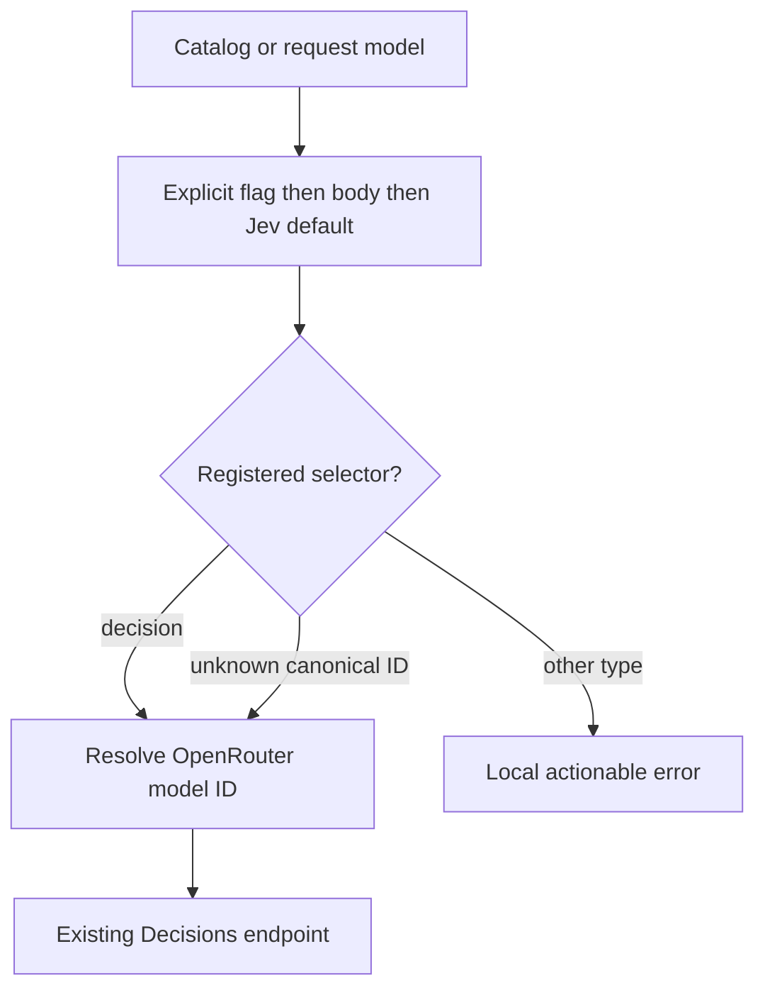
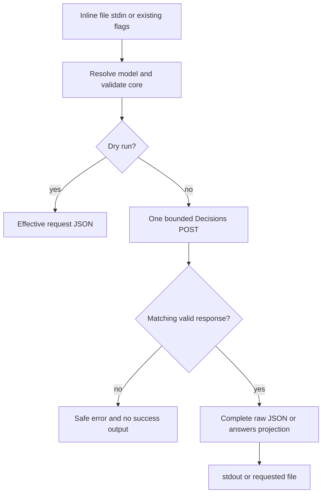
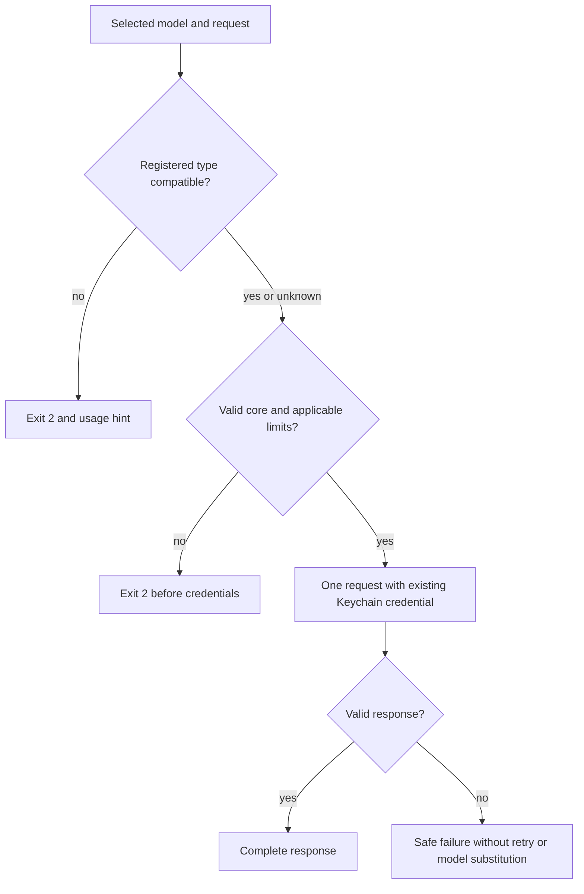

# Generic Decision Models

- **Feature:** Generic Decision Models
- **Feature Number:** 009
- **Branch:** main
- **Date:** 2026-10-07
- **Status:** Implemented
- **Input:** Integrate OpenRouter's `openai/gpt-6-luna-decisions` alongside Jev; select decision models generically with `decide -m <model>`, independent of model vendor, retaining all native parameters and complete inputs/outputs. Validate then commit and push main through the parent pipeline.
- **Dependency:** Extend feature 008's decision contract; no new UI, persistence, credentials or autonomous agent routing engine.

## User Scenarios & Testing

### Story 1 — Select and discover a decision model (P1)
- **Description:** A developer selects Luna or Jev by canonical ID or catalog alias using the same command.
- **Priority reason:** Requested second model and vendor-independent user workflow.
- **Independent test:** Registry lookup, command parsing and effective-request fixtures.

```gherkin
Feature: Generic decision selection
 Scenario: Choose Luna by canonical ID or alias
  Given a valid Decisions request
  When the developer runs decide with model openai/gpt-6-luna-decisions or luna-decisions
  Then its effective model is openai/gpt-6-luna-decisions
  And the request uses the existing OpenRouter Decisions endpoint
 Scenario: Preserve the default and alias
  Given a valid request without a model
  When the developer runs decide or its jev command alias
  Then its effective model is typesafe/jev-1.13
 Scenario: Explicit model override
  Given a request body selecting typesafe/jev-1.13
  When the developer runs jev with model luna-decisions
  Then the explicit model flag overrides the body with openai/gpt-6-luna-decisions
 Scenario: Discover decision capability
  Given the current model catalog
  When the developer filters models list by type decision and provider openrouter
  Then Luna and the existing pinned and latest Jev entries are discoverable
 Scenario: Future native model
  Given a valid request naming an unregistered nonempty canonical OpenRouter model ID
  When the developer submits it with decide
  Then that model ID is passed unchanged for provider-side compatibility checks
```



### Story 2 — Preserve native input and output (P1)
- **Description:** A developer supplies full request JSON and receives the complete raw validated response for the selected model.
- **Priority reason:** Model integration must expose the provider contract without lossy adapters.
- **Independent test:** Mock HTTP body equality and response serialization across all primitives and extension fields.

```gherkin
Feature: Native Decisions contract
 Scenario: Structured multimodal state and complete metadata
  Given Luna input with text, structured JSON or provider-native image references inside JSON state
  And choice, score and noul questions with structured guidance
  And provider routing, session_id, trace, user and JSON extension fields
  When the developer supplies inline, file or stdin JSON input
  Then the valid complete envelope reaches one bounded Decisions POST
  And only explicit overrides and model alias resolution change supplied fields
 Scenario: Complete optional and future response fields
  Given a valid response with decimal scores, probabilities and optional confidence, legend, id, provider, usage metadata and nested extensions
  When the developer consumes normal JSON or pretty output through stdout or an output file
  Then all response fields and numeric values are retained
 Scenario: Answers projection
  Given a valid response whose answers contain extensions
  When the developer requests answers-only output
  Then the complete answers object is retained while the outer envelope is omitted
 Scenario: Dry run without credentials
  Given valid input and no configured OpenRouter key
  When the developer requests dry-run
  Then the validated effective request is emitted
  And no credentials are read and no HTTP call occurs
```



### Story 3 — Enforce relevant capabilities and recover from errors (P1)
- **Description:** A developer receives local validation for known model limits and clear provider errors for unavailable or unsupported requests.
- **Priority reason:** Shared selection must preserve compatibility and avoid unnecessary paid requests.
- **Independent test:** Known limits, unknown-model passthrough, chat guards and typed error fixtures.

```gherkin
Feature: Decision capabilities and safety
 Scenario: Luna question boundary
  Given Luna requests containing 1 or 200 valid named questions
  When the requests are validated
  Then both requests pass local question-count validation
 Scenario: Reject Luna overflow
  Given a Luna request with 201 named questions
  When it is submitted
  Then exit code 2 and a model-specific limit message occur before credentials or network
 Scenario: Avoid Jev-specific bounds for Luna
  Given a Luna score question with 11 valid rubric levels
  When it is validated
  Then it is not rejected by the existing Jev-only 10-level bound
 Scenario: Preserve Jev validation
  Given a Jev score question with 11 levels or a choice with 256 options
  When it is validated
  Then its existing local validation still rejects it
 Scenario: Guard incompatible registered models
  Given a registered decision model selected in ask or a registered text model selected in decide
  When the command is invoked
  Then it fails locally with the appropriate command hint and sends no wrong-endpoint request
 Scenario: Provider or transport failure
  Given a missing key, provider rejection, malformed response, network failure or timeout
  When decide runs
  Then it retains safe actionable stderr and existing exit classes 3 for configuration and 4 for transport or response failures
  And it produces no success JSON, performs no automatic retry and selects no substitute model
```



## Acceptance Criteria

| ID | Given / When / Then |
|---|---|
| AC-001 | Given the catalog, when decision/OpenRouter filtering or lookups run, then `openai/gpt-6-luna-decisions` and alias `luna-decisions` resolve as decision capability alongside unchanged Jev pinned/latest entries; Luna is excluded from text-only results. |
| AC-002 | Given decide/jev and valid input, when selecting a model, then precedence is explicit `-m/--model` > body model > pinned Jev default; known decision IDs/aliases resolve to provider model IDs; unknown nonempty canonical IDs pass unchanged; the jev command alias obeys explicit selection. |
| AC-003 | Given native JSON input or existing flags, when a request is produced, then every documented core/native field and nested JSON extension is preserved except explicit overrides and alias normalization; input/file/stdin precedence and competing-stdin validation retain feature 008 behavior. |
| AC-004 | Given a valid provider result, when JSON/pretty/answers-only/file output runs, then complete selected output and decimals survive; optional fields may be absent, unknown fields survive, answer names/types match requested questions and invalid core responses fail without success output. |
| AC-005 | Given Luna requests, when local validation runs, then 1–200 named questions are accepted and 201 fails with code 2 before auth/network; common required shapes remain validated, while Jev's 1–255 choice and 1–10 score bounds remain Jev-specific and do not restrict Luna or unknown models without source-backed limits. |
| AC-006 | Given a registered wrong-category model, malformed input, dry-run or provider/configuration failure, when commands run, then wrong-endpoint calls are prevented, dry-run has zero credential/network access, and feature 008's safe errors, exit classes, timeout and no-automatic-retry behavior remain intact with no client model substitution. |
| AC-007 | Given the installed CLI and user/agent documentation, when reviewed, then decide help, README and cc-hub skill explain both models, alias/ID resolution, precedence, native JSON/extensions, model-specific limits and the distinction between Decisions parameters and chat parameters with accurate copyable examples. |
| AC-008 | Given implementation-ready sources, when acceptance is verified, then Gherkin-derived Bun unit/mock-HTTP/CLI contract tests cover AC-001–AC-007 for Luna and Jev, TypeScript and Biome pass, and isolated delivery excludes pre-existing unrelated changes; live inference is separately reported with model and timing if performed. |

## Functional Requirements

| ID | Requirement | AC |
|---|---|---|
| FR-001 | Register Luna as a decision model with `luna-decisions` alias and current source-backed metadata; keep existing Jev catalog entries, provider routing and non-decision catalogs compatible. | AC-001 |
| FR-002 | Resolve any decision selector generically, apply explicit flag/body/default precedence, preserve `jev` compatibility and unknown canonical IDs; do not add an autonomous router or select a different model after errors. | AC-002, AC-006 |
| FR-003 | Preserve full native request and response JSON through the existing Decisions transport and input/output options; validate required core without dropping JSON extensions or inventing chat-parameter support. | AC-003, AC-004 |
| FR-004 | Apply documented model-specific limits only to their model identities, including Jev aliases and Luna's 200-question maximum; retain shared primitive/schema constraints and allow undocumented upper bounds to be decided by the provider. | AC-005 |
| FR-005 | Retain safe Keychain credential reuse, pre-auth input validation, bounded single POST, dry-run, typed failures, complete response validation and wrong-category guards across both registered decision models. | AC-004, AC-006 |
| FR-006 | Update command help, README and cc-hub skill; derive focused and regression tests, source mappings and delivery evidence while preserving unrelated work. | AC-007, AC-008 |

## Key Entities

- **Decision model capability:** Canonical ID, aliases, provider model ID, decision category and source-backed model-specific limits/modalities.
- **Decision request:** Existing model/state/questions envelope plus optional routing/observability metadata and arbitrary JSON extensions; state is a string, object or array. Image references supplied in native JSON are retained; no upload/conversion helper is introduced.
- **Decision response:** Existing typed answers and usage with optional probabilities/confidence/legend/provider identifiers and arbitrary nested JSON extensions.

## Infrastructure Requirements

| Resource | Type/provider | Environment | Required when |
|---|---|---|---|
| Existing OpenRouter Decisions endpoint | HTTP API, OpenRouter | Local CLI | Inference only; continue POST `/api/alpha/decisions` and configured base-URL handling. |
| Existing OpenRouter API key | macOS Keychain via existing creds resolution | Local CLI | Inference only; reuse existing configured credential; no new key or plaintext secret. |

## Edge Cases

- Empty, all-whitespace or surrounding-whitespace model selectors fail with code 2 before configuration/auth/network; no silent trim can bypass a registered category or Luna's 200-question limit. Unknown canonical IDs without surrounding whitespace remain extensible.
- Body alias and command alias have different roles: `jev` is a backward-compatible command name; model aliases normalize to provider IDs.
- Requested model aliases may yield provider-versioned response model IDs; retain provider's returned model rather than rewriting it to the requested alias.
- Structured instructions/criteria and null choice guidance remain supported; noul criteria require true/false only when present. Optional confidence/probabilities/score legend cannot become mandatory.
- A score response is any finite JSON number, including 4, negative and decimal values; the source schema declares number/double without a numeric bound for Jev, Luna or future models. Reject nonnumeric/nonfinite scores; retain existing confidence/probability and noul [0,1] checks. Question-rubric counts do not impose a local response-score range. This is validation of native number shape, not evidence that a provider emits or considers an out-of-rubric score meaningful.
- Provider routing, trace custom fields, optional null routing fields and arbitrary nested extensions survive; passthrough is transport compatibility, not a promise every provider supports every extension.
- Native image data inside JSON is forwarded intact; no local filesystem image upload, chat message conversion, binary stdin or image generation.
- Luna limits are not global limits; the Jev latest alias inherits existing Jev validation. Unknown models receive common schema validation and provider-side capability checks.
- Existing stdout/file/pretty/answers-only and stdin collision contracts remain; failures never create successful JSON output or leak credentials/state/provider payloads.

## Success Criteria

- **SC-001:** Every AC-001–AC-007 has deterministic Bun fixture coverage; focused tests, existing regression suite, TypeScript and Biome finish with exit 0.
- **SC-002:** Installed CLI help and filtered catalog demonstrate Luna/Jev selection and correct command/category behavior; README/skill examples produce the specified effective request with dry-run.
- **SC-003:** Parent delivery verifies a pushed main commit whose diff contains only this feature's required changes; live provider success, if observed, has separate model/timing evidence and is never inferred from mocked tests.

## Quality Engineering

- **Risk:** High criticality, Shared/External blast radius, primary Contract risk, Medium confidence before implementation.
- **Dimensions:** Functional correctness, regression, API compatibility, security and operability apply; performance requires bounded single request and configurable timeout, without an invented latency SLA. CLI recovery applies; visual accessibility and data migration are N/A because no GUI or storage change exists.
- **P0 gates/evidence:** Alias/default precedence; raw body/response equality including nested extensions; Jev regression bounds versus Luna 200/201 and 11-level score fixtures; wrong-category and dry-run no-I/O; secret/payload-safe error tests. Require current independent spec/plan receipts plus later Bun transcripts and AC mappings.
- **P1 gates/evidence:** Installed help/catalog, README/skill dry-run examples, full regression suite and static checks. A live request may add integration evidence but is not required by unit/mock acceptance or the constitution.
- **Non-functional expectations:** Existing timeout, no retries and no client model fallback; no new dependencies/services/storage; preserve decimal JSON values; no credential or payload logs.
- **Gaps:** No runtime behavior or remote inference is proven during specification. Multimodal guide retrieval is unavailable; image-containing JSON is preserved without inventing a typed image serialization scheme. OpenAPI provides no Luna choice/score maximum, so no Jev-specific maximum is inferred.
- **Boundary:** QE defines risks/gates; independent reviewers review sources; later spec-test executes tests. No security audit or runtime certification is claimed by this spec.

## Clarifications

- User-authorized scope is one decision model integration and generic explicit model selection. Preserve pinned Jev default and `jev` alias; add the model alias `luna-decisions`. No additional command alias is needed.
- Vendor-independent selection means use model identity/capability through existing OpenRouter transport; new direct vendor integrations and automatic agent routing are outside scope.
- Full parameters means preserve supported Decisions-native fields and arbitrary JSON extensions through full JSON input/output; do not equate chat `supported_parameters` metadata with Decisions API support.
- Model limits are provider-backed metadata: Luna supports up to 200 questions. Common shapes still apply; Jev's existing local upper bounds remain confined to Jev. Unknown model IDs use shared shape validation without invented maxima.
- No new preflight tools/tokens: existing Bun, TypeScript, Biome and OpenRouter credential setup suffice. Commit/push main belongs to the parent's authorized final delivery phase.

## API Sources

- **Read** [Luna Decisions model page](https://openrouter.ai/openai/gpt-6-luna-decisions), checked 2026-10-07: identity, text/JSON/image state, three primitives, 200 questions; metadata snapshot, not a latency promise.
- **Read** [OpenRouter Decisions reference](https://openrouter.ai/docs/api/api-reference/alphadecisions/submit-a-decisions-request) and [official OpenAPI](https://openrouter.ai/openapi.json), checked 2026-10-07: endpoint, request/response required and optional fields and structured guidance. Current OpenAPI has no shared choice/score maximum.
- **Read** [existing Jev specification](../008-jev-openrouter/spec.md) for backward-compatible command/input/output, error and local-validation contracts.
