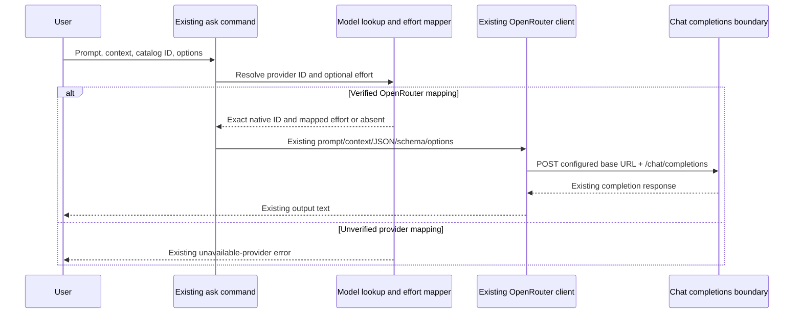

# Technical Plan: Text Model Catalog Update

## Summary

Add four source-backed text catalog entries and verify the existing provider, effort and ask contracts without changing defaults or inventing provider support.

- **Feature Status:** Planned; implementation and runtime acceptance remain pending.
- **Functional source:** Read [spec.md](spec.md) and the exact [source snapshot](sources.json) before implementation.
- **Scope:** S is retained from the reviewed spec: six FR describe one additive catalog change, no new entity, endpoint or persistence. Budget: one sequence diagram and four implementation steps.
- **Ownership:** Feature 010 owns the four text entries, their tests and bounded model documentation. Coordinate shared catalog/docs/tests with feature 009; preserve its decision entries and all pre-existing dirty work.
- **Publication:** The parent applies only this feature's delta in the current isolated candidate based on HEAD, which already contains feature 009. The foreign shared catalog split is excluded from delivery.

## Technical Context

| Aspect | Choice | Source / rationale |
|---|---|---|
| Language / runtime | Strict TypeScript / Bun | Existing constitution and default stack |
| CLI | Commander.js factories | Existing `ask` and `models` commands |
| Static catalog | Existing Model entries | Current isolated candidate keeps text entries in models.ts |
| Provider | Existing OpenRouter chat completions | Only provider mappings verified by the frozen source |
| Reasoning | Existing ordered effort mapping | Preserve nearest supported effort and omission behavior |
| Testing | bun:test with mocked HTTP / credentials | Constitution overrides generic Vitest convention |
| Static checks | TypeScript 6.0.3 / Biome 2.4.11 | Availability observed during planning; application checks pending |
| Storage / migrations / UI | None | Static additive CLI change; no screens or new persistence |

## Constitution Check

| Principle | Planned decision | Design assessment |
|---|---|---|
| Zero server / local first | Add static records; use current provider boundary | Pass; no server or daemon |
| Keychain credentials | Reuse current OpenRouter configuration and credential resolution | Pass; no new secret or plaintext token |
| Command factories | Preserve current `createAskCommand` / models factories | Pass; no new command surface |
| Fail fast | Retain unavailable-provider and invalid-effort behavior | Pass; deterministic negative assertions |
| Simplicity | Reuse lookup, provider resolution and effort mapper | Pass; no abstraction or new dependency |
| Explicit configuration | Leave existing defaults and environment references untouched | Pass; no migration |
| Module / naming | Kebab-case existing files; catalog data stays in data layer | Pass; Bun/functional patterns override generic Node/class suggestions |
| Testing | Derive catalog and request assertions from spec Gherkin | Pass as design; actual test execution pending |
| Living documentation | Update README, canonical skill and models reference together | Pass as design; mappings added only after implementation |

These are design assessments, not a whole-project conventions PASS. The earlier external corpus mismatch (201 sources versus 199 classified) is historical and resolved. The supplied current receipt reports PASS with 199 classified sources, zero unknown sources and four warnings; later feature-specific implementation/test certification remains pending.

## Infrastructure Setup

Reuse the existing OpenRouter base URL and credential reference. No account, credential creation, OAuth, provider client or provisioning command is needed. Before runtime checks, the parent uses the current project preflight; tests replace HTTP and credential lookup deterministically. Public metadata is already frozen in sources.json with SHA-256 `f95c3dc6fab7e1693e04ff1883738325b98df873789ced443919003398795edd`; a hash mismatch blocks source use and requires a reviewed spec update. Paid inference is optional and must be reported separately if actually observed.

## Service Interaction

```gherkin
Feature: Existing ask request with a new text model
  Scenario: Resolve a registered model and mapped effort
    Given a new catalog ID and prompt with stdin and file context
    And a JSON schema and explicit effort ultra
    When the existing ask command resolves the model for OpenRouter
    Then it maps ultra to max for the first three models or xhigh for Grok
    And the existing client posts the exact native ID and context to chat completions
    And the request has json_schema response_format and reasoning exclude true
  Scenario: Preserve provider-default reasoning
    Given a new catalog ID without an effort flag and JSON mode without a schema
    When the existing ask workflow sends its request
    Then it omits reasoning and retains json_object and the JSON system instruction
  Scenario: Reject an unverified provider
    Given a new catalog ID with provider Poyo
    When provider resolution runs
    Then it returns the existing unavailable-provider error before an HTTP call
```



### Diagram applicability

- **Sequence:** One diagram above covers the existing external API interaction and negative provider boundary.
- **State:** N/A; catalog records and requests introduce no stateful entity lifecycle.
- **ER:** N/A; no new table or persistence relationship.
- **API contracts:** No new API endpoint or transport schema; reuse the existing client request. No OpenAPI artifact is generated.
- **Penflow Contract Verdict:** ABSENT — this non-UI feature has no governed visual workspace; no certification is implied.

## Implementation Plan

### Step 1 — Add exact source-backed catalog records

**FR covered:** FR-001.1: Register four text records, FR-003.1: Declare ordered source efforts, FR-004.1: Preserve prior catalog records

**AC covered:** AC-001, AC-002, AC-004, AC-006. **SC covered:** SC-001.

- Modify the current isolated candidate catalog [models.ts](../../../src/data/models.ts), currently 430 lines before feature 010; keep the approved hard 500-line limit. The foreign shared text/media/music split is excluded from this candidate and this feature.
- Add exactly one record for `openai/gpt-6.1-sol`, `anthropic/claude-sonnet-5.5`, `anthropic/claude-opus-5.5`, `xai/grok-4.6`, all type text and only OpenRouter provider mappings. Grok maps to `x-ai/grok-4.6`.
- First three efforts: low, medium, high, xhigh, max. Grok: low, medium, high, xhigh. Do not encode a local default effort; source defaults remain provider behavior when the flag is absent.
- Preserve every old record field, existing order relative to old records, configuration default and feature 009's decision entries. Retain the existing direct native raw-ID pass-through without extending guaranteed model-specific effort mapping to arbitrary aliases.
- Verify the frozen source hash before using its records. Add requirement anchors at the actual additive records; no copied implementation mapping before code exists.

### Step 2 — Verify catalog routing and effort compatibility

**FR covered:** FR-001.2: Assert exact model lookup, FR-002.1: Verify provider resolution, FR-003.2: Assert mapped effort bounds, FR-004.2: Assert unchanged prior contracts, FR-006.1: Run catalog regressions

**AC covered:** AC-001, AC-002, AC-004, AC-006, AC-008. **SC covered:** SC-001, SC-002.

- Extend [models service tests](../../../tests/services/models.test.ts) and [models command tests](../../../tests/commands/models.test.ts).
- Exercise actual `findModel`, `listModels`, `resolveForProvider` and `mapReasoningEffortForModel`; do not mock these pure functions.
- Assert exactly one entry per ID, text/OpenRouter filters, exact native resolution, unsupported-provider exclusion and existing resolution error for Copilot/Codex/Poyo.
- For each entry assert the entire ordered effort list, unchanged supported efforts, minimal→low and ultra→max/xhigh. Preserve raw native Grok ID pass-through.
- Capture the current pre-010 catalog projection (105 entries after feature 009) without altering the independent frozen 104-entry [decision baseline](../../../tests/fixtures/decision-catalog-baseline.json); after the four additions expect 109 entries and compare prior fields/order, excluding only those four IDs. Assert defaults unchanged and Jev/Luna remain decision entries after feature 009 is present.
- No service algorithm change is expected. If evidence reveals a mismatch, update/review the plan before widening scope; do not modify common routing silently.

### Step 3 — Verify existing ask request boundaries

**FR covered:** FR-002.2: Assert prompt/context JSON requests, FR-003.3: Assert omitted reasoning behavior, FR-004.3: Retain existing ask contract, FR-006.2: Run HTTP boundary regressions

**AC covered:** AC-003, AC-005, AC-006, AC-008. **SC covered:** SC-002.

- Extend [ask command tests](../../../tests/commands/ask.test.ts) and add or extend [OpenRouter client tests](../../../tests/services/openrouter.test.ts) based on the existing runner layout.
- Derive table-driven cases for all four registered IDs using real command/provider/effort paths and a mocked HTTP/credential output boundary.
- Assert configured chat completions URL, exact native model, prompt first, existing stdin/file context message shape, JSON-schema response_format, plain JSON json_object plus system instruction, and explicit mapped effort `{effort, exclude: true}`.
- Assert omitted effort omits reasoning entirely and no disable field is introduced. Mock response text and check existing output; no real Keychain, paid API or unrelated secret lookup.
- Keep existing invalid schema, unavailable model/provider and HTTP-error tests; restore mocks and temporary files per test so shared test modules do not contaminate later tests.

### Step 4 — Synchronize docs and certify the additive delta

**FR covered:** FR-005.1: Sync bounded model references, FR-006.3: Run static and full regression, FR-004.4: Verify isolated delivery scope

**AC covered:** AC-006, AC-007, AC-008. **SC covered:** SC-002, SC-003.

- Update [README](../../../README.md), [canonical cc-hub skill](../../../.agent-sync/skills/cc-hub/SKILL.md) and its [model reference](../../../.agent-sync/skills/cc-hub/references/models.md) with the same four IDs, OpenRouter availability and documented bounded efforts.
- Preserve old defaults and options. Explain that omitted effort leaves provider default, minimal/ultra map through the existing supported list, and only current ask prompt/context/model/provider/JSON/schema/effort options are exposed. No unverified native Codex/Copilot/Poyo availability or new general OpenRouter parameter flags.
- Run focused Bun suites, TypeScript and applicable Biome checks; parent runs full regression and feature 009 decision/ask regressions after shared changes settle. Review doc/catalog coherence against the exact source/spec.
- After implementation, create requirement/AC mappings with actual anchors/tests and append changelog via native finalization. Require current semantic progression and native acceptance evidence; require current feature-specific conventions certification; the former external corpus blocker is resolved and does not establish feature 010 runtime acceptance.
- Parent owns selective commit/push on main. Test the actual isolated candidate that contains required dependencies and the authorized additive delta, preserving unrelated working-tree refactors and excluding generated preflight report modifications. Verify remote identity after push; no commit/push is performed by this planning command.

## Resolved Test Commands

| Action | Command | Tool / availability | Execution status |
|---|---|---|---|
| Catalog / command unit regression | `bun test tests/services/models.test.ts tests/commands/models.test.ts` | Bun 1.3.9 observed | Planned; feature tests not run |
| Ask / HTTP integration boundary | `bun test tests/commands/ask.test.ts tests/services/openrouter.test.ts` | bun:test; new file added if absent | Planned; deterministic mocks |
| Nearby decisions | `bun test tests/services/decisions.test.ts tests/commands/decide.test.ts` | Existing bun:test | Planned after shared009 work |
| Type check | `bunx --no-install tsc --noEmit` | TypeScript 6.0.3 observed | Planned; availability is not typecheck success |
| Lint / format changed TypeScript | `bunx --no-install @biomejs/biome check <changed-ts-files>` | Biome 2.4.11 observed | Planned; no install required |
| Full suite | `bun test` | Existing bun:test | Planned in isolated candidate |
| Visual / browser E2E | N/A | Pure CLI; no screens | Not applicable |
| Installed CLI / delivery | Parent invokes actual installed `cc-hub` after tests | Existing local CLI | Pending actual installation/path proof |

## Testing Strategy

| Level / priority | Behavior from Gherkin | Concrete test file(s) | FR / AC / SC | Required proof |
|---|---|---|---|---|
| Unit P0 | Discover exactly four additions and exact native IDs | models service + command tests | FR-001, FR-002; AC-001, AC-002; SC-001 | Bun assertions for real lookup/filter/resolution |
| Unit P0 | Unsupported provider exclusion/error and raw Grok ID | models service tests | FR-002, FR-004; AC-002, AC-006 | Error and pass-through assertions |
| Unit P0 | Full effort lists and supported/minimal/ultra mapping | models service tests | FR-003; AC-004, AC-005 | Table-driven real mapper assertions |
| Integration P0 | Prompt/stdin/files plus schema and plain JSON | ask command + OpenRouter client tests | FR-002, FR-006; AC-003, AC-008 | Captured mocked HTTP body/URL |
| Integration P0 | Explicit exclude-true and omitted reasoning | ask command + OpenRouter client tests | FR-003; AC-005 | Body presence/absence assertions for all IDs |
| Regression P0/P1 | Prior records/defaults and decision separation | models + existing ask/decide tests | FR-004, FR-006; AC-006, AC-008; SC-002 | Pre-change projection and focused/full transcripts |
| Documentation P1 | Four coherent references and bounded options | README + canonical skill/model reference | FR-005; AC-007; SC-003 | Source/spec/catalog/doc diff review |
| Static P0 | Types and changed-code conventions | Changed source/tests | FR-006; AC-008 | Actual tsc/Biome transcripts |

## Quality Engineering Analysis

Risk: Medium criticality, Shared blast radius, primary Contract risk; source metadata confidence High, actual inference unproven.

| Dimension / risk | Gate and level | Artifact / owner | Evidence gap now |
|---|---|---|---|
| Functional / contract | P0 exact catalog, provider and request tests | Bun transcripts, body assertions; implementer/tester | No application change or test execution |
| Regression | P0 old-entry/default projection; P1 shared009 suites | Baseline diff and Bun suites; parent | Isolated candidate exists with feature009; feature010 delta/tests pending |
| Reasoning compatibility | P0 ordered-list/mapping/omission cases | Real mapper and HTTP assertions; tester | No paid inference; not required |
| Documentation | P1 exact IDs/options/provider coherence | README/skill/model reference diff; reviewer | References not yet modified |
| Security / operability | Reuse secret/error boundary; mock credentials | Test harness + no-secret-output review | No new credential or provider provisioning |
| Performance | Static records only; no new startup dependency/network call | Scope diff; reviewer | No benchmark necessary for unchanged algorithm |
| Data / migration / accessibility / visual UX | N/A: no storage change or screens | Reviewed scope | No visual or migration certificate claimed |
| Evidence integrity | Current spec/plan review, Analyze, tsc/Bun, native acceptance and conventions | Native receipts; parent | Historical201/199 corpus blocker resolved; feature010 evidence pending |

Blocking gates: frozen source hash; current complete independent plan review; shared Clarify/Analyze progression; focused/full regression, tsc and applicable Biome; docs coherence; actual conventions certification and isolated candidate delivery checks. Planning completes documentary evidence only; the current external corpus PASS does not certify later feature execution. QE selects gates and evidence; independent review evaluates semantic design, spec-test executes application tests, and the parent handles acceptance and publication. Public metadata and mocked requests do not certify successful paid inference.

## Risks & Considerations

- Native `x-ai/` differs from catalog `xai/`; both registered resolution and existing raw-ID pass-through need explicit tests.
- Static source effort metadata must be used exactly; no implicit local default or unsupported provider mapping.
- Shared application files are owned by another feature execution during this plan. Apply changes after coordination; preserve unrelated work and test the actual delivery candidate.
- Existing source metadata may change later; this plan binds the frozen snapshot, not future silent migration.
- Native feature-specific conventions remains a prerequisite for later implementation/test certification. The external LiveSpec repair has resolved the historical corpus mismatch; its PASS is not feature 010 runtime proof.

## Next Action

Run `$spec-implement 010-model-catalog-update --auto --model=gpt-6 --review-max-chars=400000` after the parent observes required current Analyze/preflight/conventions gates. Implementation, tests and main publication remain separate uncompleted work.
