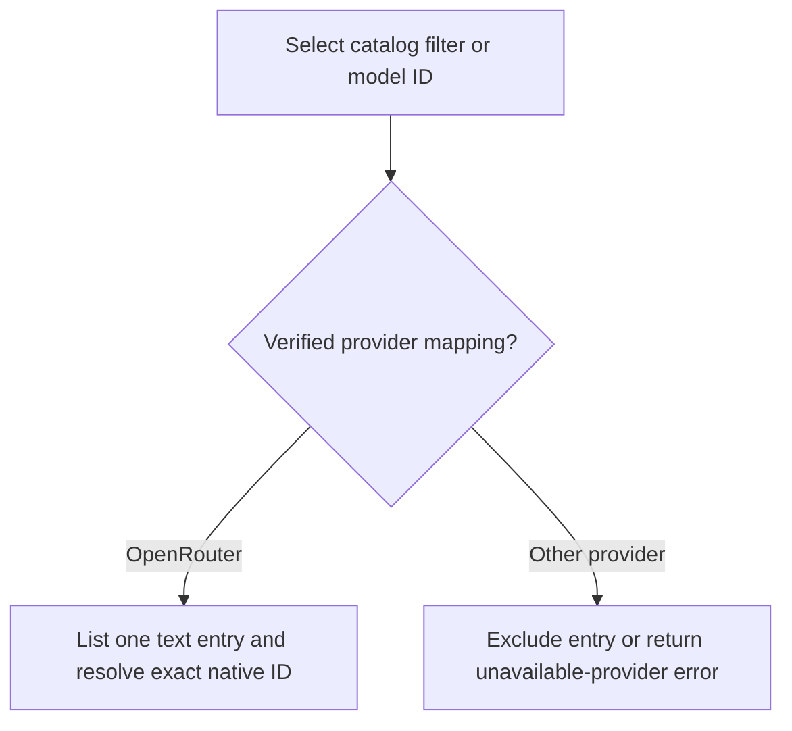
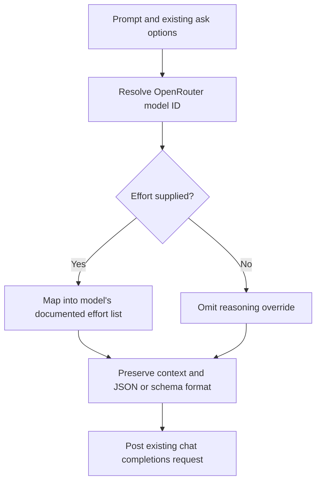
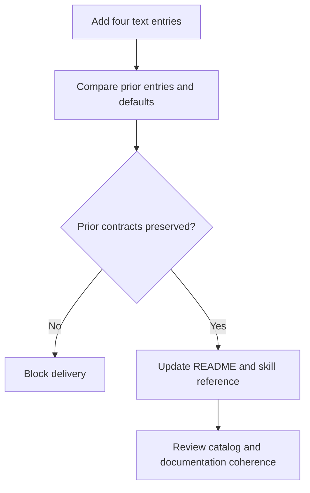

# Text Model Catalog Update

- **Feature:** Text Model Catalog Update
- **Feature Number:** 010
- **Branch:** main
- **Date:** 2026-10-08
- **Status:** Implemented
- **Input:** Register GPT-6.1 Sol, Claude Sonnet 5.5, Claude Opus 5.5 and Grok 4.6 in cc-hub's text model catalog, as explicitly requested during the Luna Decisions integration.
- **Dependency:** Existing model catalog, provider resolution and OpenRouter ask workflow. Feature 009's decision entries remain independent.

## Clarifications

- The dictated Grok version means Grok 4.6; do not substitute Grok 4.7 or another variant.
- Add the four verified OpenRouter models without changing configured defaults, existing entries, automation prompts or external Codex settings.
- cc-hub exposes its current ask options only: prompt/stdin, files, model/provider, JSON/schema and reasoning effort. OpenRouter's other supported parameters do not become new CLI options.
- Only OpenRouter mappings are established by this feature's source snapshot. Copilot, Poyo and Codex mappings require separate provider-specific evidence and are outside this change.
- This is a CLI catalog feature with no visual screens, native behavioral screen contract or mockups.

## Source Evidence

Read the [model source snapshot](sources.json) for the four exact records selected from the public OpenRouter models API on 2026-10-08. Consult the official [GPT-6.1 Sol](https://openrouter.ai/openai/gpt-6.1-sol), [Sonnet 5.5](https://openrouter.ai/anthropic/claude-sonnet-5.5), [Opus 5.5](https://openrouter.ai/anthropic/claude-opus-5.5) and [Grok 4.6](https://openrouter.ai/x-ai/grok-4.6) pages for provider identity. Metadata is evidence of supported routing/capability, not an observed successful paid inference.

- **Source snapshot SHA-256:** `f95c3dc6fab7e1693e04ff1883738325b98df873789ced443919003398795edd`. Verify the linked snapshot against this digest before using its evidence; a mismatch blocks that use and requires updating the spec and its current review together.

| Catalog ID | OpenRouter ID | Type | Supported efforts in ascending cc-hub order | Provider default effort |
|---|---|---|---|---|
| `openai/gpt-6.1-sol` | `openai/gpt-6.1-sol` | text | low, medium, high, xhigh, max | medium |
| `anthropic/claude-sonnet-5.5` | `anthropic/claude-sonnet-5.5` | text | low, medium, high, xhigh, max | high |
| `anthropic/claude-opus-5.5` | `anthropic/claude-opus-5.5` | text | low, medium, high, xhigh, max | high |
| `xai/grok-4.6` | `x-ai/grok-4.6` | text | low, medium, high, xhigh | high |

All four source records declare mandatory reasoning. Without `--effort`, preserve the existing ask behavior of omitting the reasoning override and allowing the provider's default. The current request uses `reasoning.exclude: true` when an effort is sent; that controls returned reasoning content and does not disable mandatory reasoning.

## User Scenarios & Testing

### Story 1 — Discover and resolve the new models (P1)

- **Description:** A developer discovers each requested text model and resolves its exact OpenRouter identifier.
- **Priority reason:** An unregistered or wrong identifier prevents the requested catalog workflow.
- **Independent test:** Model lookup and type/provider filtering using the catalog and provider-resolution functions.

```gherkin
Feature: Text model discovery
  Scenario: Discover the four additions
    Given the model catalog contains the four entries in Source Evidence
    When the developer lists text models filtered by provider openrouter
    Then each of the four catalog IDs occurs exactly once
    And each resolves to its exact OpenRouter ID from Source Evidence
  Scenario: Keep unsupported providers absent
    Given the four new entries have only verified OpenRouter mappings
    When the developer filters the catalog by provider copilot, codex or poyo
    Then none of the four additions appears in that provider's results
    And resolving a new catalog ID for that provider fails with the existing unavailable-provider error
```



### Story 2 — Use the existing ask options with correct reasoning (P1)

- **Description:** A developer selects a new model through the current ask workflow, preserving its prompt/context and structured-output options.
- **Priority reason:** Catalog metadata must produce a provider-compatible request rather than reject or silently change the user's input.
- **Independent test:** Mocked OpenRouter HTTP boundary plus reasoning mapping tests derived from the scenarios.

```gherkin
Feature: Ask with the new models
  Scenario: Send an explicit supported effort and structured output
    Given the developer selects one of the four catalog IDs
    And supplies a prompt, stdin context, file context, a JSON schema and effort high
    When the existing OpenRouter ask workflow builds the request
    Then it posts to the configured OpenRouter chat completions endpoint with the exact native ID
    And preserves prompt, stdin and file context in the existing message format
    And sends the existing json_schema response_format
    And sends reasoning effort high with exclude true
  Scenario: Apply the current effort mapping at the boundaries
    Given the developer selects one of the four catalog IDs
    When the developer requests effort minimal or ultra
    Then minimal maps to low for each new model
    And ultra maps to max for GPT-6.1 Sol, Sonnet 5.5 and Opus 5.5
    And ultra maps to xhigh for Grok 4.6
  Scenario: Leave omitted effort to provider defaults
    Given the developer selects one of the four catalog IDs without an effort flag
    When the existing ask workflow builds the request
    Then it omits the reasoning override
    And the catalog update does not disable mandatory reasoning or set a local default effort
  Scenario: Keep JSON mode without a schema
    Given the developer selects one of the four catalog IDs with the JSON flag and no schema
    When the existing ask workflow builds the request
    Then it sends the existing json_object response_format and JSON system instruction
```



### Story 3 — Preserve existing selection and documentation (P1)

- **Description:** A developer can continue existing model/default workflows and find the new IDs in the command reference.
- **Priority reason:** Catalog additions must not migrate unrelated configured behavior.
- **Independent test:** Existing catalog/default regression assertions and a source-backed documentation coherence review.

```gherkin
Feature: Catalog compatibility
  Scenario: Keep old models and defaults
    Given the catalog and configuration before this feature
    When the four text entries are added
    Then existing entries retain their type, provider IDs and effort lists
    And configured command defaults retain their existing values
    And the Jev and Luna decision models remain decision entries
  Scenario: Keep the user-facing reference coherent
    Given the four new entries are implemented
    When a developer reads the README and cc-hub skill model reference
    Then both references list the four catalog IDs and verified OpenRouter availability
    And neither advertises an unverified provider mapping, a new default or an unexposed ask parameter
```



## Acceptance Criteria

### AC-001

The catalog contains exactly one text entry per catalog ID in Source Evidence, with the exact OpenRouter mapping listed there.
### AC-002

Text/OpenRouter filters return the four additions; Copilot, Codex and Poyo filters omit them, and resolution of their catalog IDs for those providers reports the existing unavailable-provider error.
### AC-003

For each new model, a mocked ask request preserves its native model ID, prompt/stdin/file context and existing JSON or schema request shape; its endpoint remains the configured chat completions endpoint.
### AC-004

The new effort lists equal Source Evidence in ascending cc-hub order; supported efforts pass unchanged, minimal maps to low, and ultra maps to max for the first three models or xhigh for Grok.
### AC-005

Omitting effort adds no reasoning override; explicit mapped effort uses the current exclude-true request shape without any disable flag for mandatory reasoning.
### AC-006

Existing catalog entry values, command defaults and the decision/text distinction remain unchanged by this feature, including feature 009's entries.
### AC-007

The README and canonical cc-hub skill describe the four catalog IDs, their verified OpenRouter mapping and supported effort behavior without claiming additional ask parameters or provider availability.
### AC-008

Catalog/routing/effort/ask regression tests derived from these Gherkin scenarios pass under bun:test, and the TypeScript check passes; deterministic mocks require no paid inference or real credential access.

## Functional Requirements

- **FR-001:** Register the four exact catalog IDs as text models with OpenRouter identifiers from Source Evidence. Maps to AC-001, AC-002.
- **FR-002:** Use the existing provider-resolution and ask request contracts for these entries, including prompt, stdin, file context, JSON and JSON-schema behavior. Maps to AC-002, AC-003.
- **FR-003:** Advertise source-proven reasoning efforts in ascending cc-hub order and retain the current nearest-supported-effort mapping and omission behavior. Maps to AC-004, AC-005.
- **FR-004:** Preserve each pre-existing entry, default, command API and decision capability; this change does not migrate external settings or automation prompts. Maps to AC-006.
- **FR-005:** Synchronize README and canonical cc-hub skill model documentation with the resulting catalog and bounded ask capabilities. Maps to AC-007.
- **FR-006:** Prove the Gherkin-derived behavior through deterministic catalog and mocked HTTP tests plus the existing TypeScript check. Maps to AC-001 through AC-008.

## Key Entities

- **Model catalog entry:** Existing Model entity with catalog ID, text type, verified provider mapping and ordered reasoning-effort list; no new persistence entity.
- **OpenRouter source record:** Public model identity, supported parameters and reasoning metadata frozen in the source snapshot for review.
- **Ask request:** Existing prompt/messages, context, response format and optional mapped reasoning fields; no new transport contract.

## Edge Cases

- The catalog uses `xai/` while OpenRouter uses `x-ai/`; resolve the catalog ID exactly and preserve the existing raw-ID pass-through for a directly supplied native `x-ai/grok-4.6` ID.
- Native raw-ID pass-through retains its existing behavior; model-specific effort mapping is guaranteed for the registered catalog IDs, not every possible provider alias.
- Efforts minimal and ultra are globally valid but absent in the source lists; apply the existing bounded mapping rather than advertise unsupported source capability.
- Missing credentials, HTTP errors, invalid JSON schema and unknown models retain the existing command error behavior.
- A source record changing after the snapshot requires a reviewed spec/catalog update; it does not silently migrate local defaults.

## Quality Engineering Analysis

- **Risk:** Criticality Medium; blast radius Shared; primary risk Contract; confidence High for the frozen metadata, unproven for paid runtime inference.
- **Functional correctness / contract compatibility:** P0 catalog lookup, provider-resolution and mocked request assertions for AC-001 through AC-005; compare exact IDs and request fields.
- **Regression:** P0 unchanged-entry/default assertions and P1 existing decision/ask tests for AC-006, plus docs coherence for AC-007.
- **Security / operability:** No new credentials, storage, logging or provider client; retain existing secret handling and error boundaries. Mock HTTP and credential lookup during tests.
- **Performance:** Static additions only; no new request, daemon or startup dependency. Existing lookup/ask code paths remain applicable.
- **Data/migration and accessibility/visual UX:** Not applicable; no persistence migration or screens.
- **Blocking gates:** Structural spec validation, current complete independent review, Clarify/plan progression, targeted bun:test regression, TypeScript check and documentation coherence.
- **Expected evidence:** Source snapshot, raw independent review receipt, Gherkin-to-test mapping, targeted test/typecheck transcripts and README/skill diff.
- **Gaps:** This Specify phase establishes no implementation or runtime-test proof for feature 010. The earlier external conventions manifest mismatch (201 source files versus 199 covered) was historical and has since been resolved; the supplied current corpus receipt reports PASS with 199 classified sources, zero unknown sources and four warnings. That corpus receipt does not certify this feature's later implementation or runtime tests.
- **Boundary:** QE defines risks and evidence; independent review evaluates the spec and later spec-test validates application behavior. Metadata and mocks do not certify successful paid inference.

## Infrastructure Requirements

- Reuse the existing OpenRouter base URL and credential configuration; no new provider account, secret name or dependency is required.
- Public metadata is read-only source evidence. CI and local regression tests use deterministic HTTP responses instead of real OpenRouter inference.

## Success Criteria

- **SC-001:** All four exact catalog entries are discoverable and resolve to the documented OpenRouter identifiers, with zero duplicate IDs or invented provider mappings.
- **SC-002:** AC-001 through AC-008 have their specified evidence and the focused Bun/TypeScript checks pass without changing any pre-existing default or catalog record.
- **SC-003:** README and cc-hub skill list the same four entries and provider/effort contract as the catalog, with zero claims for unexposed ask parameters.
