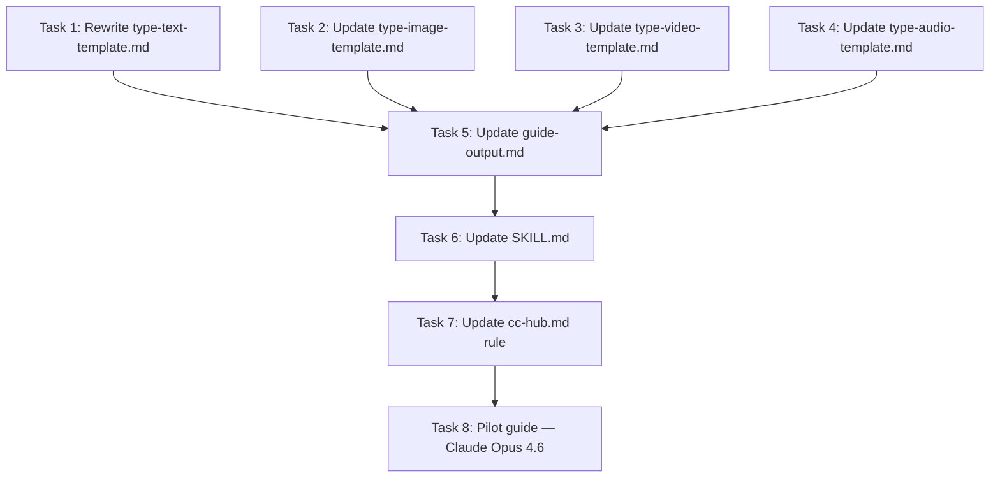

# Implementation Plan: Prompt Guide Refactor

Spec: `docs/superpowers/specs/2026-04-01-prompt-guide-refactor-design.md`

## Task Dependency Graph



## Tasks

### Task 1: Rewrite `type-text-template.md` (INDEPENDENT)

**File:** `.claude/skills/prompt-guide/references/type-text-template.md`

**Action:** Full rewrite. Replace 6-section identity-based structure with 5-section block-based structure:

1. **Core Prompting Rules** — 5-10 operational rules (replaces "Prompting Identity")
   - Content: behavioral shifts, hard constraints, native conventions, optional role preamble
   - Quality: every rule must affect prompting, no specs/marketing
2. **Block Catalog** — Two subsections:
   - 2a. Prompt Blocks: table (name, purpose, when to use) + 2-3 line example per block
   - 2b. API Controls: table (control, values, default, when to change) + SDK snippet per control
3. **Task Recipes** — 4+ complete recipes
   - Format: task label, block list, effort recommendation, complete prompt with `{dynamic_slots}`
4. **Anti-Patterns** — 8+ entries
   - Format: name, bad example, better example, one-line why
5. **Sources** — unchanged

**Size guidance:** Template itself ~120 lines (defines structure, not content).

### Task 2: Update `type-image-template.md` (INDEPENDENT)

**File:** `.claude/skills/prompt-guide/references/type-image-template.md`

**Action:** Rename only:
- "Prompting Identity" → "Core Prompting Rules" (update content description to match: operational rules, not personality)
- "Do / Don't" → "Anti-Patterns" (update format to bad/better/why)
- Keep sections 2 (Prompt Structure) and 3 (Style & Keywords) unchanged

### Task 3: Update `type-video-template.md` (INDEPENDENT)

**File:** `.claude/skills/prompt-guide/references/type-video-template.md`

**Action:** Same renames as Task 2:
- "Prompting Identity" → "Core Prompting Rules"
- "Do / Don't" → "Anti-Patterns"

### Task 4: Update `type-audio-template.md` (INDEPENDENT)

**File:** `.claude/skills/prompt-guide/references/type-audio-template.md`

**Action:** Same renames as Task 2:
- "Prompting Identity" → "Core Prompting Rules"
- "Do / Don't" → "Anti-Patterns"
- Add note: "Music guides use this template (type=audio)"

### Task 5: Update `guide-output.md` (DEPENDS ON: Tasks 1-4)

**File:** `.claude/skills/prompt-guide/templates/guide-output.md`

**Action:**
1. Update format template: rename section headers (Identity → Core Prompting Rules, etc.)
2. Replace section mapping table with new mapping (from spec)
3. Replace mandatory minimums table (from spec)
4. Add note about music → audio mapping
5. Update content rules to reference block-based structure
6. Add size budget: max 200 lines (text), max 120 lines (non-text)

### Task 6: Update `SKILL.md` (DEPENDS ON: Task 5)

**File:** `.claude/skills/prompt-guide/SKILL.md`

**Action:** This is a substantial rewrite of Steps 5-6 and the rubric, not a light touch-up.

1. **Step 5** ("Chargement du template"): update description to reference new template structure (Core Prompting Rules, Block Catalog, Task Recipes, Anti-Patterns)
2. **Step 6** ("Rédaction du guide"): full rewrite of writing rules:
   - Replace identity-focused rules with block-based operator style rules
   - Add: "Structure guides as operator references, not personality descriptions"
   - Add: "Prompt Blocks go in prompt text, API Controls go in API call envelope — never mix"
   - Add: "Recipes must use dynamic slots ({user_task}, {code_to_review}), not zero-placeholder concrete examples"
3. **"Ce que le guide DOIT contenir"**: rewrite entirely:
   - Core Prompting Rules (5-10 operational rules, migration shifts)
   - Block Catalog (prompt blocks + API controls with SDK snippets)
   - Task Recipes (4+ complete recipes with dynamic slots and block references)
   - Anti-Patterns (8+ bad/better/why entries)
4. **"Ce que le guide NE DOIT PAS contenir"**: add:
   - Identity/personality descriptions ("you are a world-class expert")
   - Partial templates with vague placeholders
   - API techniques separated from their prompt blocks
5. **Quality rubric**: replace with new weights (from spec: Core Rules 15%, Block Catalog 20%, Recipes 25%, Anti-Patterns 20%, Actionable 10%, Zero specs 5%, Format 5%)
6. **Size budget**: add enforcement — max 200 lines (text), 120 lines (non-text)

### Task 6b: Verify reference files (DEPENDS ON: Task 6)

**Files:** `references/known-models.md`, `references/research-sources.md`

**Action:** Quick verification — scan for section-name references ("Prompting Identity", "Do / Don't", "Model-Specific Techniques") that would conflict with the new template structure. Update any references found.

### Task 7: Update `cc-hub.md` rule (DEPENDS ON: Task 6b)

**File:** `.claude/rules/cc-hub.md`

**Action:** Add format-agnostic consumption protocol after "Cache de session" section. Must handle both old-format and new-format guides:

```markdown
### Comment utiliser le guide chargé

Le guide peut être en ancien format (Prompting Identity, Do/Don't) ou nouveau format (Core Prompting Rules, Block Catalog, Anti-Patterns). Les étapes s'adaptent :

1. Lire la première section (Core Prompting Rules ou Prompting Identity) — appliquer à TOUS les prompts
2. Identifier le type de tâche (coding, review, research, agentic, extraction)
3. Sélectionner la recette correspondante (Task Recipe ou Prompt Recipe by Task Type)
4. Remplacer les slots dynamiques ({user_task}, {code_to_review}, etc.) avec le contenu réel
5. Si Block Catalog présent : ajuster les API Controls selon la recommandation de la recette. Sinon : appliquer les Model-Specific Techniques pertinentes.
6. Vérifier les Anti-Patterns ou Do/Don't avant envoi — aucun ne doit s'appliquer au prompt
```

### Task 8: Pilot guide — Claude Opus 4.6 (DEPENDS ON: Task 7)

**File:** `~/.claude-hub/prompts/anthropic-claude-opus-46.md`

**Action:** Manual restructure of the existing Opus 4.6 guide into new format. This is a manual exercise to validate the template, NOT an invocation of `/prompt-guide` (end-to-end skill validation is a follow-up).

1. Core Prompting Rules: extract from current "Prompting Identity" + key techniques (literal instruction following, XML tags, over-engineering, no prefilling, document ordering, system prompt amplification)
2. Block Catalog:
   - 2a. Prompt Blocks: extract from current recipes (`<context>`, `<task>`, `<constraints>`, `<output_contract>`, `<instructions>`, `<verification_loop>`, `<documents>`, `<tool_guidance>`)
   - 2b. API Controls: extract from "Model-Specific Techniques" (adaptive thinking, effort, structured outputs, vision, compaction, parallel tool calling)
3. Task Recipes: restructure current 4 recipes with dynamic slots and block references
4. Anti-Patterns: restructure current Do/Don't table into bad/better/why format (11 current entries → 8+ anti-patterns)
5. Sources: keep as-is

**Validation:**
- Line count target: ~180 lines (vs current 259)
- Verify Block Catalog is structurally parseable
- Verify each recipe references blocks from the catalog
- Verify anti-patterns follow bad/better/why format

**Follow-up (out of scope):** End-to-end validation by invoking `/prompt-guide --model anthropic/claude-opus-4.6` to confirm the skill produces correct new-format output.

## Parallelization

- **Tasks 1-4**: fully independent, run in parallel
- **Task 5**: depends on 1-4 (needs to know final section names)
- **Task 6**: depends on 5 (needs to reference correct template)
- **Task 7**: depends on 6 (light dependency — just needs to be consistent)
- **Task 8**: depends on 7 (needs all templates finalized)

## Estimated Complexity

| Task | Files | Complexity |
|------|-------|------------|
| 1 | 1 | High (full rewrite) |
| 2 | 1 | Low (rename) |
| 3 | 1 | Low (rename) |
| 4 | 1 | Low (rename) |
| 5 | 1 | Medium (table updates) |
| 6 | 1 | Medium (rubric + rules) |
| 7 | 1 | Low (add section) |
| 8 | 1 | High (restructure guide) |
