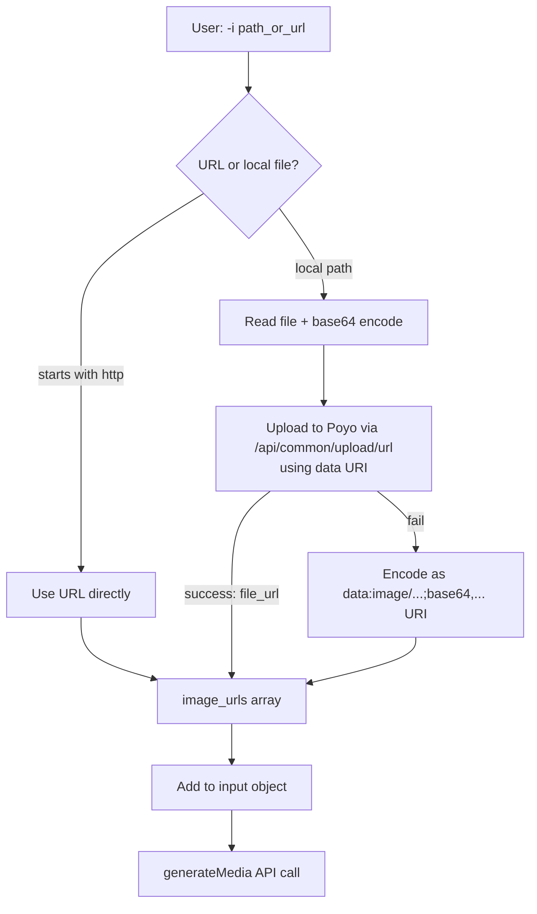

# Image Reference Support for `imagine` and `video` Commands

## Purpose

Allow `imagine` and `video` commands to accept a reference image (`-i, --image <path_or_url>`) in addition to the text prompt, enabling image-to-image generation and image-to-video animation via the Poyo API.

## Context

- Both commands currently accept only a text prompt
- Poyo API supports `image_urls: string[]` in the `input` object for both Nano Banana and Kling 3.0 models
- Poyo provides an upload-from-URL endpoint (`POST /api/common/upload/url`) for hosting images temporarily (72h expiry)
- No base64 upload endpoint is reliably documented

## Architecture

### Data Flow



### Sequence Diagram

```mermaid
sequenceDiagram
    participant U as User
    participant CLI as imagine/video command
    participant R as resolveImageInput()
    participant P as Poyo API

    U->>CLI: prompt + --image ./photo.png
    CLI->>R: resolveImageInput("./photo.png")
    R->>R: Detect local file (not http)
    R->>R: Read file, validate format
    R->>R: Encode base64 data URI
    R->>P: POST /api/common/upload/url {file_url: dataURI}
    alt Upload succeeds
        P-->>R: {file_url: "https://storage.poyo.ai/..."}
        R-->>CLI: ["https://storage.poyo.ai/..."]
    else Upload fails (data URI not accepted)
        R-->>CLI: ["data:image/png;base64,..."]
    end
    CLI->>P: POST /api/generate/submit {input: {prompt, image_urls, ...}}
    P-->>CLI: task_id
    CLI->>P: Poll status
    P-->>CLI: finished + file URLs
    CLI->>U: Output file path
```

## Changes

### New File: `src/services/image-input.ts`

Responsible for resolving an image path or URL into a `string[]` suitable for the `image_urls` API parameter.

```typescript
/** Supported image MIME types for Poyo API upload. */
const SUPPORTED_EXTENSIONS: Record<string, string>;

/** Resolves a local file path or URL into image_urls for the Poyo API. */
async function resolveImageInput(pathOrUrl: string): Promise<string[]>;

/** Validates that a file has a supported image extension. */
function validateImageExtension(filePath: string): string; // returns mime type

/** Uploads an image to Poyo temporary storage via data URI. */
async function uploadToPoyo(base64DataUri: string): Promise<string>;
```

**Logic:**
1. If `pathOrUrl` starts with `http` → return `[pathOrUrl]` directly
2. Otherwise → resolve absolute path, validate extension, read file
3. Encode as `data:<mime>;base64,<data>` URI
4. Attempt upload to Poyo (`POST /api/common/upload/url` with `file_url: dataURI`)
5. On success → return `[response.file_url]`
6. On failure → return `[dataURI]` as fallback (some models may accept data URIs directly)

### Modified: `src/commands/imagine.ts`

- Add `.option('-i, --image <path>', 'Image de référence (chemin local ou URL)')`
- Import and call `resolveImageInput` when `opts.image` is provided
- Spread `image_urls` into the `input` object

### Modified: `src/commands/video.ts`

- Add `.option('-i, --image <path>', 'Image de départ pour animation (chemin local ou URL)')`
- Import and call `resolveImageInput` when `opts.image` is provided
- Spread `image_urls` into the `input` object

### Modified: `src/services/poyo-media.ts`

No changes needed. The `SubmitRequest.input` is already `Record<string, unknown>`, so `image_urls` passes through transparently.

### Modified: `.claude/rules/cc-hub.md`

Update CLI documentation to reflect the new `-i` option on both commands.

## API Compatibility

| Model | `image_urls` support | Behavior |
|-------|---------------------|----------|
| `nano-banana-2-new` | Yes (up to 14 images) | Image-to-image generation with reference |
| `kling-3.0/pro` | Yes (start + optional end frame) | Image-to-video animation |
| `kling-3.0/standard` | Yes | Same as pro |

## Validation Rules

- Supported extensions: `.png`, `.jpg`, `.jpeg`, `.webp`
- File must exist and be readable
- File size not validated (API will reject if too large)
- Only one image accepted per invocation (v1 scope)

## Error Cases

| Scenario | Behavior |
|----------|----------|
| File not found | Exit with error: `Image not found: <path>` |
| Unsupported format | Exit with error (code 4): `Unsupported image format: <ext>. Supported: png, jpg, jpeg, webp` |
| Upload fails + data URI fails | Let the API error propagate naturally |
| URL unreachable | Not validated client-side; API will error |

## Out of Scope (v1)

- Multiple images (`-i img1 -i img2`)
- End frame for video (`--end-frame`)
- `--strength` / `--weight` parameter for blending
- Auto-switching to `nano-banana-2-new-edit` model
- Mask support (`mask_url`)

## CLI Usage Examples

```bash
# Image generation with local reference
cc-hub imagine "a cat in space" -i ./cat.png -o result.png

# Image generation with URL reference
cc-hub imagine "transform into watercolor style" -i https://example.com/photo.jpg -o watercolor.png

# Video from still image
cc-hub video "the person starts walking slowly" -i ./portrait.jpg -o animated.mp4

# Video with URL reference
cc-hub video "zoom out revealing the landscape" -i https://example.com/scene.png -o reveal.mp4
```
